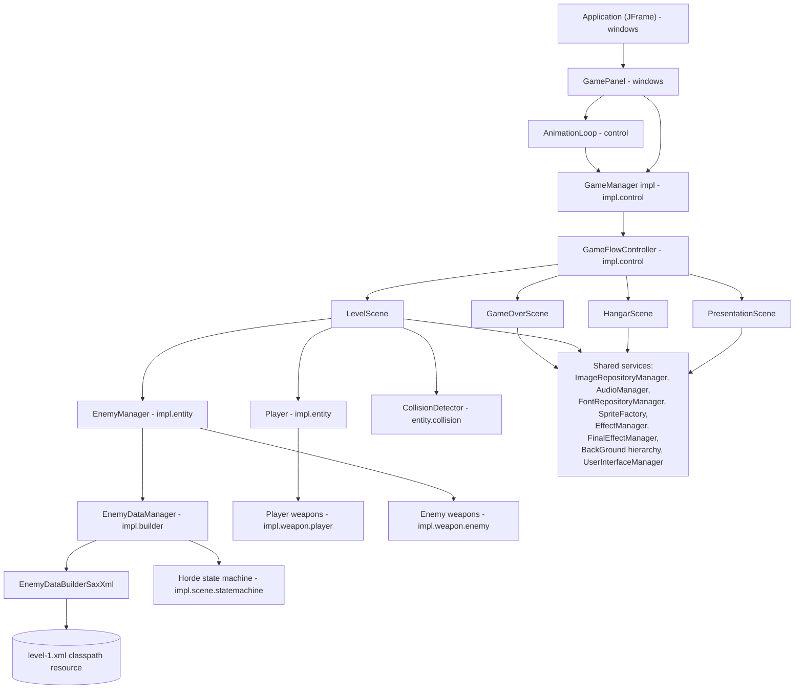

# System Architecture

## System Overview

TigerSupply is a **standalone, offline, single-process desktop game** written in Java 17. It
has no client/server split, no database, and no network calls. The whole application runs in
one JVM:

- A **Swing `JFrame`** (`Application`) hosts a single **`JPanel`** (`GamePanel`) that owns a
  custom **fixed-timestep game loop thread** (`AnimationLoop`) targeting 60 FPS, with
  frame-skipping if updates fall behind.
- Rendering is **manual double-buffering**: each `Game` (Scene) draws into an off-screen
  `BufferedImage` (`internalRenderGame` + `doFinalEffect`) which is then blitted to the panel
  (`paintScreen`).
- Game content (images, audio, fonts, and the level script) is **data-driven**: plain-text
  catalog files (`image-catalog.txt`, `audio-catalog.txt`, `font-catalog.txt`) list classpath
  resources to preload into in-memory repositories, and an XML file
  (`level/level-1.xml`) scripts enemy "hordes" parsed via SAX and instantiated through
  reflection (`ClassFactory`).
- The engine and the concrete TigerSupply game rules currently live in the **same Maven
  module** (`engine`); `game` and `launcher` are empty placeholder modules reserved for a
  future split.

## Architecture Diagram



## Component Descriptions

### `control` (engine contracts)
- **Purpose**: Defines the reusable game-loop abstractions.
- **Responsibilities**: `Game`/`GameManager` interfaces, `AbstractGameJPanel`/
  `AbstractGameManagerJPanel` template-method bases, `AnimationLoop` fixed-timestep thread,
  `ApplicationContext` shared mutable state.
- **Dependencies**: `java.awt`/`javax.swing` only.
- **Type**: Application (framework layer).

### `impl.control` (TigerSupply flow)
- **Purpose**: Wires the reusable framework to TigerSupply's concrete scenes.
- **Responsibilities**: `GameManager` bootstraps every singleton repository/manager and starts
  on the Presentation scene; `GameFlowController` is the transaction script that owns the
  `Player`/`EnemyManager` and switches the active Scene.
- **Dependencies**: `control`, `impl.scene`, `impl.entity`, `audio`, `image.repository`,
  `font.repository`.
- **Type**: Application.

### `impl.scene` (+ `definition`, `statemachine` sub-packages)
- **Purpose**: The four playable Scenes and the data-driven level/horde engine.
- **Responsibilities**: `PresentationScene`, `HangarScene`, `LevelScene`, `GameOverScene`
  implement `Game`; `definition` holds level-XML DTOs (`Horde`, `EnemyDefinition`,
  `EnemyPrototype`, `AlgorithmPrototype`, …); `statemachine` drives horde spawn pacing
  (`StateWaitTime` / `StateWaitKill` / `StateGenerateHorde` / `StateKillBoss`) on top of the
  generic `statemachine` package.
- **Dependencies**: `control`, `entity`, `impl.entity`, `impl.builder`, `background`, `ui`,
  `font.repository`, `image.repository`.
- **Type**: Application.

### `entity` (+ `manager`, `logic`, `collision` sub-packages)
- **Purpose**: Generic simulation model shared by every game object.
- **Responsibilities**: `Entity`/`AbstractEntity` (position/speed/size/sprite + delegated
  `UpdateAlgorithm`), `EntityManager`/`EntityManagerEntityRequest`/`EntityManagerRemovable`
  (composite collections of entities), `CollisionDetector` (rectangle intersection for
  1:1 / 1:N / N:N pairings), `logic.*` (pluggable movement strategies: default, sinusoidal,
  go-to-point, follow-sprite, copy-position, B-spline).
- **Dependencies**: `sprite`, `control`, `utils`.
- **Type**: Application (framework layer).

### `impl.entity`
- **Purpose**: Concrete TigerSupply simulation objects.
- **Responsibilities**: `Player`, `PlayerEngine`/`PlayerRocket`/`PlayerBomb`, `Enemy` and its
  subclasses (`EnemyStandard`, `EnemyBoss`, `EnemyShield`, `EnemyRocket`,
  `EnemyShoterRocket`, `EnemyBackGround`, `Asteroid`), `EnemyManager`, `EnergeticShield`,
  `ExplosionParticle`, `LithingBolt`, `Smoke`, and `BaseEntity` (minimal concrete
  `AbstractEntity`).
- **Dependencies**: `entity`, `impl.weapon`, `impl.utils`, `audio`.
- **Type**: Application.

### `impl.weapon` (+ `player`, `enemy` sub-packages)
- **Purpose**: Fire-control components attached to entities, decoupled from entity logic.
- **Responsibilities**: `Weapon`/`AbstractWeapon` state machine (unloaded → reloading → ready →
  firing); player variants (`Paser`, `DoubleGun`, `SynusoidalGun`, `RocketLauncer`, `Bomb`);
  enemy variants (`StandardShot`, `RocketLauncer`, `PlasmaCannon`, `LightinBoltLaser`).
- **Dependencies**: `entity`, `impl.utils`, `impl.entity` (via generics on the owner type).
- **Type**: Application.

### `impl.builder`
- **Purpose**: Loads and serves the level script.
- **Responsibilities**: `EnemyDataBuilder`/`EnemyDataBuilderSaxXml` (SAX parser for
  `level-N.xml`), `EnemyDataManager` (orchestrates parsing, indexes results in
  `LevelDataRepository`, and creates concrete `Enemy` entities/algorithms/sprites per horde on
  demand via reflection).
- **Dependencies**: `impl.scene.definition`, `entity`, `sprite`, `statemachine`, `utils`.
- **Type**: Application.

### `sprite`, `image` (+ `repository`, `effect`, `finaleffect`), `audio` (+ `repository`),
`font.repository`, `background`, `path`, `ui`, `statemachine`, `utils`, `windows`
- **Purpose**: Cross-cutting reusable framework services consumed by every Scene.
- **Responsibilities** (highlights): `SpriteFactory`/`Sprite` hierarchy (animated/static
  images with a per-frame filter chain); `ImageRepositoryManager`/`AudioManager`/
  `FontRepositoryManager` singleton catalog-driven asset stores; `EffectManager` (per-sprite
  image filters: rotate/scale/brighten/transparent) and `FinalEffectManager` (full-screen
  post-processing: darkness fade, star field); `BackGround` hierarchy (static/scrolling/
  parallax backgrounds); `path` (natural-cubic-spline path generation for scripted enemy
  movement); `ui` (composable clickable widgets used by the Hangar); `statemachine` (generic,
  reusable finite-state-machine contract used both by the horde spawner and available for
  reuse elsewhere); `utils` (`ClassFactory` reflection helpers, `DynaProperties` dynabean,
  `StaticResources` constants catalog); `windows` (JFrame/JPanel bootstrap + AWT input
  listeners).
- **Dependencies**: Mostly leaf packages depending only on the JDK (`java.awt`,
  `javax.sound.sampled`, `javax.xml.parsers`) plus `utils`.
- **Type**: Application (framework layer).

## Data Flow

```mermaid
sequenceDiagram
    participant OS as OS / Window Events
    participant App as Application (JFrame)
    participant Panel as GamePanel
    participant Loop as AnimationLoop (Thread)
    participant Mgr as GameManager
    participant Scene as Active Scene (Game)

    App->>Panel: construct + addNotify()
    Panel->>Mgr: new GameManager(panel, context)
    Mgr->>Mgr: init repositories, GameFlowController.doPresentation()
    Panel->>Loop: start()
    loop every ~16.6 ms (60 FPS, up to 5 skipped frames)
        Loop->>Mgr: getActualGame()
        Mgr-->>Loop: Scene
        Loop->>Scene: updateGame(deltaSeconds)
        Loop->>Scene: renderGame()
        Scene->>Scene: internalRenderGame() + doFinalEffect()
        Loop->>Scene: paintScreen()
    end
    OS->>Panel: keyPressed / mousePress / mouseMove
    Panel->>Mgr: keyPressed / mousePress / mouseMove
    Mgr->>Scene: delegate input event
    Scene->>Mgr: GameFlowController.doNextLevel() / doGameOver() / doHangar()
    Mgr->>Mgr: setActualGame(newScene)
```

Within `LevelScene.updateGame`, the per-frame simulation order is: manage game-flow
(win/lose checks) → update player → update enemies (which advances the horde state machine
and per-enemy target scanning/weapon firing) → update effects → update player/enemy shots →
run the three `CollisionDetector`s (player↔enemy, player↔enemy-shot, player-shot↔enemy) →
update the parallax background. Rendering then z-sorts all live entities
(`EntityZComparator`) before drawing them back-to-front.

## Integration Points

- **External APIs**: None. TigerSupply makes no HTTP/network calls of any kind.
- **Databases**: None. All game data is either compiled-in constants
  (`StaticResources`) or classpath resource files (images, audio, fonts, level XML) loaded
  once at startup into in-memory repositories.
- **Third-party Services**: None.
- **Local integrations**: Java AWT/Swing (windowing, input, 2D rendering), Java Sound API
  (`javax.sound.sampled`, played on dedicated `AudioPlayerThread`s), Java XML `SAX`
  (`javax.xml.parsers`) for level-script parsing, Java Reflection (`ClassFactory`) for
  data-driven instantiation of entities/algorithms named in the level XML.

## Infrastructure Components

- **CDK Stacks**: None — this is a local desktop application, not a cloud-deployed service.
- **Deployment Model**: Maven multi-module **reactor build** (`mvn install` from the repo
  root builds `engine` → `game` → `launcher` in dependency order). No shade/assembly plugin is
  configured in any module, so there is currently no "fat jar" or distributable package;
  running the game means launching
  `it.spaghettisource.tigersupply.engine.windows.Application#main` on the `engine` module's
  classpath (e.g., from an IDE, or `java -cp engine/target/classes ... Application`).
- **Networking**: None — the application is fully offline and does not open any sockets.
- **CI/CD**: The only GitHub Actions workflow in the repository
  ([.github/workflows/copilot-setup-steps.yml](../../../.github/workflows/copilot-setup-steps.yml))
  installs the OpenSpec CLI for GitHub Copilot's coding-agent setup step; it does not build,
  test, or package the game.
