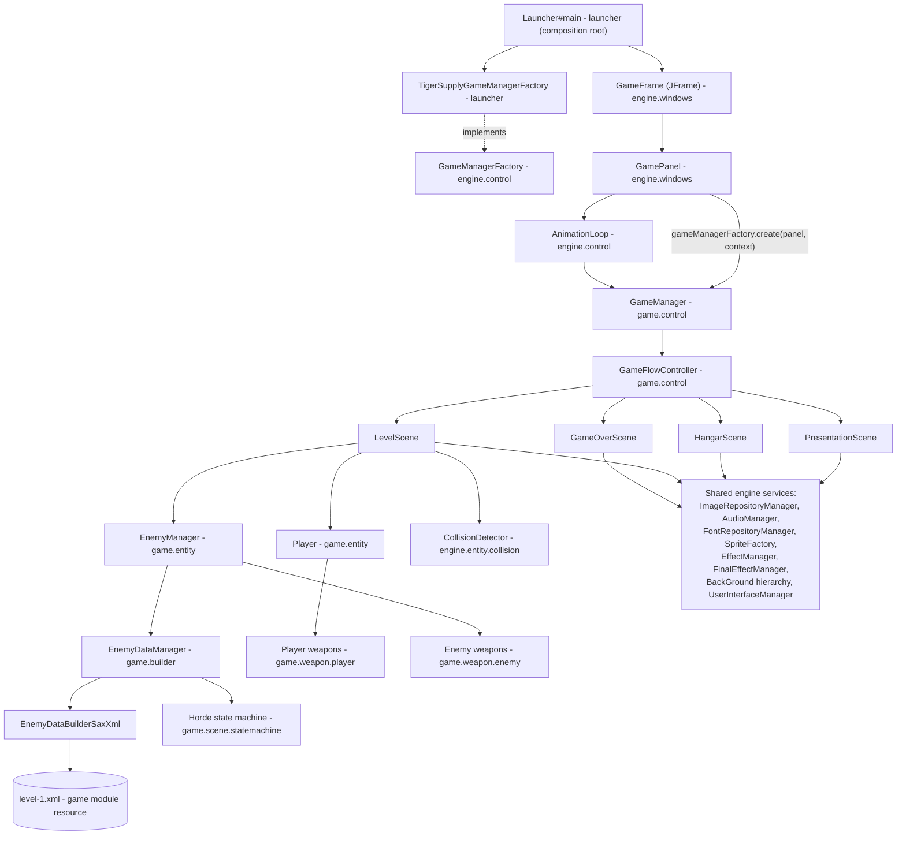

# System Architecture

## System Overview

TigerSupply is a **standalone, offline, single-process desktop game** written in Java 17. It
has no client/server split, no database, and no network calls. The whole application runs in
one JVM:

- A **Swing `JFrame`** (`GameFrame`, in the `engine` module) hosts a single **`JPanel`**
  (`GamePanel`) that owns a custom **fixed-timestep game loop thread** (`AnimationLoop`)
  targeting 60 FPS, with frame-skipping if updates fall behind.
- Rendering is **manual double-buffering**: each `Game` (Scene) draws into an off-screen
  `BufferedImage` (`internalRenderGame` + `doFinalEffect`) which is then blitted to the panel
  (`paintScreen`).
- Game content (images, audio, fonts, and the level script) is **data-driven**: plain-text
  catalog files (`image-catalog.txt`, `audio-catalog.txt`, `font-catalog.txt`) list classpath
  resources to preload into in-memory repositories, and an XML file
  (`level/level-1.xml`) scripts enemy "hordes" parsed via SAX and instantiated through
  reflection (`ClassFactory`).
- The code is split across **three Maven modules**: `engine` holds the reusable framework
  (game loop, entity/sprite/collision, asset repositories, UI, state machine, window shell);
  `game` holds the concrete TigerSupply rules (player, enemies, weapons, scenes, XML-driven
  level/horde builder) under `it.spaghettisource.tigersupply.game.*`; and `launcher` holds the
  composition root (`Launcher#main` + `TigerSupplyGameManagerFactory`) that wires a concrete
  game into the engine's `GameFrame` window shell through the `GameManagerFactory` seam.

## Architecture Diagram



## Component Descriptions

### `control` (engine contracts)
- **Purpose**: Defines the reusable game-loop abstractions.
- **Responsibilities**: `Game`/`GameManager` interfaces, `GameManagerFactory` seam (lets the
  window shell build a concrete manager without naming any game type), `AbstractGameJPanel`/
  `AbstractGameManagerJPanel` template-method bases, `AnimationLoop` fixed-timestep thread,
  `ApplicationContext` shared mutable state.
- **Dependencies**: `java.awt`/`javax.swing` only.
- **Type**: Application (framework layer).

### `launcher` (composition root)
- **Purpose**: The runnable entry point and the only place that binds a concrete game to the
  engine.
- **Responsibilities**: `Launcher#main` owns the launch configuration (window title
  "Tiger Supply", 1360x660 playfield), constructs the shared `ApplicationContext`, selects the
  concrete game via `TigerSupplyGameManagerFactory` (the sole class outside the game module
  that names `game.control.GameManager`), and hands both to the engine `GameFrame`.
- **Dependencies**: `engine.control`, `engine.windows`, `game.control`.
- **Type**: Application (composition root).

### `game.control` (TigerSupply flow)
- **Purpose**: Wires the reusable framework to TigerSupply's concrete scenes.
- **Responsibilities**: `GameManager` (built by the launcher's `GameManagerFactory`)
  bootstraps every singleton repository/manager and starts on the Presentation scene;
  `GameFlowController` is the transaction script that owns the `Player`/`EnemyManager` and
  switches the active Scene.
- **Dependencies**: `engine.control`, `game.scene`, `game.entity`, `engine.audio`,
  `engine.image.repository`, `engine.font.repository`.
- **Type**: Application (game module).

### `game.scene` (+ `definition`, `statemachine` sub-packages)
- **Purpose**: The four playable Scenes and the data-driven level/horde engine.
- **Responsibilities**: `PresentationScene`, `HangarScene`, `LevelScene`, `GameOverScene`
  implement `Game`; `definition` holds level-XML DTOs (`Horde`, `EnemyDefinition`,
  `EnemyPrototype`, `AlgorithmPrototype`, …); `statemachine` drives horde spawn pacing
  (`StateWaitTime` / `StateWaitKill` / `StateGenerateHorde` / `StateKillBoss`) on top of the
  generic `engine.statemachine` package.
- **Dependencies**: `engine.control`, `engine.entity`, `game.entity`, `game.builder`,
  `engine.background`, `engine.ui`, `engine.font.repository`, `engine.image.repository`.
- **Type**: Application (game module).

### `entity` (+ `manager`, `logic`, `collision` sub-packages)
- **Purpose**: Generic simulation model shared by every game object.
- **Responsibilities**: `Entity`/`AbstractEntity` (position/speed/size/sprite + delegated
  `UpdateAlgorithm`), `EntityManager`/`EntityManagerEntityRequest`/`EntityManagerRemovable`
  (composite collections of entities), `CollisionDetector` (rectangle intersection for
  1:1 / 1:N / N:N pairings), `logic.*` (pluggable movement strategies: default, sinusoidal,
  go-to-point, follow-sprite, copy-position, B-spline).
- **Dependencies**: `sprite`, `control`, `utils`.
- **Type**: Application (framework layer).

### `game.entity`
- **Purpose**: Concrete TigerSupply simulation objects.
- **Responsibilities**: `Player`, `PlayerEngine`/`PlayerRocket`/`PlayerBomb`, `Enemy` and its
  subclasses (`EnemyStandard`, `EnemyBoss`, `EnemyShield`, `EnemyRocket`,
  `EnemyShoterRocket`, `EnemyBackGround`, `Asteroid`), `EnemyManager`, `EnergeticShield`,
  `ExplosionParticle`, `LithingBolt`, `Smoke`, `Effect` (time-limited effect base) and
  `BaseEntity` (minimal concrete `AbstractEntity`).
- **Dependencies**: `engine.entity`, `game.weapon`, `game.utils`, `engine.audio`.
- **Type**: Application (game module).

### `game.weapon` (+ `player`, `enemy` sub-packages)
- **Purpose**: Fire-control components attached to entities, decoupled from entity logic.
- **Responsibilities**: `Weapon`/`AbstractWeapon` state machine (unloaded → reloading → ready →
  firing); player variants (`Paser`, `DoubleGun`, `SynusoidalGun`, `RocketLauncer`, `Bomb`);
  enemy variants (`StandardShot`, `RocketLauncer`, `PlasmaCannon`, `LightinBoltLaser`).
- **Dependencies**: `engine.entity`, `game.utils`, `game.entity` (via generics on the owner type).
- **Type**: Application (game module).

### `game.builder`
- **Purpose**: Loads and serves the level script.
- **Responsibilities**: `EnemyDataBuilder`/`EnemyDataBuilderSaxXml` (SAX parser for
  `level-N.xml`), `EnemyDataManager` (orchestrates parsing, indexes results in
  `LevelDataRepository`, and creates concrete `Enemy` entities/algorithms/sprites per horde on
  demand via reflection).
- **Dependencies**: `game.scene.definition`, `engine.entity`, `engine.sprite`,
  `engine.statemachine`, `engine.utils`.
- **Type**: Application (game module).

### `sprite`, `image` (+ `repository`, `effect`, `finaleffect`), `audio` (+ `repository`),
`font.repository`, `background`, `path`, `ui`, `statemachine`, `utils`, `windows`
- **Purpose**: Cross-cutting reusable framework services consumed by every Scene.
- **Responsibilities** (highlights): `SpriteFactory`/`Sprite` hierarchy (animated/static
  images with a per-frame filter chain); `ImageRepositoryManager`/`AudioManager`/
  `FontRepositoryManager` singleton catalog-driven asset stores; `EffectManager` (per-sprite
  image filters: rotate/scale/brighten/transparent) and `FinalEffectManager` (full-screen
  post-processing: darkness fade, star field); `BackGround` hierarchy (static/scrolling/
  parallax backgrounds); `path` (natural-cubic-spline path generation for scripted enemy
  movement); `ui` (composable clickable widgets used by the Hangar); `statemachine` (generic,
  reusable finite-state-machine contract used both by the horde spawner and available for
  reuse elsewhere); `utils` (`ClassFactory` reflection helpers, `DynaProperties` dynabean,
  `StaticResources` constants catalog); `windows` (JFrame/JPanel bootstrap + AWT input
  listeners).
- **Dependencies**: Mostly leaf packages depending only on the JDK (`java.awt`,
  `javax.sound.sampled`, `javax.xml.parsers`) plus `utils`.
- **Type**: Application (framework layer).

## Data Flow

```mermaid
sequenceDiagram
    participant OS as OS / Window Events
    participant Main as Launcher#main
    participant Frame as GameFrame (JFrame)
    participant Panel as GamePanel
    participant Factory as GameManagerFactory
    participant Loop as AnimationLoop (Thread)
    participant Mgr as GameManager (game.control)
    participant Scene as Active Scene (Game)

    Main->>Frame: new GameFrame(title, w, h, context, factory)
    Frame->>Panel: construct + addNotify()
    Panel->>Factory: create(panel, context)
    Factory-->>Panel: GameManager
    Panel->>Mgr: drive loop + route input
    Mgr->>Mgr: init repositories, GameFlowController.doPresentation()
    Panel->>Loop: start()
    loop every ~16.6 ms (60 FPS, up to 5 skipped frames)
        Loop->>Mgr: getActualGame()
        Mgr-->>Loop: Scene
        Loop->>Scene: updateGame(deltaSeconds)
        Loop->>Scene: renderGame()
        Scene->>Scene: internalRenderGame() + doFinalEffect()
        Loop->>Scene: paintScreen()
    end
    OS->>Panel: keyPressed / mousePress / mouseMove
    Panel->>Mgr: keyPressed / mousePress / mouseMove
    Mgr->>Scene: delegate input event
    Scene->>Mgr: GameFlowController.doNextLevel() / doGameOver() / doHangar()
    Mgr->>Mgr: setActualGame(newScene)
```

Within `LevelScene.updateGame`, the per-frame simulation order is: manage game-flow
(win/lose checks) → update player → update enemies (which advances the horde state machine
and per-enemy target scanning/weapon firing) → update effects → update player/enemy shots →
run the three `CollisionDetector`s (player↔enemy, player↔enemy-shot, player-shot↔enemy) →
update the parallax background. Rendering then z-sorts all live entities
(`EntityZComparator`) before drawing them back-to-front.

## Integration Points

- **External APIs**: None. TigerSupply makes no HTTP/network calls of any kind.
- **Databases**: None. All game data is either compiled-in constants
  (`StaticResources`) or classpath resource files (images, audio, fonts, level XML) loaded
  once at startup into in-memory repositories.
- **Third-party Services**: None.
- **Local integrations**: Java AWT/Swing (windowing, input, 2D rendering), Java Sound API
  (`javax.sound.sampled`, played on dedicated `AudioPlayerThread`s), Java XML `SAX`
  (`javax.xml.parsers`) for level-script parsing, Java Reflection (`ClassFactory`) for
  data-driven instantiation of entities/algorithms named in the level XML.

## Infrastructure Components

- **CDK Stacks**: None — this is a local desktop application, not a cloud-deployed service.
- **Deployment Model**: Maven multi-module **reactor build** (`mvn install` from the repo
  root builds `engine` → `game` → `launcher` in dependency order). The `launcher` module is
  configured with the **maven-shade-plugin** to produce a runnable uber-jar
  (`launcher/target/tigersupply.jar`, manifest `Main-Class:
  it.spaghettisource.tigersupply.launcher.Launcher`) that bundles engine + game + resources,
  and with the **exec-maven-plugin** for a reactor dev run (`mvn -pl launcher exec:java`, after
  an `mvn install` so engine/game resolve). Running the game means launching
  `it.spaghettisource.tigersupply.launcher.Launcher#main` (e.g. `java -jar
  launcher/target/tigersupply.jar`).
- **Networking**: None — the application is fully offline and does not open any sockets.
- **CI/CD**: The only GitHub Actions workflow in the repository
  ([.github/workflows/copilot-setup-steps.yml](../../../.github/workflows/copilot-setup-steps.yml))
  installs the OpenSpec CLI for GitHub Copilot's coding-agent setup step; it does not build,
  test, or package the game.
