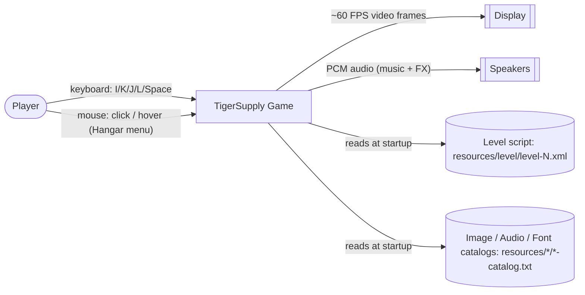

# Business Overview

## Business Context Diagram

## Business Description

- **Business Description**: TigerSupply is a single-player, offline, retro 90s-style arcade
  "shoot 'em up" (shmup) desktop game written in Java/Swing. The [README](../../../README.md)
  describes it as featuring "fast-paced arcade action, classic gameplay mechanics, and
  nostalgic pixel-art aesthetics". The player customizes a spaceship in a hangar, then flies
  through a horizontally-themed, vertically-scrollable level fighting scripted waves
  ("hordes") of enemies and a boss. The developer's design notes
  ([note.txt](../../../note.txt)) explicitly cite the game **"Revenge of the Titans"** as the
  inspiration for decoupling Entity/Sprite/Weapon, and reference `com.shavenpuppy.jglib` /
  `worm.*` classes as prior art studied while designing the engine's sprite command and
  rendering pipeline.
- **Business Transactions** — the finite set of game-flow ("Scene") transactions implemented
  by `GameFlowController`
  ([GameFlowController.java](../../../engine/src/main/java/it/spaghettisource/tigersupply/engine/impl/control/GameFlowController.java)):
  1. **Show Presentation** (`doPresentation`) – title screen with parallax background, star
     field and a "Tiger Supply" logo rendered from font glyph outlines; pressing **Fire**
     (Space) starts a darkness fade into the Hangar.
  2. **Configure Loadout in Hangar** (`doHangar`) – the player picks one of two ship hulls
     (each with a different top speed and sprite), one primary weapon (Paser, Double Gun,
     Sinusoidal Gun) and one secondary weapon (Rocket Launcher, Bomb); pressing **Start**
     commits the loadout onto the `Player` entity.
  3. **Play Level** (`doNextLevel`) – loads the next configured level's XML script, spawns
     scripted hordes of enemies/obstacles over time, and runs the real-time
     simulate/collide/render loop until the player dies or the level's boss is destroyed.
  4. **Advance / Finish** (`doNextLevel` again) – on boss death, advances to the next level if
     one is configured, otherwise loops back to the Presentation screen (the game currently
     ships exactly **one** level, `level-1.xml`).
  5. **Game Over** (`doGameOver`) – triggered when the player's life count reaches zero; shows
     a looping explosion particle effect and returns to Presentation on **Fire**.
- **Business Dictionary**:
  | Term | Meaning |
  |------|---------|
  | **Entity** | Anything simulated in the game world (ships, bullets, effects, asteroids) with position/speed/size and update/render/collision behaviour. |
  | **Sprite** | The visual representation (static image or animated image sequence) bound to an Entity; intentionally decoupled from Entity so behaviour and appearance vary independently. |
  | **Horde** | A scripted wave of enemies defined in the level XML, spawned together and gated by a `generateEvent` (`waitTime` or `waitKill`). |
  | **Enemy Prototype** | A named, reusable enemy template declared once in the level XML (`<enemyPrototype>`) with an implementation class, sprite image, speed and scale; hordes reference prototypes by name. |
  | **Algorithm Prototype** | A named, reusable movement-strategy template (`<algorithmPrototype>`) with typed properties (deltas, speeds, waypoint lists) consumed by an `UpdateAlgorithm`. |
  | **Weapon** | A fire-control component (reload → ready → firing state machine) attached to the Player or an Enemy, deliberately decoupled from the owning Entity ("weapons are objects contained in the entity", per `note.txt`). |
  | **Scene** | One full-screen "mode" of the game (Presentation, Hangar, Level, Game Over); each Scene implements the generic `Game` contract. |
  | **GameFlowController** | The singleton transaction script that owns the `Player`/`EnemyManager` and decides which Scene is active and how levels progress. |
  | **ApplicationContext** | Shared mutable runtime state (running/paused flags, frame period, screen size) visible to the whole engine. |

## Component Level Business Descriptions

### `engine` (Maven module — package `it.spaghettisource.tigersupply.engine`)
- **Purpose**: Provides both the reusable arcade-game **framework** (game loop, entity/sprite
  system, collision detection, audio/image/font repositories, UI widgets, path splines,
  generic state machine) and, in its `impl` sub-package, the **concrete TigerSupply game
  rules** (player ship, enemy types, weapons, scenes, XML-driven level/horde builder).
- **Responsibilities**: Owns the entire runtime of the game today — window bootstrap, the
  fixed-step simulation loop, rendering, sound, input handling, and all TigerSupply-specific
  gameplay/level content. This is the only module with source code.

### `game` (Maven module)
- **Purpose**: Reserved module intended to eventually hold game-specific content separate from
  the reusable engine (per the multi-module split already declared in the root
  [pom.xml](../../../pom.xml)).
- **Responsibilities**: None yet — only a [pom.xml](../../../game/pom.xml) declaring a
  dependency on `engine` exists; there is no `src/` directory.

### `launcher` (Maven module)
- **Purpose**: Reserved module intended to become the packaging/distribution entry-point
  module for the game.
- **Responsibilities**: None yet — only a [pom.xml](../../../launcher/pom.xml) declaring a
  dependency on `game` exists; there is no `src/` directory. The actual runnable entry point
  today is
  `it.spaghettisource.tigersupply.engine.windows.Application#main`, inside the `engine`
  module itself.

### `openspec` (process tooling — not shipped with the game)
- **Purpose**: Houses the OpenSpec spec-driven-change workflow configuration
  ([config.yaml](../../../openspec/config.yaml)) used by AI coding agents to propose and track
  future changes to this repository.
- **Responsibilities**: `specs/` and `changes/archive/` are both currently empty — no
  OpenSpec change has been authored yet for this codebase.

> **Note on repository documentation**: a pre-existing `documentation/subsystems/` folder in
> this repository contains a subsystem-documentation guide that refers to a different,
> unrelated project ("MIG", a Java EE enterprise application). It appears to be carried over
> from another template/repository and does not describe TigerSupply. This reverse-engineering
> pass ignores that guide and documents the codebase as it actually exists.
