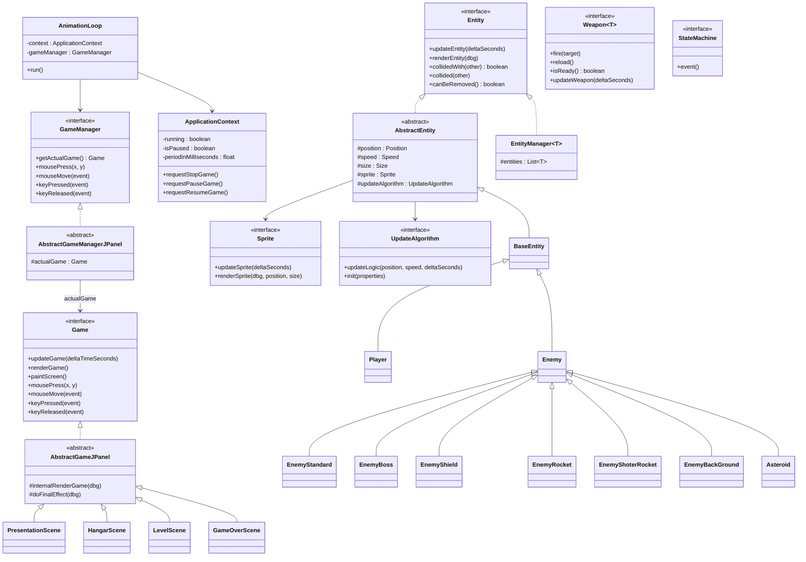

# Code Structure

## Build System

- **Type**: Maven (multi-module reactor).
- **Configuration**:
  - Root [pom.xml](../../../pom.xml) — `packaging=pom`, aggregates modules `engine`, `game`,
    `launcher` (in that dependency order); `groupId=it.spaghettisource.tigersupply`,
    `version=1.0-SNAPSHOT`.
  - `<maven.compiler.release>17</maven.compiler.release>`, `UTF-8` source encoding.
  - `dependencyManagement` imports `org.junit:junit-bom:5.11.0`.
  - `pluginManagement` pins: `maven-clean-plugin:3.4.0`, `maven-resources-plugin:3.3.1`,
    `maven-compiler-plugin:3.13.0`, `maven-surefire-plugin:3.3.0`, `maven-jar-plugin:3.4.2`,
    `maven-install-plugin:3.1.2`, `maven-deploy-plugin:3.1.2`, `maven-site-plugin:3.12.1`,
    `maven-project-info-reports-plugin:3.6.1`.
  - Module POMs: [engine/pom.xml](../../../engine/pom.xml) (no internal deps),
    [game/pom.xml](../../../game/pom.xml) (depends on `engine`),
    [launcher/pom.xml](../../../launcher/pom.xml) (depends on `game`, and configures
    `maven-shade-plugin:3.6.0` to build the runnable uber-jar `tigersupply.jar` plus
    `exec-maven-plugin:3.5.0` for `mvn -pl launcher exec:java`) — see
    [dependencies.md](./dependencies.md).

## Key Classes/Modules

### Existing Files Inventory

The codebase now spans **three source roots** (172 Java files total): the reusable framework in
**`engine`** (102 files, base path
`engine/src/main/java/it/spaghettisource/tigersupply/engine/`), the concrete TigerSupply game in
**`game`** (68 files, base path `game/src/main/java/it/spaghettisource/tigersupply/game/` — the
former `impl.*` packages with the `impl` segment dropped), and the composition root in
**`launcher`** (2 files, base path
`launcher/src/main/java/it/spaghettisource/tigersupply/launcher/`). Package headings below are
grouped by module; paths under each heading are relative to that module's base path.

**Engine module** — reusable framework (base path
`engine/src/main/java/it/spaghettisource/tigersupply/engine/`).

#### `control/` — engine loop contracts
- `Game.java` — Contract for a renderable/updatable/input-handling game screen ("Scene").
- `GameManager.java` — Contract for the component that owns/returns the currently active `Game`.
- `GameManagerFactory.java` — Factory seam that builds the concrete `GameManager` for a given panel/context, letting `GamePanel` stay game-agnostic; the concrete implementation is supplied by the `launcher` module.
- `AbstractGameJPanel.java` — Template-method base `Game` that manages Swing double-buffering and calls `internalRenderGame`/`doFinalEffect`.
- `AbstractGameManagerJPanel.java` — Base `GameManager` that forwards input events to the active `Game`.
- `AnimationLoop.java` — Fixed-timestep game-loop thread (update/render/paint, frame-skipping, thread-yield logic).
- `ApplicationContext.java` — Mutable shared runtime state (running/paused flags, frame period, screen size).

#### `entity/` — generic simulation model
- `Entity.java` — Contract for any simulated game object (update/render/collide/out-of-screen).
- `AbstractEntity.java` — Base `Entity`: position/speed/size/sprite, delegates movement to an `UpdateAlgorithm`, AABB collision via `getEntityRectangle()`.
- `EntityFactory.java` — Singleton reflection-based factory that instantiates `AbstractEntity` subclasses and wires position/speed/size/sprite/algorithm/context.
- `Position.java` — Mutable X/Y/Z + rotation-angle value object.
- `Size.java` — Width/height + scale value object (derives effective width/height).
- `Speed.java` — X/Y pixel-per-second velocity value object.

#### `entity/collision/`
- `CollisionDetector.java` — Rectangle-intersection collision checker supporting one-to-one, one-to-many and many-to-many entity/`EntityManager` pairings.

#### `entity/logic/` — pluggable movement strategies
- `UpdateAlgorithm.java` — Strategy contract for per-entity movement (`updateLogic` + `DynaProperties`-based `init`).
- `AbstractUpdateAlgorithm.java` — Shared numeric-parsing helpers for concrete algorithms.
- `UpdateAlgorithmDefault.java` — Straight-line movement using `Speed` only.
- `UpdateAlgorithmSinusoidal.java` — Sine-wave lateral movement (used by "sinusoidal" enemies/shots).
- `UpdateAlgoritmGoToPoint.java` — Moves toward a fixed target point.
- `UpdateAlgoritmGoToPointIncreasingSpeed.java` — Moves toward a target point while accelerating.
- `UpdateAlgoritmFollowSprite.java` — Follows another Entity's position (turret/attachment use cases).
- `UpdateAlgoritmCopyPosition.java` — Mirrors another `Position` with a fixed offset (attaches engine-trail/shield fx to the ship).
- `UpdateAlgorithmBspline.java` — Moves along a spline path built from configured waypoints.
- `UpdateAlgorithmFactory.java` — Reflection-based factory that instantiates + initializes an `UpdateAlgorithm` from a class name and `DynaProperties`.
- `UpdateAlgorithmFactoryWrapper.java` — Convenience static factory methods for common `UpdateAlgorithm` configurations (copy-position, sinusoidal, …); promoted from the old `impl.utils` into the framework so no engine class references game code.

#### `entity/manager/`
- `EntityManager.java` — Generic composite `Entity` implementation fanning update/render/collision out to a managed list.
- `EntityManagerEntityRequest.java` — `EntityManager` variant supporting deferred "request" of new entities (used for shots/effects/enemies produced mid-update).
- `EntityManagerRemovable.java` — `EntityManager` variant that prunes entities once `canBeRemoved()`/`isOutOfScreen()` is true.

#### `audio/`
- `AudioManager.java` — Singleton facade to play looping/one-shot music and FX via background threads.
- `AudioPlayer.java` — Low-level `javax.sound.sampled` playback helper.
- `AudioPlayerThread.java` — Runnable that plays one audio buffer on its own thread (supports stop/loop).
- `AudioType.java` — `FX` vs `MUSIC` constants.

#### `audio/repository/`
- `AudioRepository.java` — In-memory alias → `byte[]` audio-buffer store.
- `FileAudioLoader.java` — Loads a single audio file from the classpath into a `byte[]`.
- `RepositoryLoader.java` — Parses `audio-catalog.txt` and populates the `AudioRepository` at startup.

#### `background/`
- `BackGround.java` — Contract for a renderable/updatable background layer.
- `BackGroundFitImage.java` / `StaticBackGroundFitImage.java` — Background scaled/fit to the screen, animated or static.
- `BackGroundTexture.java` / `StaticBackGroundTexture.java` — Tiling/scrolling texture background, animated or static.
- `ParallaxBackGround.java` — Composite `BackGround` layering several backgrounds at different scroll speeds.

#### `font/repository/`
- `FontRepository.java` — In-memory alias → `Font` store.
- `FontLoader.java` — Loads a single TTF from the classpath and derives sizes.
- `FontRepositoryManager.java` — Singleton facade; parses `font-catalog.txt` and serves `getFont(alias, size)`.
- `RepositoryLoader.java` — Catalog-driven bulk loader wiring `FontLoader` into `FontRepository`.

#### `image/`
- `ImagesPlayer.java` — Frame-sequencer for a `BufferedImage[]` animation (period/duration/loop).
- `ImagesPlayerCenterControlled.java` — Frame-sequencer variant that can jump to/hold a specific "center" frame (ship bank-left/right animations).
- `ImagesPlayerWatcher.java` — Callback contract notified when an animation sequence completes.

#### `image/effect/` — per-sprite filters
- `EffectManager.java` — Singleton registry of named `Filter`s, applies a filter chain to a `BufferedImage`.
- `Filter.java` — Contract for a single image filter.
- `AbstractFilter.java` / `AbstractLookUpOpFilter.java` — Shared base classes for filters (incl. `LookupOp`-based colour filters).
- `Rotation.java` / `Scale.java` / `Brighten.java` / `Transparent.java` — Concrete filters (rotate, scale, brighten via `LookupOp`, alpha transparency).

#### `image/finaleffect/` — full-screen post-processing
- `FinalEffect.java` / `AbstractFinalEffect.java` — Contract/base for full-screen effects.
- `FinalEffectManager.java` — Singleton registry driving active full-screen effects (darkness, star field) per scene.
- `Darkness.java` — Fade-to-black / fade-from-black transition effect used between scenes.
- `Star.java` / `StarEntity.java` — Twinkling star-field effect and its per-star entity.

#### `image/repository/`
- `ImageRepository.java` — In-memory alias → `BufferedImage`(s) store plus a "volatile" filtered-image cache.
- `ImageLoader.java` — Loads single images and numbered loop-image sequences from the classpath.
- `RepositoryLoader.java` — Parses `image-catalog.txt` (`s`/`l` directives) and populates the `ImageRepository`.
- `ImageRepositoryManager.java` — Singleton facade over `ImageRepository` (single/loop/volatile image access, cache reset).

#### `path/` — spline path generation
- `ControlCurve.java` — Holds the polygon of control points feeding a spline.
- `Cubic.java` — Cubic polynomial segment evaluator.
- `NatCubicSpline.java` — Natural cubic spline solver turning control points into a dense point list (enemy movement paths).

#### `sprite/`
- `Sprite.java` — Contract for a renderable animated/static image bound to an `Entity`.
- `AbstractSprite.java` — Base `Sprite`: builds a cache key (image + angle + scale + colour), runs the `EffectManager` filter chain, caches/draws the filtered image.
- `SpriteColor.java` — RGBA-ish colour/alpha value object applied by filters.
- `SpriteFactory.java` — Singleton factory creating `ImageSingleSprite`/`ImagePlayerSprite`/`ImagePlayerCenterControllerSprite` from catalog aliases.
- `ImageSingleSprite.java` — `Sprite` backed by one static image.
- `ImagePlayerSprite.java` — `Sprite` backed by a looping `ImagesPlayer` animation.
- `ImagePlayerCenterControllerSprite.java` — `Sprite` backed by `ImagesPlayerCenterControlled` (banking ship animation).

#### `statemachine/` — generic, reusable FSM
- `StateMachine.java` / `StateMachineImpl.java` — Minimal state-machine contract/implementation (`event()` advances state via a `TransactionManager`).
- `State.java` / `AbstractState.java` — Contract/base for a state (`processState` delegates to `internalProcess` then looks up the next state).
- `Event.java` — Named event value object.
- `TransactionManager.java` — Contract resolving `(state, event) → next state`.
- `StateMachineException.java` / `StateMachineUnsupportedEvent.java` / `StateMachineUnsupportedState.java` — Checked exceptions for invalid transitions.

#### `ui/`
- `UserInterface.java` / `AbstractInterfaceComposition.java` — Contract/base for a composite of interactive UI widgets.
- `UserInterfaceManager.java` — Routes mouse input and update/render calls to the active `UserInterface` composition.
- `RectangleInterfaceComposition.java` — Concrete composition rendering a rounded-rectangle panel containing child widgets.
- `AbstractButton.java` / `RectangleButton.java` — Base clickable widget / rectangle-shaped button with hover paint.
- `ui/listener/MouseOverListener.java`, `ui/listener/MouseOutListener.java` — Hover callback contracts used by hangar buttons.

#### `utils/`
- `ClassFactory.java` — Reflection helpers (`newIstance`, `loadClass`) used by every factory for data-driven class instantiation.
- `DynaProperties.java` — Dynamic/typed property bag ("dynabean") used to configure `UpdateAlgorithm`s from XML.
- `StaticResources.java` — Framework-only constants catalog (algorithm property keys `ALGPRO_*`, colour keys `COLOR_*`, filter keys `FILTER_*`); the game-specific keys (asset aliases, game-state/event names, Z-order layers) now live in `game.utils.GameResources`.
- `StreamUtils.java` — Classpath/stream helper utilities.

#### `windows/` — window shell
- `GameFrame.java` — Game-agnostic `JFrame` window shell (renamed from `Application`); takes a window title, playfield size, `ApplicationContext` and a `GameManagerFactory`, and hosts the `GamePanel`. No longer the process entry point — that moved to the `launcher` module.
- `GamePanel.java` — `JPanel` hosting the game; builds the `GameManager` via the injected `GameManagerFactory`, owns the `AnimationLoop`, registers input listeners, and starts the loop in `addNotify()`.
- `GamePanelKeyListener.java`, `GamePanelMauseListener.java`, `GamePanelMauseMotionListener.java` — AWT listener adapters forwarding key/mouse events to the `GameManager` *(class names contain a "Mause" typo for "Mouse")*.

---

**Game module** — concrete TigerSupply game (base path
`game/src/main/java/it/spaghettisource/tigersupply/game/`; the former `engine.impl.*` packages
with the `impl` segment dropped).

#### `game/control/` — TigerSupply flow
- `GameFlowController.java` — Singleton transaction script owning the `Player`/`EnemyManager` and switching the active Scene; drives level progression.
- `GameManager.java` — Concrete `GameManager` (built by the launcher's `TigerSupplyGameManagerFactory`): bootstraps all singleton services and starts on the Presentation scene; handles global pause/quit keys.

#### `game/scene/`
- `PresentationScene.java` — Title-screen scene (logo text via `GlyphVector`, star field, fade-to-black transition into the Hangar).
- `HangarScene.java` — Loadout scene: ship/weapon selection buttons wired to a `HangarDataModel`; the Start button hands the configured `Player` to `GameFlowController`.
- `LevelScene.java` — Core gameplay scene: owns shot/effect `EntityManager`s, the `EnemyManager`, three `CollisionDetector`s, and the parallax background; declares win/lose transitions.
- `GameOverScene.java` — Game-over scene with a looping explosion-particle effect and restart-on-Space.

#### `game/scene/definition/` — level-XML DTOs
- `Horde.java` — One scripted wave: a `GenerateEvent` + list of `EnemyDefinition`s.
- `GenerateEvent.java` — Named event (`waitTime`/`waitKill`) with optional delay, gating horde progression.
- `EnemyDefinition.java` — One `<enemy>` entry in a horde (prototype ref, algorithm ref, spawn position).
- `EnemyPrototype.java` — Named reusable enemy template (implementation class, speed, image, scale).
- `AlgorithmPrototype.java` / `AlgorithmProperties.java` — Named reusable movement-algorithm template and its typed property bag.
- `PointDefinition.java` — X/Y waypoint used by spline/B-spline algorithms.
- `Image.java` / `Scale.java` / `Speed.java` — Small XML-attribute value objects (image alias, scale factor, speed vector). *These names shadow other engine classes (e.g. `entity.Speed`) but are separate XML-parsing DTOs, not runtime entity state — a naming hazard to be aware of when navigating the codebase.*
- `LevelDataRepository.java` — In-memory index of parsed Hordes/EnemyPrototypes/AlgorithmPrototypes, queried by the builder.

#### `game/scene/statemachine/` — horde-pacing FSM (built on engine `statemachine/`)
- `StateAbstract.java` — Base `State` resolving the next `Event` then asking the `TransactionManager` for the next `State`.
- `StateWaitTime.java` — "Waiting for a timer" state before the next horde spawns.
- `StateWaitKill.java` — "Waiting for all current enemies to die" state before the next horde spawns.
- `StateGenerateHorde.java` — "Spawn the next horde" state; delegates to `EnemyBuilderDataModel`/`EnemyDataManager`.
- `StateKillBoss.java` — Terminal state reached once the boss horde has been generated, waiting for boss death.
- `EnemyTxManager.java` — `TransactionManager` implementation encoding the horde-generation state graph.
- `EnemyBuilderDataModel.java` — Facade the states use to query/advance `EnemyDataManager` (elapsed time, spawn next horde, boss killed).

#### `game/builder/`
- `EnemyDataBuilder.java` — Contract for a level-data parser (returns Hordes/EnemyPrototypes/AlgorithmPrototypes).
- `EnemyDataBuilderSaxXml.java` — SAX-based XML parser implementation reading `level/level-N.xml`.
- `EnemyDataManager.java` — Orchestrates parsing, stores results in `LevelDataRepository`, and creates concrete `Enemy` entities/algorithms/sprites per horde on demand.

#### `game/entity/` — concrete simulation objects
- `BaseEntity.java` — Minimal concrete `AbstractEntity` used for simple entities (shots, smoke, engine fx) with no extra behaviour.
- `Effect.java` — Base class for time-limited effect entities (extends `BaseEntity`; auto-removes after a configurable `spriteTimeDuration`).
- `Entity.java` — **Empty placeholder class** — unused leftover/dead code that shares its simple name with `engine.entity.Entity` (a potential source of import confusion).
- `Player.java` — Player ship: input handling, weapons list, life/lives, engine-trail/smoke effects, hit reaction.
- `PlayerEngine.java` — Player's animated engine-trail effect entity; follows the ship via `UpdateAlgoritmCopyPosition`.
- `PlayerRocket.java` / `PlayerBomb.java` — Player secondary-weapon projectile entities.
- `Enemy.java` — Base enemy: life, weapons array, target-scanning, hit/death explosion-particle spawning.
- `EnemyStandard.java` — Basic enemy armed with `StandardShot`.
- `EnemyBoss.java` — Boss enemy: dual weapons (`PlasmaCannon` + `LightinBoltLaser`), vertical tracking of the player, random self-damage explosions below a life threshold.
- `EnemyShield.java` — Enemy that periodically projects an `EnergeticShield` and fires `StandardShot`.
- `EnemyRocket.java` — Homing/rocket-type projectile entity.
- `EnemyShoterRocket.java` — Enemy armed with the `RocketLauncer` weapon.
- `EnemyBackGround.java` — Non-interactive decorative "enemy" used purely as scrolling background filler (never collides, never dies).
- `Asteroid.java` — Rotating obstacle enemy (no weapon, high life, spins continuously).
- `EnemyManager.java` — `EntityManagerEntityRequest<Enemy>` specialization driving the horde state machine and per-enemy target scanning.
- `EnergeticShield.java` — Shield visual/behaviour entity attached to a shielded enemy.
- `ExplosionParticle.java` — Single particle used to compose fire/energy explosion effects.
- `LithingBolt.java` — Lightning-bolt beam projectile entity (boss weapon) *(class name contains a "Lithing"/"Lightning" typo)*.
- `Smoke.java` — Cosmetic smoke-puff effect entity trailing the player ship.

#### `game/ui/` — hangar widgets
- `HangarDataModel.java` — Holds the player's in-progress hangar selection (ship sprite/speed, primary/secondary weapon).
- `ShipButtonHangar.java` — Button selecting a ship hull + speed and updating the model/preview sprite.
- `WeaponButtonHangar.java` — Button selecting a primary or secondary weapon into the model.
- `DescriptionListenerHangar.java` — Hover listener rendering the description panel text for the hovered button.
- `StartButtonHangar.java` — Button applying the `HangarDataModel` to the `Player` and starting the first level.
- `MenuCompositionTest.java` — Ad-hoc/experimental UI composition (spike code; not wired into the actual game flow).

#### `game/utils/`
- `EntityFactoryWrapper.java` — Convenience static factory methods creating every concrete game entity (player, shots, effects, engine trail) with the right sprite/Z-order/speed defaults.
- `EntityZComparator.java` — Comparator sorting entities by Z position for draw order.
- `GameResources.java` — Game-specific constants catalog (image/audio/font aliases, game-state/event names, Z-order layers); counterpart to the framework-only `engine.utils.StaticResources`. *(`UpdateAlgorithmFactoryWrapper` previously lived here; it was promoted to `engine.entity.logic`.)*

#### `game/weapon/`
- `Weapon.java` — Contract: target-range check, fire/reload state machine.
- `AbstractWeapon.java` — Shared UNLOADED/READY/RELOADING/FIREING state machine and timers.
- `HangarWeapon.java` — Contract for weapons that can be previewed/selected in the Hangar UI (`getSprite`, `getDescription`).

#### `game/weapon/player/`
- `Paser.java`, `DoubleGun.java`, `SynusoidalGun.java` — Primary weapon variants (single shot, twin shot, sine-wave shot).
- `RocketLauncer.java`, `Bomb.java` — Secondary weapon variants (homing rocket, dropped bomb) *(class name contains a "Launcer"/"Launcher" typo)*.

#### `game/weapon/enemy/`
- `StandardShot.java` — Basic forward-firing enemy weapon.
- `RocketLauncer.java` — Enemy homing-rocket weapon.
- `PlasmaCannon.java` — Boss plasma-cannon weapon.
- `LightinBoltLaser.java` — Boss lightning-beam weapon.

---

**Launcher module** — composition root (base path
`launcher/src/main/java/it/spaghettisource/tigersupply/launcher/`).

#### `launcher/`
- `Launcher.java` — Process entry point (`main`); owns the launch configuration (window title "Tiger Supply", 1360x660 playfield), builds the `ApplicationContext` and a `TigerSupplyGameManagerFactory`, and starts the engine `GameFrame`.
- `TigerSupplyGameManagerFactory.java` — Concrete `GameManagerFactory`; the single class outside the `game` module that names `game.control.GameManager` — the seam binding the engine to the TigerSupply game.

## Design Patterns

### Singleton
- **Location**: `EntityFactory`, `SpriteFactory`, `ImageRepositoryManager`, `AudioManager`,
  `FontRepositoryManager`, `EffectManager`, `FinalEffectManager`, `GameFlowController`.
- **Purpose**: Provide one globally-reachable instance of each cross-cutting service without a
  dependency-injection container.
- **Implementation**: Private constructor + static `init(...)`/`getInstance()` with
  double-checked locking (`synchronized` block guarding a second `null` check).

### Factory Method / Abstract Factory
- **Location**: `EntityFactory`, `SpriteFactory`, `UpdateAlgorithmFactory`,
  `EntityFactoryWrapper`, `UpdateAlgorithmFactoryWrapper`, `ClassFactory`.
- **Purpose**: Centralize object construction so entities/sprites/algorithms named as plain
  strings in the level XML can be instantiated generically via reflection.
- **Implementation**: `ClassFactory.newIstance(String|Class)` used by every higher-level
  factory.

### Strategy
- **Location**: `entity.logic.UpdateAlgorithm` implementations; `game.weapon.Weapon`
  implementations.
- **Purpose**: Vary movement and fire-control behaviour independently of the owning `Entity`
  class (explicitly called out as a design goal in [note.txt](../../../note.txt)).
- **Implementation**: Entities hold a reference to an `UpdateAlgorithm`/`Weapon[]` and delegate
  to it every frame.

### State
- **Location**: `statemachine` (generic) + `game.scene.statemachine` (horde-pacing FSM);
  `game.control.GameFlowController` (Scene switching is effectively a simpler, code-driven
  state machine).
- **Purpose**: Encode the horde-generation lifecycle (`waitTime`/`waitKill` ⇄
  `generateHorde` → `killBoss`) and the game's Scene graph without nested conditionals.
- **Implementation**: `TransactionManager.findNextState(state, event)` looked up by
  string-named state/event constants in `StaticResources`.

### Composite
- **Location**: `entity.manager.EntityManager` (and its `EntityManagerEntityRequest`/
  `EntityManagerRemovable` variants) implements the `Entity` interface itself.
- **Purpose**: Let `LevelScene` treat "all enemies" or "all player shots" as a single `Entity`
  for update/render calls.

### Template Method
- **Location**: `AbstractGameJPanel.renderGame()` (calls abstract `internalRenderGame` +
  `doFinalEffect`); `game.entity.Enemy`/`game.weapon.AbstractWeapon` (base update loop calling
  into subclass-specific hooks).

### Observer / Listener
- **Location**: `ui.listener.MouseOverListener`/`MouseOutListener`; AWT
  `KeyListener`/`MouseListener`/`MouseMotionListener` adapters in `windows/`.

### DynaBean / Reflection-driven configuration
- **Location**: `utils.DynaProperties` + `entity.logic.UpdateAlgorithmFactory` +
  `game.builder.EnemyDataManager.buildAlgorithm`.
- **Purpose**: Let the level XML configure arbitrary algorithm parameters (deltas, speeds,
  waypoint lists) without a Java class per configuration.

### Object caching
- **Location**: `image.repository.ImageRepositoryManager` ("volatile" filtered-image cache
  keyed by image alias + angle + scale + colour, populated by `AbstractSprite.renderSprite`).
- **Purpose**: Avoid recomputing the same rotated/scaled/coloured `BufferedImage` every frame.

## Critical Dependencies

### JDK (Java SE 17)
- **Version**: 17 (`maven.compiler.release=17`).
- **Usage**: `java.awt`/`javax.swing` (windowing, 2D rendering, double buffering),
  `javax.sound.sampled` (audio playback), `javax.xml.parsers`/`org.xml.sax` (level-script
  parsing), `java.lang.reflect` (data-driven instantiation).
- **Purpose**: The entire engine is built directly on the JDK with **no external runtime
  library** — see [dependencies.md](./dependencies.md).

### JUnit Jupiter (`org.junit.jupiter:junit-jupiter-api`, `junit-jupiter-params`)
- **Version**: 5.11.0 (via `junit-bom` import in the root POM).
- **Usage**: Declared as a `test`-scope dependency in all three module POMs.
- **Purpose**: Intended unit-testing framework — however, **no test source files exist** in
  any module today (see [code-quality-assessment.md](./code-quality-assessment.md)).
