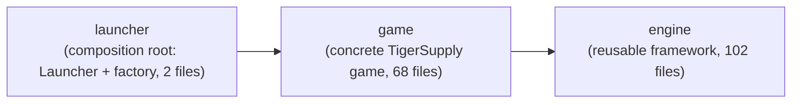

# Dependencies

## Internal Dependencies

### `launcher` depends on `game`
- **Type**: Compile (Maven module dependency declared in
  [launcher/pom.xml](../../../launcher/pom.xml)).
- **Reason**: `launcher` is the composition root: `TigerSupplySceneManagerFactory` references
  `game.control.TigerSupplySceneManager` to bind the concrete game into the engine's `GameFrame`. The
  launcher also packages the runnable uber-jar (via shade) that bundles `game` (and
  transitively `engine`) plus resources.

### `game` depends on `engine`
- **Type**: Compile (Maven module dependency declared in
  [game/pom.xml](../../../game/pom.xml)).
- **Reason**: `game` holds the concrete TigerSupply content (`game.*`, formerly
  `engine.impl.*`) and builds on the engine framework (entity/sprite/collision model, asset
  repositories, UI, state machine, window shell).

> All three modules now contain source and are exercised at build time: `engine` compiles
> standalone, `game` compiles against `engine`, and `launcher` compiles against `game` and
> produces the runnable `tigersupply.jar`.

### Layering & coupling (informative, not a Maven dependency)
- The `engine` framework packages (`entity`, `sprite`, `image.*`, `audio.*`, `font.repository`,
  `background`, `path`, `ui`, `statemachine`, `utils`, `control`, `windows`) are self-contained
  and hold **no** reference to any `game.*` type — the module boundary now enforces the
  layering that was previously only a convention (verified: 0 `engine → game` references).
- The `game.*` packages (TigerSupply's concrete game) depend heavily on the `engine` framework,
  as expected.
- `game.control.SceneFlowController` and `game.control.TigerSupplySceneManager` wire the game internals
  together at startup (reaching into every `game.*` sub-package and every framework singleton).
- The single seam binding the two modules is `engine.control.SceneManagerFactory`, implemented
  by `launcher.TigerSupplySceneManagerFactory` — the only class outside `game.*` that names a
  concrete game type.

## External Dependencies

### `org.junit.jupiter:junit-jupiter-api`
- **Version**: 5.11.0 (via `org.junit:junit-bom:5.11.0` dependency-management import in the
  root [pom.xml](../../../pom.xml)).
- **Purpose**: Declared unit-testing API in every module (`test` scope). Currently unused —
  no test classes exist.
- **License**: Eclipse Public License 2.0.

### `org.junit.jupiter:junit-jupiter-params`
- **Version**: 5.11.0 (same BOM).
- **Purpose**: Declared parameterized-test support (`test` scope, root and `engine` POMs
  only). Currently unused.
- **License**: Eclipse Public License 2.0.

No other external (non-JDK) libraries are declared anywhere in the reactor — the engine's
rendering, audio, XML parsing and reflection all come from the Java SE 17 standard library
itself. There are no transitive runtime dependencies to audit. The only non-core Maven build
plugins are `maven-shade-plugin` (3.6.0) and `exec-maven-plugin` (3.5.0) in the `launcher`
module; both affect packaging/running only and introduce no runtime library dependency.
