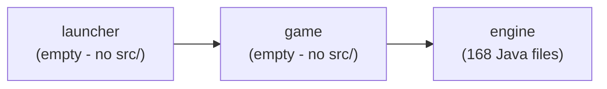

# Dependencies

## Internal Dependencies

### `launcher` depends on `game`
- **Type**: Compile (Maven module dependency declared in
  [launcher/pom.xml](../../../launcher/pom.xml)).
- **Reason**: `launcher` is reserved to become the distributable/packaging module that would
  sit on top of the finished game; the dependency is declared ahead of any actual code.

### `game` depends on `engine`
- **Type**: Compile (Maven module dependency declared in
  [game/pom.xml](../../../game/pom.xml)).
- **Reason**: `game` is reserved to eventually hold TigerSupply-specific content split out of
  `engine`'s current `impl.*` packages; the dependency is declared ahead of any actual code.

> Because `game` and `launcher` have no source files, the **only module with a compile-time
> effect today is `engine`** — the module graph above is aspirational/scaffolding for a future
> refactor rather than a currently exercised dependency chain.

### Intra-package coupling inside `engine` (informative, not a Maven dependency)
- The framework packages (`entity`, `sprite`, `image.*`, `audio.*`, `font.repository`,
  `background`, `path`, `ui`, `statemachine`, `utils`, `control`) are self-contained and do
  **not** depend on the `impl.*` packages — this is the healthiest layering boundary in the
  codebase.
- The `impl.*` packages (TigerSupply's concrete game) depend heavily on the framework
  packages, as expected.
- `impl.control.GameFlowController` and `impl.control.GameManager` are the composition root:
  they are the only classes that reach into essentially every other `impl.*` sub-package and
  every framework singleton to wire the game together at startup.

## External Dependencies

### `org.junit.jupiter:junit-jupiter-api`
- **Version**: 5.11.0 (via `org.junit:junit-bom:5.11.0` dependency-management import in the
  root [pom.xml](../../../pom.xml)).
- **Purpose**: Declared unit-testing API in every module (`test` scope). Currently unused —
  no test classes exist.
- **License**: Eclipse Public License 2.0.

### `org.junit.jupiter:junit-jupiter-params`
- **Version**: 5.11.0 (same BOM).
- **Purpose**: Declared parameterized-test support (`test` scope, root and `engine` POMs
  only). Currently unused.
- **License**: Eclipse Public License 2.0.

No other external (non-JDK) libraries are declared anywhere in the reactor — the engine's
rendering, audio, XML parsing and reflection all come from the Java SE 17 standard library
itself. There are no transitive runtime dependencies to audit.
