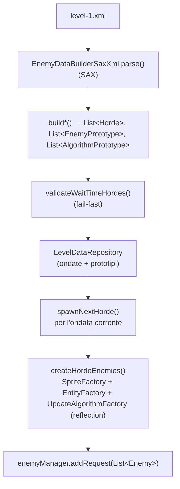

# Caricamento dei dati del livello (modulo game)

> **Indice correlato**: [Ciclo di vita dello spawn dei nemici](index.md)

> **Modulo:** `game` — **esempio implementativo** guidato dai dati. Questa pagina descrive come
> l'XML del livello diventa nemici concreti in scena. È la controparte "dati" del
> [sequenziamento a stati](sequenziamento-horde.md); il framework a stati generico è invece nel
> [modulo engine](motore-macchina-a-stati.md).

## Indice

1. [Contesto](#1-contesto)
2. [Descrizione dei componenti](#2-descrizione-dei-componenti)
3. [Flusso dati](#3-flusso-dati)
4. [Punti di integrazione](#4-punti-di-integrazione)
5. [Stato dell'engine toccato](#5-stato-dellengine-toccato)

---

## 1. Contesto

### Scopo
Trasformare la definizione dichiarativa del livello
([level-1.xml](../../../game/src/main/resources/level/level-1.xml)) in strutture in memoria (ondate
e prototipi) e, ondata dopo ondata, in istanze di `Enemy` pronte per la scena.

### Obiettivo
Due fasi distinte:

1. **Caricamento (una tantum):** `HordeSpawner.loadLevelData()` fa il parse SAX dell'XML, **valida**
   le ondate temporizzate e popola `LevelDataRepository`.
2. **Generazione (su richiesta):** `HordeSpawner.spawnNextHorde()` istanzia — per **reflection** —
   sprite, nemici e algoritmi di movimento dell'ondata corrente e li consegna a `EnemyManager`.

### Trigger
- **Caricamento:** `EnemyManager.initComponents()` durante l'avvio della `LevelScene` (una volta).
- **Generazione:** lo stato `StateSpawningHorde`, a ogni ondata (vedi
  [sequenziamento-horde.md](sequenziamento-horde.md)).

### Concetti locali
- **Prototipo**: modello riusabile (nemico o algoritmo) referenziato per nome dalle ondate.
- **Reflection**: nomi di classe pienamente qualificati nell'XML istanziati a runtime tramite
  `EntityFactory` e `UpdateAlgorithmFactory`.

---

## 2. Descrizione dei componenti

| Componente | Modulo | Classe/Interfaccia | Responsabilità |
|---|---|---|---|
| Interfaccia builder | `game` | `EnemyDataBuilder` | Contratto: `parse()`, `buildHordes()`, `buildEnemyPrototypes()`, `buildAlgorithmPrototypes()`. |
| Parser | `game` | `EnemyDataBuilderSaxXml` | Handler SAX che riempie ondate e prototipi dai tag XML. |
| Repository | `game` | `LevelDataRepository` | Custodisce ondate + prototipi; lookup per indice (ondate) e per nome (prototipi). |
| Coordinatore | `game` | `HordeSpawner` | Orchestratore: carica, valida, istanzia i nemici dell'ondata. |
| Modello dati | `game` | `Horde`, `GenerateEvent`, `EnemyDefinition`, `EnemyPrototype`, `AlgorithmPrototype`, … | POJO che rispecchiano i tag XML. |
| Fabbriche (engine) | `engine` | `SpriteFactory`, `EntityFactory`, `UpdateAlgorithmFactory` | Creano sprite, entità e algoritmi (le ultime due per reflection). |

> **Il seam di reflection è nell'engine.** I nomi di classe dell'XML sono istanziati da
> `EntityFactory` e `UpdateAlgorithmFactory`, che stanno nel modulo `engine`. Il gioco fornisce i
> **nomi** (nell'XML) e i **tipi concreti** (`game.entity.*`, `engine.entity.logic.*`); l'engine
> fornisce il meccanismo di creazione.

---

## 3. Flusso dati

### Fase 1 — caricamento (`loadLevelData()`)

1. `builder.parse()` legge l'XML con SAX; ogni `startElement` costruisce il POJO corrispondente
   (`<horde>` → `Horde`, `<enemy>` → `EnemyDefinition`, `<enemyPrototype>` → `EnemyPrototype`, …).
2. `buildHordes()` / `buildEnemyPrototypes()` / `buildAlgorithmPrototypes()` restituiscono le liste.
3. `validateWaitTimeHordes(hordes)` scorre le ondate e **fallisce subito** se un'ondata `hordeTimed`
   ha `time` assente o non numerico.
4. Le tre liste vengono riposte in `LevelDataRepository`.

### Fase 2 — generazione (`spawnNextHorde()`)

1. `createHordeEnemies()` legge l'ondata all'indice corrente e, per ogni `EnemyDefinition`:
   - risolve `EnemyPrototype` e `AlgorithmPrototype` per **nome** dal repository;
   - crea lo `Sprite` via `SpriteFactory.createImageSingleSprite(alias)`;
   - crea l'algoritmo via `UpdateAlgorithmFactory.newInstance(classe, proprietà)` (**reflection**);
   - crea l'`Enemy` via `EntityFactory.createEntity(x, y, z, vx, vy, scala, algoritmo, sprite, classe)` (**reflection**);
   - inietta effect/shot/enemy manager, target (il player) e contesto.
2. `createHordeEvent()` costruisce l'`Event` con il `name` del `generateEvent`; se è `hordeTimed`,
   fa il parse del `time` in `currentWaitTime`.
3. `enemyManager.addRequest(horde)` accoda i nemici; `advanceHorde()` incrementa l'indice.

---

## 4. Punti di integrazione

### Elementi e attributi XML

| Tag | Attributi | POJO | Note |
|---|---|---|---|
| `<horde>` | — | `Horde` | Ondata; ordine di dichiarazione = ordine di spawn. |
| `<generateEvent>` | `name`, `time` | `GenerateEvent` | `name` ∈ {`hordeTimed`, `hordeClearable`, `bossSpawned`}; `time` in secondi (solo `hordeTimed`). |
| `<enemy>` | `enemyPrototype`, `algorithmPrototype`, `posX`, `posY`, `posZ` | `EnemyDefinition` | Riferimenti per nome + posizione (la risoluzione assume 1360×660). |
| `<enemyPrototype>` | `name`, `type`, `class` | `EnemyPrototype` | `type` oggi è sempre `imageSingleSprite`; `class` è l'FQN del nemico. |
| `<speed>` / `<image>` / `<scale>` | vari | `Speed` / `Image` / `Scale` | Attributi del prototipo nemico. `image alias` risolto dal catalogo immagini. |
| `<algorithmPrototype>` | `name`, `class` | `AlgorithmPrototype` | `class` è l'FQN dell'algoritmo (`engine.entity.logic.*`). |
| `<algorithmProperties>` | — | `AlgorithmProperties` | Contenitore di parametri semplici e liste di punti. |
| `<property>` | `name`, `value` | proprietà semplice | Es. `delta`, `increment`. |
| `<listPoints>` / `<point>` | `name` / `posX`, `posY` | `List<PointDefinition>` | Waypoint per gli algoritmi a spline (B-spline). |

### File esterni

| File | Ruolo |
|---|---|
| [level/level-1.xml](../../../game/src/main/resources/level/level-1.xml) | Definizione autorevole del livello (caricata dal classpath). |
| `image-catalog.txt` | Risolve gli alias `<image alias="…">` in immagini reali. |

---

## 5. Stato dell'engine toccato

| Elemento | Modulo | Letto / scritto | Note |
|---|---|---|---|
| `LevelDataRepository` | `game` | scritto in caricamento, letto in generazione | Fonte in memoria di ondate e prototipi. |
| `EnemyManager` (gruppo entità) | `game` | scritto via `addRequest(...)` | I nemici generati entrano in scena. |
| `SpriteFactory` (singleton) | `engine` | letto | Crea gli sprite dagli alias immagine. |
| `EntityFactory` (singleton) | `engine` | letto | Istanzia i nemici per reflection dall'FQN. |
| `UpdateAlgorithmFactory` | `engine` | letto | Istanzia gli algoritmi di movimento per reflection. |

### Casi limite e sicurezza

| Situazione | Comportamento |
|---|---|
| Ondata `hordeTimed` senza `time` valido | `validateWaitTimeHordes` lancia un'eccezione che **nomina l'indice** dell'ondata; il livello non parte. |
| `time` dichiarato su un'ondata **non** `hordeTimed` | Ignorato: la validazione passa e il valore non ha effetto sul sequenziamento. |
| `enemyPrototype` / `algorithmPrototype` con nome inesistente | Il lookup nel repository restituisce `null` → `NullPointerException` alla generazione. |
| FQN di classe nemico/algoritmo errato | La factory di reflection fallisce; l'eccezione viene ripropagata da `createHordeEnemies`. |
| `type` diverso da `imageSingleSprite` | Nessun ramo lo gestisce: l'entità resta `null` (oggi tutti i prototipi usano `imageSingleSprite`). |

> **Nota.** La validazione fail-fast riguarda **solo** il `time` delle ondate `hordeTimed`: rende
> ogni attesa temporizzata esplicita e leggibile, senza fallback a un valore di default.
