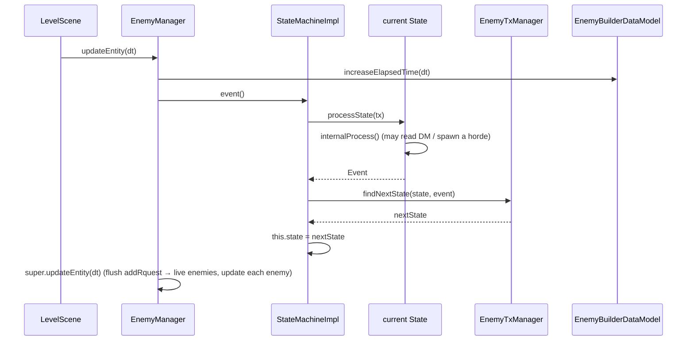
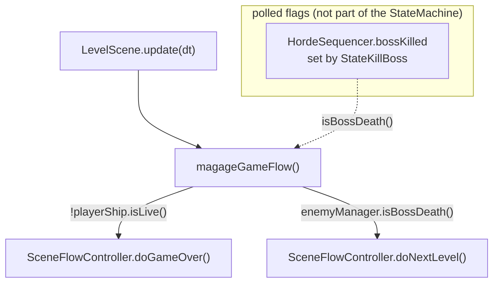

# Flow 1 — Ticking the Enemy Spawn State Machine

> **Related index**: [Enemy Spawn Lifecycle & State Machine](index.md)

## Table of Contents

1. [Context](#1-context)
2. [Component Descriptions](#2-component-descriptions)
3. [Data Flow](#3-data-flow)
4. [The transition table](#4-the-transition-table)
5. [Relationship to the outer scene-flow control](#5-relationship-to-the-outer-scene-flow-control)
6. [Engine State Touched](#6-engine-state-touched)

---

## 1. Context

**Purpose.** Describe exactly what happens on a single frame tick of the enemy spawn state
machine: how the current state is executed, how it emits an `Event`, and how `EnemyTxManager`
maps `(state, event)` to the next state.

**Goal.** Make it obvious that the machine advances **one edge per frame**, that spawning happens
only inside `StateGenerateHorde`, and that level progression is decided **outside** this machine.

**Trigger.** The per-frame `update` of the active `LevelScene`:
`LevelScene.update(dt)` → `enemyManager.updateEntity(dt)` (only while the game is not paused/stopped).

**Flow-local key concepts.**

- **One transition per tick.** `StateMachine.event()` executes the *current* state's
  `processState` once and replaces the current state with whatever `findNextState` returns. A
  "spawn then wait" chain therefore spans several frames.
- **Shared timer.** `elapsedTime` is incremented **before** `event()` on every frame, in
  `EnemyManager.updateEntity`, regardless of the current state.
- **Deferred spawn.** Enemies created during the tick are queued via `addRquest` and only inserted
  into the live group at the end of the same `updateEntity` call (see [§6](#6-engine-state-touched)).

---

## 2. Component Descriptions

| Component | Module | Class / Interface | Responsibility |
|-----------|--------|-------------------|----------------|
| Scene tick | game | [`LevelScene`](../../../game/src/main/java/it/spaghettisource/tigersupply/game/scene/LevelScene.java) | Calls `enemyManager.updateEntity(dt)` each frame; separately polls boss/player death. |
| Machine owner | game | [`EnemyManager`](../../../game/src/main/java/it/spaghettisource/tigersupply/game/entity/EnemyManager.java) | Increments `elapsedTime`, calls `stateMachine.event()`, then flushes queued enemies. |
| Machine | engine | [`StateMachineImpl`](../../../engine/src/main/java/it/spaghettisource/tigersupply/engine/statemachine/StateMachineImpl.java) | Holds current `State` + `TransactionManager`; `event()` runs one transition. |
| State base | engine / game | [`AbstractState`](../../../engine/src/main/java/it/spaghettisource/tigersupply/engine/statemachine/AbstractState.java) → [`StateAbstract`](../../../game/src/main/java/it/spaghettisource/tigersupply/game/scene/statemachine/StateAbstract.java) | `processState` = run `internalProcess()` to get an `Event`, then ask the tx manager for the next state. |
| Concrete states | game | [`StateWaitTime`](../../../game/src/main/java/it/spaghettisource/tigersupply/game/scene/statemachine/StateWaitTime.java), [`StateGenerateHorde`](../../../game/src/main/java/it/spaghettisource/tigersupply/game/scene/statemachine/StateGenerateHorde.java), [`StateWaitKill`](../../../game/src/main/java/it/spaghettisource/tigersupply/game/scene/statemachine/StateWaitKill.java), [`StateKillBoss`](../../../game/src/main/java/it/spaghettisource/tigersupply/game/scene/statemachine/StateKillBoss.java) | Compute the event for the current situation. |
| Transition table | game | [`EnemyTxManager`](../../../game/src/main/java/it/spaghettisource/tigersupply/game/scene/statemachine/EnemyTxManager.java) | Maps `(stateName, eventName)` → next `State`. |
| Shared model | game | [`EnemyBuilderDataModel`](../../../game/src/main/java/it/spaghettisource/tigersupply/game/scene/statemachine/EnemyBuilderDataModel.java) | Owns `elapsedTime` and delegates to the `HordeSequencer`. |

---

## 3. Data Flow

**Step by step.**

1. `LevelScene.update` guards on `!paused && !stop`, then calls `enemyManager.updateEntity(dt)`.
2. `EnemyManager` calls `dataModel.increaseElapsedTime(dt)` — the shared timer advances **every**
   frame, in every state.
3. `EnemyManager` calls `stateMachine.event()`.
4. `StateMachineImpl.event()` calls `state.processState(trxManager)`.
5. `AbstractState.processState` runs `internalProcess()` to produce an `Event` (wrapping any
   thrown exception in a `StateMachineException`), then calls `trxManager.findNextState(this, event)`.
6. The returned `State` becomes the new current state. **Only one edge is walked this frame.**
7. Back in `EnemyManager.updateEntity`, `super.updateEntity(dt)` updates every live enemy and
   **flushes** any enemies queued during step 5 (relevant only when the state was
   `StateGenerateHorde`).

> **Why spawning is safe.** `StateGenerateHorde` runs in step 5 and queues enemies with
> `addRquest`; the flush in step 7 inserts them the *same* frame. The transition to
> `StateWaitKill` also happened in step 5, so the earliest `StateWaitKill` check runs a frame
> later — by then the enemies are live and `isKilledAllEnemiesInScene()` correctly returns
> `false`.

---

## 4. The transition table

`EnemyTxManager.findNextState` is a hard-coded `(stateName, eventName)` switch. Unknown states
raise `StateMachineUnsupportedState`; unknown events for a known state raise
`StateMachineUnsupportedEvent`.

| Current state | Incoming event | Next state |
|---------------|----------------|------------|
| `generateHorde` | `waitKill` (`EVENT_WAIT_KILL`) | `StateWaitKill` |
| `generateHorde` | `waitTime` (`EVENT_WAIT_TIME`) | `StateWaitTime` |
| `generateHorde` | `bossGenerated` (`EVENT_BOSS_GENERATED`) | `StateKillBoss` |
| `waitTime` | `wait` (`EVENT_WAIT`) | *(stay)* `StateWaitTime` |
| `waitTime` | `newHorde` (`EVENT_NEW_HORDE`) | `StateGenerateHorde` |
| `waitKill` | `wait` | *(stay)* `StateWaitKill` |
| `waitKill` | `newHorde` | `StateGenerateHorde` |
| `killBoss` | `wait` | *(stay)* `StateKillBoss` |
| `killBoss` | `bossKilled` (`EVENT_BOSS_KILLED`) | *(stay)* `StateKillBoss` |

> **Asymmetry — the `generateHorde` events are XML-driven.** For the three `generateHorde` rows,
> the incoming event is exactly the horde's `<generateEvent name="…">` from the level XML (returned
> by `HordeSequencer.spawnNextHorde`). For the `waitTime`/`waitKill`/`killBoss` rows the event is
> computed by the state itself from the game situation (timer elapsed / group empty).

> **`killBoss` is terminal.** Both of its events keep it in `killBoss`. The `bossKilled` event's
> side effect (`dataModel.bossKilled()`) has already flipped the flag that the *other* control loop
> polls — see [§5](#5-relationship-to-the-outer-scene-flow-control).

---

## 5. Relationship to the outer scene-flow control

The spawn machine never changes the scene. Level progression lives in a separate, informal loop
in the same frame:

- `LevelScene.magageGameFlow()` runs every frame **before** the entities update.
- `enemyManager.isBossDeath()` simply returns `HordeSequencer.isBossDead()` — the `bossKilled`
  flag that `StateKillBoss.internalProcess()` sets via `dataModel.bossKilled()`.
- When that flag is set, `SceneFlowController.doNextLevel()` swaps the active scene; the spawn
  machine keeps looping harmlessly in `killBoss` until the `EnemyManager` is discarded/reset.

> This split is the intended design (`EnemyTxManager` even comments on the "other state machine"),
> but it means the answer to *"how does the level end?"* is **not** in the state machine.

---

## 6. Engine State Touched

| State / collection | Read | Written | Notes |
|--------------------|------|---------|-------|
| `EnemyBuilderDataModel.elapsedTime` | `StateWaitTime` | `EnemyManager` (each frame), `StateWaitTime` (reset on entry) | Global timer; drives the fixed ~1s `waitTime`. |
| `EnemyManager` live group (`entities`) | `StateWaitKill`, `StateKillBoss` via `isEnemyManagerEmpty()` | flushed from `entityRequest` in `super.updateEntity` | Deferred insertion: queued in `StateGenerateHorde`, inserted at end of the same tick. |
| `HordeSequencer.hordeIndex` | — | `StateGenerateHorde` (via `spawnNextHorde` → `advanceHorde`) | Advances after every spawned horde. |
| `HordeSequencer.bossKilled` | `LevelScene.magageGameFlow` (poll) | `StateKillBoss` | The bridge to the outer scene-flow loop. |

**Edge cases & safety checks.**

- Any exception thrown by a state's `internalProcess()` is wrapped into a `StateMachineException`
  by `AbstractState.processState` and propagates out through `updateEntity` / `LevelScene.update`.
- An unhandled `(state, event)` pair throws `StateMachineUnsupportedEvent`; an unknown state name
  throws `StateMachineUnsupportedState` — both surface as a `StateMachineException` cause.
- The machine has **no explicit terminal transition** for "level complete"; it relies on the
  scene being swapped by the outer loop.
