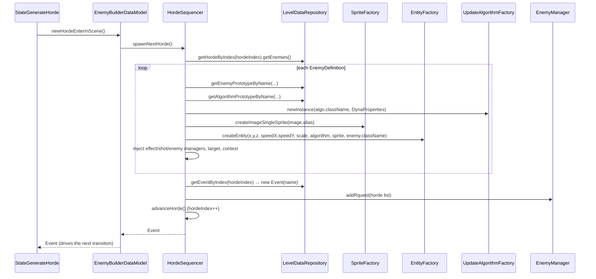

# Flow 2 — Spawning a Horde's Entities

> **Related index**: [Enemy Spawn Lifecycle & State Machine](index.md)

## Table of Contents

1. [Context](#1-context)
2. [Component Descriptions](#2-component-descriptions)
3. [Data Flow](#3-data-flow)
4. [Integration Points](#4-integration-points)
5. [Engine State Touched](#5-engine-state-touched)

---

## 1. Context

**Purpose.** Describe how one horde becomes live `Enemy` entities: from the XML definitions and
prototypes held in the `LevelDataRepository`, through the engine factories and reflection, into
the `EnemyManager` group.

**Goal.** Show that entity creation is entirely **data-driven** — classes and assets are named as
strings in the XML and resolved by alias/reflection — and that the state machine only *triggers*
this, it does not build anything itself.

**Trigger.** The state machine enters `StateGenerateHorde` and runs its `internalProcess()`, which
calls `dataModel.newHordeEnterInScene()` → `HordeSequencer.spawnNextHorde()`.

**Flow-local key concepts.**

- **Prototype resolution.** An `EnemyDefinition` references an `EnemyPrototype` and an
  `AlgorithmPrototype` by `name`; `LevelDataRepository` resolves them by linear search.
- **Reflection.** Both the enemy class (`EnemyPrototype.className`) and the movement algorithm
  (`AlgorithmPrototype.className`) are instantiated from fully-qualified class names via the engine
  factories.
- **Deferred insertion.** Built enemies are handed to `enemyManager.addRquest(list)`; they go live
  on the flush at the end of the current `EnemyManager.updateEntity` tick.

---

## 2. Component Descriptions

| Component | Module | Class / Interface | Responsibility |
|-----------|--------|-------------------|----------------|
| Spawn state | game | [`StateGenerateHorde`](../../../game/src/main/java/it/spaghettisource/tigersupply/game/scene/statemachine/StateGenerateHorde.java) | Calls the data model and returns the horde's `generateEvent`. |
| Data model | game | [`EnemyBuilderDataModel`](../../../game/src/main/java/it/spaghettisource/tigersupply/game/scene/statemachine/EnemyBuilderDataModel.java) | `newHordeEnterInScene()` delegates to `HordeSequencer.spawnNextHorde()`. |
| Sequencer / builder | game | [`HordeSequencer`](../../../game/src/main/java/it/spaghettisource/tigersupply/game/builder/HordeSequencer.java) | Builds the horde's enemies, creates the event, registers them, advances `hordeIndex`. |
| Level data | game | [`LevelDataRepository`](../../../game/src/main/java/it/spaghettisource/tigersupply/game/scene/definition/LevelDataRepository.java) | Holds hordes + prototypes; resolves prototypes by `name` and hordes by index. |
| Sprite factory | engine | [`SpriteFactory`](../../../engine/src/main/java/it/spaghettisource/tigersupply/engine/sprite/SpriteFactory.java) | `createImageSingleSprite(alias)` builds the visual from a catalog alias. |
| Entity factory | engine | [`EntityFactory`](../../../engine/src/main/java/it/spaghettisource/tigersupply/engine/entity/EntityFactory.java) | `createEntity(...)` instantiates the enemy class by name and wires position/speed/scale/algorithm/sprite. |
| Algorithm factory | engine | [`UpdateAlgorithmFactory`](../../../engine/src/main/java/it/spaghettisource/tigersupply/engine/entity/logic/UpdateAlgorithmFactory.java) | `newInstance(className, props)` instantiates the movement algorithm by name. |
| Enemy | game | [`Enemy`](../../../game/src/main/java/it/spaghettisource/tigersupply/game/entity/Enemy.java) | The built entity; receives effect/shot/enemy managers, target and context. |
| Enemy group | game | [`EnemyManager`](../../../game/src/main/java/it/spaghettisource/tigersupply/game/entity/EnemyManager.java) | Receives the horde via `addRquest`; becomes the live enemy group. |

---

## 3. Data Flow



**Step by step (`HordeSequencer.spawnNextHorde`).**

1. **Build enemies** — `createHordeEnemies()` reads the current horde's `EnemyDefinition`s. For
   each one it resolves the enemy and algorithm prototypes by name, then (only for
   `type == "imageSingleSprite"`):
   - `createUpdateAlgorithm(algorithmDef)` builds a `DynaProperties` bean from the prototype's
     single properties plus any list-of-`Point` properties (e.g. waypoints), then
     `UpdateAlgorithmFactory.newInstance(className, props)` instantiates the movement strategy.
   - `SpriteFactory.createImageSingleSprite(image.alias)` builds the sprite.
   - `EntityFactory.createEntity(...)` instantiates the enemy class (`enemyDef.getClassName()`)
     with position, speed, scale, algorithm and sprite.
   - The enemy is wired with the effect manager, shot manager, enemy manager, target (the player)
     and the game context.
2. **Create the event** — `createHordeEvent()` reads `getEventByIndex(hordeIndex)` and wraps its
   `name` in an `Event`. This is the transition trigger for [Flow 1](enemy-spawn-state-machine.md).
3. **Register** — `enemyManager.addRquest(horde)` queues the whole list for deferred insertion.
4. **Advance** — `advanceHorde()` increments `hordeIndex` so the next call builds the next horde.

> **Order matters.** The event is read for the **same** `hordeIndex` that was just built, and only
> then is `hordeIndex` advanced. So the returned event belongs to the horde that just entered the
> scene (see the Design Observations in the [hub](index.md#10-design-observations--asymmetries)).

---

## 4. Integration Points

The level XML (`level/level-1.xml`) is the external contract. Relevant elements:

```xml
<horde>
    <generateEvent name="waitTime" time="1" />              <!-- name: transition trigger; time: UNUSED -->
    <enemy enemyPrototype="sinusoidal" posX="1350" posY="350" posZ="20" algorithmPrototype="pathUp" />
</horde>
```

| XML element / attribute | Maps to | Consumed by |
|-------------------------|---------|-------------|
| `<horde>` | `Horde` | ordered, indexed by `hordeIndex` |
| `<generateEvent name>` | `GenerateEvent.name` → `Event` | `EnemyTxManager` transition out of `generateHorde` |
| `<generateEvent time>` | `GenerateEvent.time` | **nothing** (parsed, never read) |
| `<enemy enemyPrototype>` | `EnemyDefinition.enemyPrototype` | `getEnemyPrototypeByName` |
| `<enemy algorithmPrototype>` | `EnemyDefinition.algorithmPrototype` | `getAlgorithmPrototypeByName` |
| `<enemy posX/posY/posZ>` | spawn coordinates (parsed to `int`) | `EntityFactory.createEntity` |
| `EnemyPrototype.className` (from the `<enemyPrototypes>` section) | fully-qualified enemy class | `EntityFactory` (reflection) |
| `EnemyPrototype.image.alias` | catalog alias | `SpriteFactory` / `ImageRepositoryManager` |
| `AlgorithmPrototype.className` + properties | fully-qualified algorithm class + params | `UpdateAlgorithmFactory` (reflection) |

> **Only `imageSingleSprite` is handled.** `createHordeEnemies` has a single `if` branch on
> `enemyDef.getType()`. Any other `type` leaves `entity == null`, and the following
> `entity.setEffectManager(...)` throws a `NullPointerException` — wrapped and rethrown by the
> surrounding `try/catch`.

> **Fixed playfield.** Spawn coordinates in the XML assume the hard-coded 1360×660 playfield from
> `launcher.Launcher`; they are absolute pixels, not relative.

---

## 5. Engine State Touched

| State / manager | Read | Written | Notes |
|-----------------|------|---------|-------|
| `LevelDataRepository` (hordes + prototypes) | `HordeSequencer` (by index / by name) | populated once in `loadLevelData` | Immutable during the level. |
| `HordeSequencer.hordeIndex` | `createHordeEnemies`, `createHordeEvent` | `advanceHorde` (after each horde) | Off-by-one risk if a horde is missing an event. |
| `EnemyManager.entityRequest` → `entities` | — | `addRquest` (queue) then flush in `updateEntity` | Deferred insertion; enemies go live end of the tick. |
| `ImageRepositoryManager` (via `SpriteFactory`) | `createImageSingleSprite` | — | Alias must exist in the image catalog. |
| Engine factories (`EntityFactory`, `UpdateAlgorithmFactory`) | class names + params | — | Instantiate by reflection; failures throw. |

**Edge cases & safety checks.**

- **Unknown prototype name** → `getEnemyPrototypeByName` / `getAlgorithmPrototypeByName` return
  `null`, causing a `NullPointerException` when the definition is used.
- **Missing catalog alias** → the sprite factory / image repository fails for that alias.
- **Reflection failure** (bad `className`, no matching constructor) → `EntityFactory` /
  `UpdateAlgorithmFactory` throw; `createUpdateAlgorithm` prints the stack trace and rethrows.
- **`loadLevelData` not called** → the repository lists are `null` and the first `spawnNextHorde`
  throws. `EnemyManager.initComponents` guarantees the call order (load before the machine ticks).
