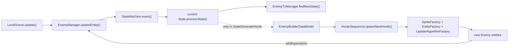
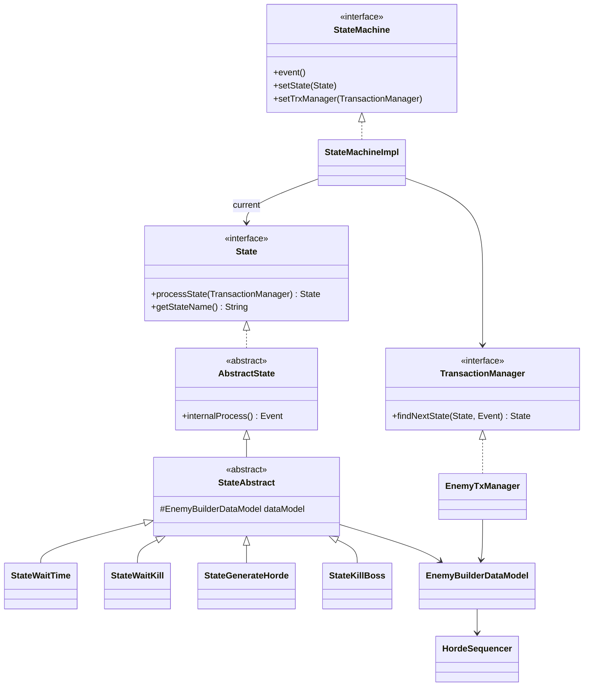
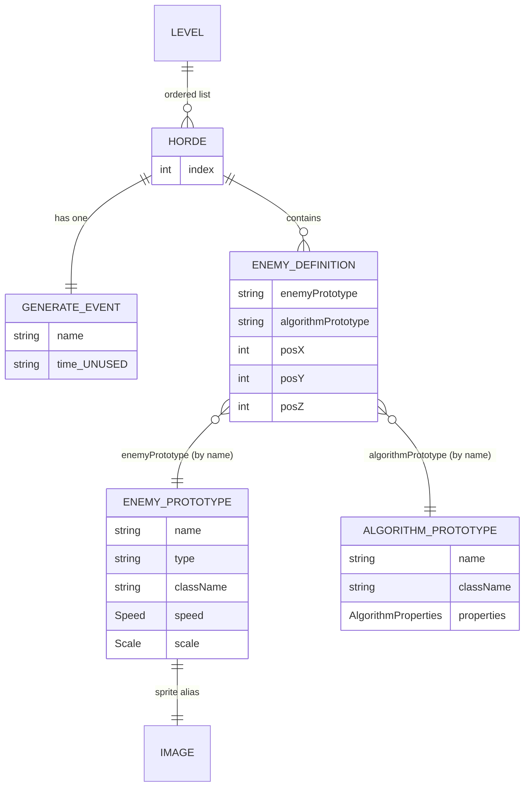
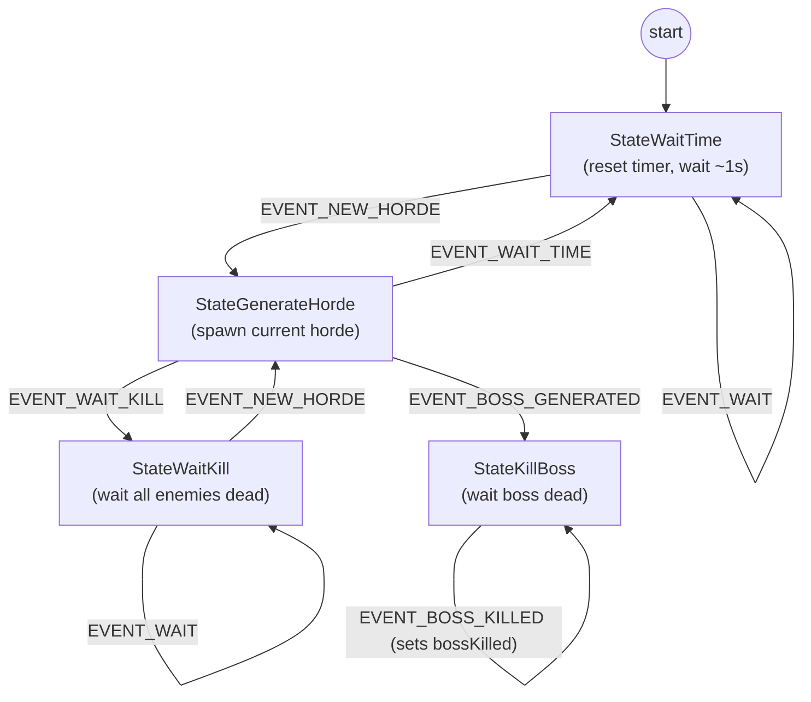

# Enemy Spawn Lifecycle & State Machine

> **Goal of this document:** enable an AI agent or a human developer to understand **how new
> enemy entities are spawned into a level** and **how the enemy state machine sequences those
> spawns**, and to add a new horde (or a new spawn state) by following the recipe. It also makes
> the non-obvious design decisions explicit so the flow stops feeling confusing.

## Table of Contents

1. [Overview](#1-overview)
2. [System Context](#2-system-context)
3. [Key Concepts](#3-key-concepts)
4. [Component Inventory](#4-component-inventory)
5. [Data & Configuration Model](#5-data--configuration-model)
6. [Lifecycle: the spawn state machine](#6-lifecycle-the-spawn-state-machine)
7. [Flows Documentation](#7-flows-documentation)
8. [Recipes](#8-recipes)
9. [Reference Scenario](#9-reference-scenario)
10. [Design Observations & Asymmetries](#10-design-observations--asymmetries)

---

## 1. Overview

### What is the "enemy spawn lifecycle"?

In game/design terms, a **level** is a scripted sequence of enemy **waves**. TigerSupply calls a
single wave a **horde**. The level does not throw every enemy on screen at once: it releases one
horde, waits for a condition (a short delay, or "all current enemies destroyed"), then releases
the next horde, until the final **boss** horde. The **enemy spawn lifecycle** is the mechanism
that decides *when* the next horde appears and *builds* its enemy entities.

Technically, this is a small **State-pattern state machine** (four states) that is ticked once
per frame from the level's `update` loop. The state machine never builds enemies itself — when it
enters the "generate" state it delegates to a **`HordeSequencer`**, which reads the current horde
from the parsed level XML and instantiates the enemy entities through the engine factories.

| Reference | Entry point |
|-----------|-------------|
| Level tick that drives everything | [`LevelScene.update`](../../../game/src/main/java/it/spaghettisource/tigersupply/game/scene/LevelScene.java) |
| The ticked machine + its owner | [`EnemyManager`](../../../game/src/main/java/it/spaghettisource/tigersupply/game/entity/EnemyManager.java) |
| Horde/entity builder | [`HordeSequencer`](../../../game/src/main/java/it/spaghettisource/tigersupply/game/builder/HordeSequencer.java) |
| The scripted level | [`level/level-1.xml`](../../../game/src/main/resources/level/level-1.xml) |

---

## 2. System Context

The subsystem is **partly in-process and partly data-driven**.

| Resource | Role | Authoritative for |
|----------|------|-------------------|
| `game/src/main/resources/level/level-1.xml` | The scripted level: an ordered list of hordes, plus reusable enemy and algorithm prototypes. | *Which* enemies spawn, *where*, *in what order*, and *what condition* gates the next horde. |
| `image-catalog.txt` (+ audio/font catalogs) | Preloaded asset repositories referenced by alias from the XML `<image>` element. | The pixels/sound behind a prototype. |
| Fully-qualified Java class names in the XML | The `className` of an enemy prototype and of an algorithm prototype, instantiated by reflection. | The *behaviour* class bound to a prototype. |

> **Integration style — two mechanisms, not one.** The horde **sequencing** is a formal
> `StateMachine` (engine `it.spaghettisource.tigersupply.engine.statemachine`). The level
> **progression** (boss dead → next level, player dead → game over) is *not* part of that machine;
> it is an in-process **polling** check inside `LevelScene.magageGameFlow()` that calls the
> `SceneFlowController` singleton. Keeping these two apart is the single biggest source of
> "where is this decided?" confusion — see [§10](#10-design-observations--asymmetries).

---

## 3. Key Concepts

### 3.1 Horde
One scripted wave of enemies (a `<horde>` element). It owns a list of `EnemyDefinition`s and
exactly one `generateEvent`. Modelled by
[`Horde`](../../../game/src/main/java/it/spaghettisource/tigersupply/game/scene/definition/Horde.java).

### 3.2 Prototype (enemy & algorithm)
A **reusable template** referenced by `name`. An `EnemyPrototype` carries the sprite image, speed,
scale and the enemy `className`; an `AlgorithmPrototype` carries a movement `className` plus its
parameters. A horde's `EnemyDefinition` only holds *references* (`enemyPrototype`,
`algorithmPrototype`) plus a spawn position — the heavy data lives once in the prototype.

### 3.3 `generateEvent` — a transition trigger, not a wave name
Each horde declares `<generateEvent name="…" time="…" />`. The `name` is the **event** that the
machine emits **after** that horde is spawned, deciding what to do next:

| `name` | Meaning after the horde spawns | Constant |
|--------|--------------------------------|----------|
| `waitTime` | wait a fixed delay, then spawn the next horde | `GameResources.EVENT_WAIT_TIME` |
| `waitKill` | wait until every enemy on screen is destroyed, then spawn the next horde | `GameResources.EVENT_WAIT_KILL` |
| `bossGenerated` | this was the boss horde: go to the terminal "wait for boss death" state | `GameResources.EVENT_BOSS_GENERATED` |

> **Important:** the `time` attribute is parsed into `GenerateEvent.time` but is **never read**;
> `StateWaitTime` hard-codes a 1-second wait. See [§10](#10-design-observations--asymmetries).

### 3.4 State vs Event (and the shared string space)
A **State** is a node the machine sits in (`waitTime`, `waitKill`, `generateHorde`, `killBoss`).
An **Event** is emitted by a state's `internalProcess()` and consumed by `EnemyTxManager` to pick
the next state. Both are plain strings from `GameResources`, and some **event and state literals
are identical** (`"waitKill"`, `"waitTime"`). They are only disambiguated because the transition
table keys on the **pair** `(currentStateName, eventName)`.

### 3.5 The shared data model (`EnemyBuilderDataModel`)
The state instances are stateless-ish strategies; the data they read/write lives in one shared
[`EnemyBuilderDataModel`](../../../game/src/main/java/it/spaghettisource/tigersupply/game/scene/statemachine/EnemyBuilderDataModel.java):
the running `elapsedTime`, plus delegate methods onto the `HordeSequencer`
(`newHordeEnterInScene`, `isKilledAllEnemiesInScene`, `bossKilled`).

### 3.6 One transition per frame
`StateMachine.event()` runs the **current** state exactly once per frame and replaces it with the
returned next state. The machine therefore advances **at most one edge per frame tick**; a
"spawn → wait" chain takes several frames to walk.

---

## 4. Component Inventory

| Layer | Element | Path | Role |
|-------|---------|------|------|
| Engine — contract | `StateMachine` / `StateMachineImpl` | [engine/…/statemachine/StateMachine.java](../../../engine/src/main/java/it/spaghettisource/tigersupply/engine/statemachine/StateMachine.java) · [Impl](../../../engine/src/main/java/it/spaghettisource/tigersupply/engine/statemachine/StateMachineImpl.java) | Holds the current `State` + a `TransactionManager`; `event()` ticks once and reassigns the state. |
| Engine — contract | `State` / `AbstractState` | [State.java](../../../engine/src/main/java/it/spaghettisource/tigersupply/engine/statemachine/State.java) · [AbstractState.java](../../../engine/src/main/java/it/spaghettisource/tigersupply/engine/statemachine/AbstractState.java) | `processState()` runs `internalProcess()` to get an `Event`, then asks the `TransactionManager` for the next state. |
| Engine — contract | `TransactionManager` | [TransactionManager.java](../../../engine/src/main/java/it/spaghettisource/tigersupply/engine/statemachine/TransactionManager.java) | `findNextState(state, event)` — the transition table interface. |
| Engine — value | `Event` | [Event.java](../../../engine/src/main/java/it/spaghettisource/tigersupply/engine/statemachine/Event.java) | Immutable named event. |
| Engine — errors | `StateMachineException` / `…UnsupportedState` / `…UnsupportedEvent` | [statemachine/](../../../engine/src/main/java/it/spaghettisource/tigersupply/engine/statemachine/) | Raised for an unknown state or an unhandled `(state, event)` pair. |
| Game — base | `StateAbstract` | [game/…/statemachine/StateAbstract.java](../../../game/src/main/java/it/spaghettisource/tigersupply/game/scene/statemachine/StateAbstract.java) | Adds the shared `EnemyBuilderDataModel` to every concrete state. |
| Game — states | `StateWaitTime`, `StateWaitKill`, `StateGenerateHorde`, `StateKillBoss` | [statemachine/](../../../game/src/main/java/it/spaghettisource/tigersupply/game/scene/statemachine/) | The four concrete spawn states. |
| Game — table | `EnemyTxManager` | [EnemyTxManager.java](../../../game/src/main/java/it/spaghettisource/tigersupply/game/scene/statemachine/EnemyTxManager.java) | The hard-coded `(state, event) → next state` transition table. |
| Game — model | `EnemyBuilderDataModel` | [EnemyBuilderDataModel.java](../../../game/src/main/java/it/spaghettisource/tigersupply/game/scene/statemachine/EnemyBuilderDataModel.java) | Shared state + delegate onto the `HordeSequencer`. |
| Game — builder | `HordeSequencer` | [HordeSequencer.java](../../../game/src/main/java/it/spaghettisource/tigersupply/game/builder/HordeSequencer.java) | Parses the level, holds `hordeIndex`, and builds each horde's `Enemy` entities. |
| Game — owner | `EnemyManager` | [EnemyManager.java](../../../game/src/main/java/it/spaghettisource/tigersupply/game/entity/EnemyManager.java) | Owns the machine + sequencer, ticks the machine every frame, and is the live enemy group. |
| Game — scene | `LevelScene` | [LevelScene.java](../../../game/src/main/java/it/spaghettisource/tigersupply/game/scene/LevelScene.java) | Drives the frame `update`, and separately polls for boss/player death. |

---

## 5. Data & Configuration Model

The level XML is parsed once (`HordeSequencer.loadLevelData` → `EnemyDataBuilderSaxXml`) into a
[`LevelDataRepository`](../../../game/src/main/java/it/spaghettisource/tigersupply/game/scene/definition/LevelDataRepository.java)
holding three lists: hordes, enemy prototypes, algorithm prototypes. Hordes are consumed by index;
prototypes are resolved by `name`.

| Entity | Role | Looked up by |
|--------|------|--------------|
| `Horde` | The scripted wave; consumed in order via `hordeIndex`. | `LevelDataRepository.getHordeByIndex(i)` |
| `GenerateEvent` | The transition trigger emitted after the wave (`name`); `time` is currently ignored. | `LevelDataRepository.getEventByIndex(i)` |
| `EnemyDefinition` | One enemy instance in a wave: references + spawn `(x,y,z)`. | iterated from `Horde.getEnemies()` |
| `EnemyPrototype` | Reusable enemy template (image, speed, scale, `className`). | `getEnemyPrototypeByName(name)` |
| `AlgorithmPrototype` | Reusable movement template (`className` + params). | `getAlgorithmPrototypeByName(name)` |

> **Only `type = "imageSingleSprite"` is implemented** in `HordeSequencer.createHordeEnemies`.
> An unknown prototype `type` leaves the entity `null` and throws on the next line.

---

## 6. Lifecycle: the spawn state machine

Every frame, `EnemyManager.updateEntity` increments the shared `elapsedTime`, then calls
`stateMachine.event()` (one transition), then flushes newly requested enemies into the live group.
The four states and their transitions:

| State | `internalProcess()` behaviour | Emits | Handled by |
|-------|-------------------------------|-------|------------|
| `StateWaitTime` | On first entry resets `elapsedTime`; emits `NEW_HORDE` once `elapsedTime > 1`s, else `WAIT`. | `EVENT_WAIT` / `EVENT_NEW_HORDE` | `EnemyTxManager` |
| `StateGenerateHorde` | Delegates to `HordeSequencer.spawnNextHorde()` (builds enemies, advances `hordeIndex`) and returns that horde's `generateEvent`. | `EVENT_WAIT_TIME` / `EVENT_WAIT_KILL` / `EVENT_BOSS_GENERATED` | `EnemyTxManager` |
| `StateWaitKill` | Emits `NEW_HORDE` once the live enemy group is empty, else `WAIT`. | `EVENT_WAIT` / `EVENT_NEW_HORDE` | `EnemyTxManager` |
| `StateKillBoss` | Once the group is empty, marks the boss killed and emits `BOSS_KILLED`; the machine then stays here forever (level end is handled elsewhere). | `EVENT_WAIT` / `EVENT_BOSS_KILLED` | `EnemyTxManager` |

The detailed frame-by-frame walk is on the [state-machine flow page](enemy-spawn-state-machine.md);
the enemy-building detail is on the [horde-spawn flow page](horde-spawn-cycle.md).

---

## 7. Flows Documentation

| # | Flow | Trigger | Description | Detail page |
|---|------|---------|-------------|-------------|
| 1 | Ticking the spawn state machine | every frame (`LevelScene.update`) | How one tick moves the machine one edge, the full transition table, and how it relates to the outer scene-flow control. | [enemy-spawn-state-machine.md](enemy-spawn-state-machine.md) |
| 2 | Spawning a horde's entities | machine enters `StateGenerateHorde` | How `HordeSequencer` turns the current horde's definitions + prototypes into live `Enemy` entities via the engine factories and reflection. | [horde-spawn-cycle.md](horde-spawn-cycle.md) |

---

## 8. Recipes

| Recipe | When to use it | Detail |
|--------|----------------|--------|
| Add a new horde (and, optionally, a new spawn state) | You want another wave in a level, or a new gating condition between waves. | [enemy-spawn-lifecycle-add-new.md](enemy-spawn-lifecycle-add-new.md) |

---

## 9. Reference Scenario

The single worked example threaded through every page is **Level 1**
([`level/level-1.xml`](../../../game/src/main/resources/level/level-1.xml)). It is an ordered list
of hordes that starts with an early `enemyPrototype="boss"` wave gated by `waitKill`, walks a long
run of `waitTime`/`waitKill` waves, and ends with a final horde whose `generateEvent` is
`bossGenerated` — the only wave that drives the machine into `StateKillBoss` and, via the boss-death
poll in `LevelScene`, ends the level.

---

## 10. Design Observations & Asymmetries

These are the current, real behaviours that make the architecture feel confusing. They are
**documented, not fixed** — do not "correct" them as a drive-by change (identifiers such as the
`horderSequencer` field and the XML `generateEvent` literals are load-bearing).

> **Two control loops, only one is a state machine.** The `StateMachine` sequences *hordes* only.
> The decision to advance to the next level (boss dead) or to game-over (player dead) is a
> **poll** in `LevelScene.magageGameFlow()` → `SceneFlowController.doNextLevel()/doGameOver()`.
> `StateKillBoss` deliberately loops on itself; `EnemyTxManager`'s comment
> *"RITORNA SEMPRE QUI TANTO C'E ALTRA MACCHINA A STATI"* refers to this second, informal loop.

> **States and events share a string namespace.** `EVENT_WAIT_KILL` and `STATE_WAIT_KILL` are both
> `"waitKill"`; `EVENT_WAIT_TIME` and `STATE_WAIT_TIME` are both `"waitTime"`. The XML
> `generateEvent name` reuses the same literals. Nothing breaks because `findNextState` keys on the
> `(stateName, eventName)` pair, but reading a single `"waitKill"` in isolation is ambiguous.

> **`generateEvent` describes the transition *after* the wave.** `HordeSequencer.spawnNextHorde()`
> reads the event of the horde it just built, *then* increments `hordeIndex`. So a horde's
> `generateEvent` says what to do once that horde is on screen — not something about the horde
> itself.

> **The XML `time` attribute is dead config.** `GenerateEvent.time` is parsed but never read;
> `StateWaitTime` hard-codes `elapsedTime > 1` second. Editing `time="…"` has no effect.

> **`elapsedTime` is global and always counting.** It lives on the shared `EnemyBuilderDataModel`
> and is incremented every frame regardless of state; it is only reset on entry to `StateWaitTime`
> (guarded by a per-instance `init` flag on the freshly-created state instance).

> **"boss" the prototype ≠ the boss terminal state.** An enemy prototype may be literally named
> `"boss"` and appear in an early `waitKill` wave; the boss-death terminal state (`StateKillBoss`)
> is only entered by the wave whose `generateEvent` is `bossGenerated`.

> **States are re-instantiated on every transition** (`new StateWaitKill()`, …) rather than reused
> as singletons; only `StateKillBoss` caches its `Event` objects.

> **Naming drift from the refactor.** The builder class is `HordeSequencer`, but `EnemyManager`
> stores it as `horderSequencer` (with setter `setHorderSequencer`) and `EnemyBuilderDataModel`
> calls it `enemyDataManager`. They are the same object.
