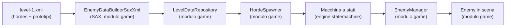
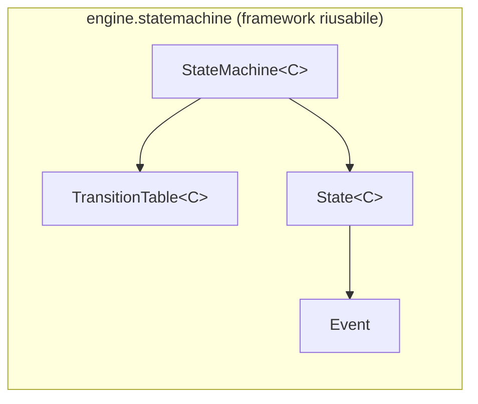
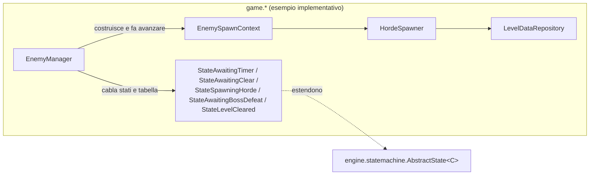
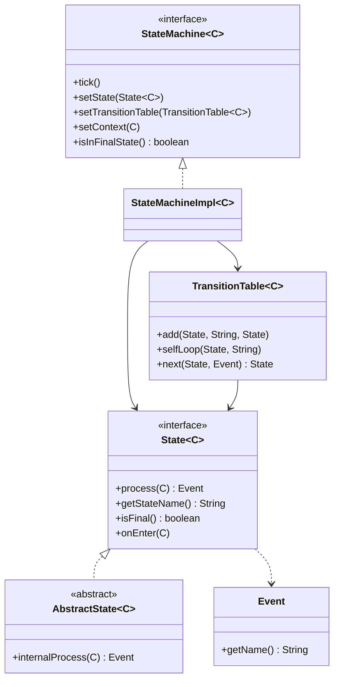
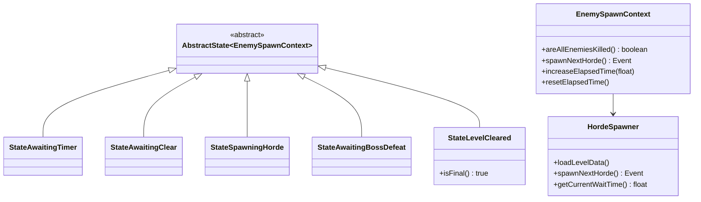
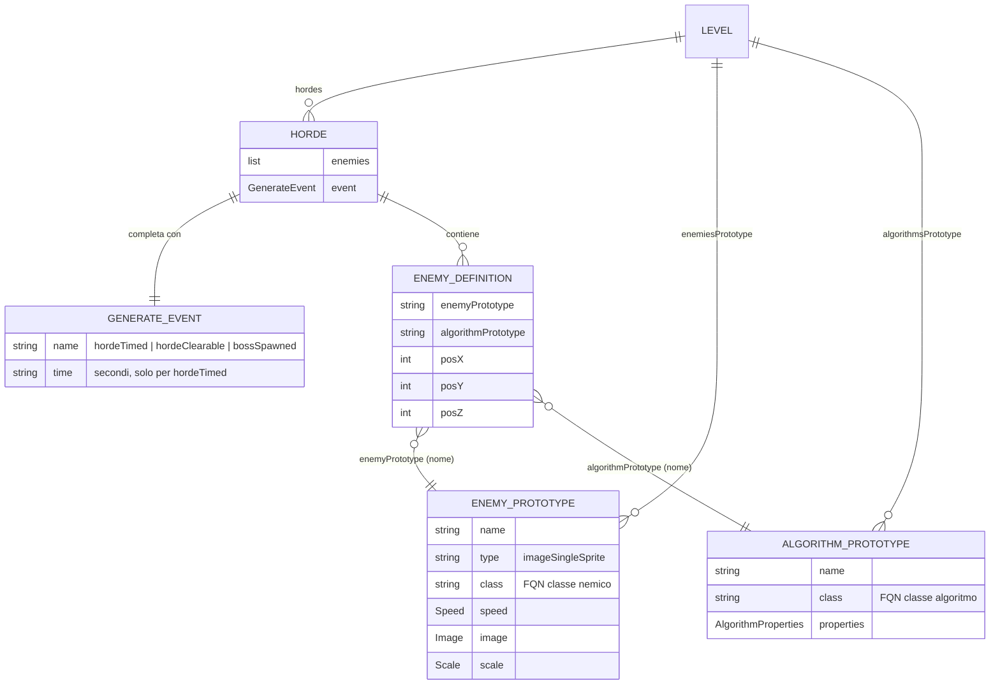
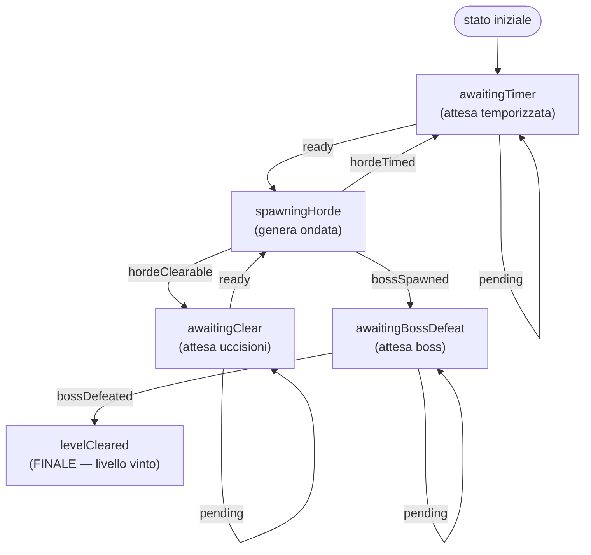

# Ciclo di vita dello spawn dei nemici (enemy-spawn-lifecycle)

> **Nota sulla lingua.** Questo sottosistema è documentato in **italiano** su richiesta. La
> [guida alla documentazione dei sottosistemi](../subsystem-documentation-guide.md) è in inglese e
> definisce la struttura (spine, archetipi, diagrammi): qui se ne segue la forma, non la lingua.

## Indice

1. [Panoramica](#1-panoramica)
2. [Contesto di sistema](#2-contesto-di-sistema)
3. [Concetti chiave](#3-concetti-chiave)
4. [La netta separazione Engine / Game](#4-la-netta-separazione-engine--game)
5. [Inventario dei componenti](#5-inventario-dei-componenti)
6. [Modello dati / configurazione (XML del livello)](#6-modello-dati--configurazione-xml-del-livello)
7. [Ciclo di vita / pipeline](#7-ciclo-di-vita--pipeline)
8. [Flussi documentati](#8-flussi-documentati)
9. [Ricette](#9-ricette)
10. [Scenari di riferimento](#10-scenari-di-riferimento)
11. [Possibili migliorie](#11-possibili-migliorie)

---

## 1. Panoramica

### Cos'è il ciclo di vita dello spawn dei nemici?

In termini di gioco, un livello di TigerSupply è una **sequenza di ondate** (le *horde*): gruppi di
nemici che entrano in scena uno dopo l'altro. Fra un'ondata e la successiva il gioco **aspetta** —
o per un tempo prefissato, o finché il giocatore non ha ripulito lo schermo — e alla fine appare il
**boss**: abbatterlo conclude il livello. Il "ciclo di vita dello spawn" è il meccanismo che decide
**quando** generare l'ondata successiva e **quando** il livello è finito.

Tecnicamente il sottosistema è composto da **due parti nettamente distinte** (vedi
[§4](#4-la-netta-separazione-engine--game)):

- una **macchina a stati generica e riusabile** nel modulo `engine` (`engine.statemachine.*`), che
  non conosce nulla dei nemici né delle ondate;
- un **esempio implementativo concreto** nel modulo `game` (`game.scene.statemachine.*`,
  `game.scene.builder.*`, `game.entity.EnemyManager`), che *usa* quella macchina a stati per
  sequenziare le ondate lette dall'XML del livello.

> **Obiettivo di questa documentazione:** permettere a uno sviluppatore (o a un agente AI) di
> capire **dove finisce il framework `engine` e dove inizia il gioco `game`**, e di aggiungere una
> nuova ondata, un nuovo tipo di nemico, un nuovo algoritmo di movimento o un nuovo stato seguendo
> la [ricetta](aggiungere-nuovi-elementi.md).

| Documento di riferimento | Ruolo |
|---|---|
| [motore-macchina-a-stati.md](motore-macchina-a-stati.md) | Il framework `engine` riusabile: come gira la macchina a stati generica. |
| [sequenziamento-horde.md](sequenziamento-horde.md) | L'esempio `game`: come le ondate vengono sequenziate a ogni frame. |
| [caricamento-dati-livello.md](caricamento-dati-livello.md) | L'esempio `game`: come l'XML diventa nemici in scena. |
| [aggiungere-nuovi-elementi.md](aggiungere-nuovi-elementi.md) | Ricetta: aggiungere ondate, nemici, algoritmi, stati. |

---

## 2. Contesto di sistema

Il sottosistema è **offline** e **guidato da file**: non c'è rete, database o servizio esterno. Le
uniche risorse esterne che tocca sono file sul classpath e costanti di gioco.

| Risorsa | Modulo | Ruolo | Autorevole? |
|---|---|---|---|
| [level/level-1.xml](../../../game/src/main/resources/level/level-1.xml) | `game` (resources) | Definisce l'ordine delle ondate, i prototipi dei nemici e gli algoritmi di movimento del livello. | **Sì** — è la fonte di verità del contenuto del livello. |
| [EnemySpawnStateMachineFactory](../../../game/src/main/java/it/spaghettisource/tigersupply/game/scene/statemachine/EnemySpawnStateMachineFactory.java) | `game` | Costanti `STATE_*` / `EVENT_*` e `Event` condivisi che nominano stati ed eventi della macchina a stati; ne costruisce anche il grafo delle transizioni. | Sì per i nomi di stato/evento e per il grafo. |
| Cataloghi immagini/audio/font (`*-catalog.txt`) | `game` (resources) | Risolvono gli alias (`enemy1`, `boss`, …) usati dai prototipi nemico in immagini reali. | Sì per gli asset. |

**Stile di integrazione.** La parte `game` è **guidata dai dati**: l'XML è letto con SAX e i nomi di
classe (nemici e algoritmi) sono istanziati per **reflection**. La parte `engine`, al contrario, è
una **API in-process** puramente programmatica: la macchina a stati non legge alcun file e non usa
reflection — riceve stati, tabella e contesto via setter e viene fatta avanzare a ogni frame.

---

## 3. Concetti chiave

### 3.1 Horde (ondata)

Un'**ondata** è un gruppo di nemici che entra in scena insieme, più l'**evento di completamento**
che dice come il gioco riconosce che l'ondata è "finita". Nel codice è
[`Horde`](../../../game/src/main/java/it/spaghettisource/tigersupply/game/scene/builder/definition/Horde.java):
una `List<EnemyDefinition>` + un `GenerateEvent`.

### 3.2 GenerateEvent (evento di completamento)

Ogni ondata dichiara **come** si completa tramite il tag `<generateEvent>`. I valori possibili
(costanti `EVENT_*` in `EnemySpawnStateMachineFactory`) sono:

| `name` | Significato | Attributo `time` |
|---|---|---|
| `hordeTimed` | Attendi *N* secondi, poi genera l'ondata successiva. | **obbligatorio** (secondi, anche frazionari) |
| `hordeClearable` | Attendi finché tutti i nemici in scena sono morti, poi genera la successiva. | ignorato |
| `bossSpawned` | Questa ondata è il boss: passa allo stato di attesa uccisione boss. | ignorato |

### 3.3 Prototipo nemico / prototipo algoritmo

Un **prototipo** è un modello riusabile referenziato per nome dalle ondate. Un
[`EnemyPrototype`](../../../game/src/main/java/it/spaghettisource/tigersupply/game/scene/builder/definition/EnemyPrototype.java)
definisce sprite, velocità, scala e classe Java del nemico; un
[`AlgorithmPrototype`](../../../game/src/main/java/it/spaghettisource/tigersupply/game/scene/builder/definition/AlgorithmPrototype.java)
definisce la classe dell'algoritmo di movimento e i suoi parametri. Le ondate contengono solo
**riferimenti per nome** (`enemyPrototype="standard"`, `algorithmPrototype="default"`).

### 3.4 EnemySpawnContext (contesto condiviso)

È il **contesto `C`** che la macchina a stati passa a ogni stato. Tiene il tempo trascorso
(`elapsedTime`), il ritardo da rispettare (`waitTime`) e delega a `HordeSpawner` le interrogazioni
"tutti i nemici sono morti?" e "genera la prossima ondata". Codice:
[`EnemySpawnContext`](../../../game/src/main/java/it/spaghettisource/tigersupply/game/scene/statemachine/EnemySpawnContext.java).

### 3.5 State, Event, TransitionTable (vocabolario dell'engine)

- Uno **State** (`State<C>`) calcola un **Event** dal contesto e può essere *finale*.
- Un **Event** è un semplice contenitore di un nome (`engine.statemachine.Event`).
- Una **TransitionTable** mappa la coppia `(nomeStato, nomeEvento)` sullo stato successivo.
- La **StateMachine** avanza di **al massimo una transizione per tick** e si **ferma** su uno stato
  finale.

### 3.6 Tick

Un **tick** è una chiamata a `StateMachine.tick()`, invocata una volta per frame da
`EnemyManager.updateEntity(...)`. Non più di una transizione avviene per tick.

### 3.7 Stato finale (fine livello)

Lo stato `levelCleared` è **finale** (`State.isFinal()` → `true`). Quando la macchina lo
raggiunge si ferma; `EnemyManager.isBossDead()` diventa `true` e la scena passa al livello
successivo. È l'**unica fonte di verità** per "boss morto".

> **Attenzione — nome vs evento.** La costante di **stato** `STATE_LEVEL_CLEARED` vale
> `"levelCleared"`, mentre la costante di **evento** `EVENT_BOSS_DEFEATED` vale `"bossDefeated"`.
> Sono deliberatamente distinti: lo stato finale e l'evento che vi conduce non collidono.

---

## 4. La netta separazione Engine / Game

Questa è la distinzione centrale del sottosistema, come richiesto: **il modulo `engine` fornisce il
meccanismo riusabile, il modulo `game` ne è un esempio implementativo concreto.**

| Aspetto | Modulo **engine** (framework) | Modulo **game** (esempio implementativo) |
|---|---|---|
| Package | `it.spaghettisource.tigersupply.engine.statemachine` | `...game.scene.statemachine`, `...game.scene.builder`, `...game.entity` |
| Cosa fornisce | Una macchina a stati **generica** `StateMachine<C>` parametrica sul contesto `C`. | Gli stati concreti, il contesto `EnemySpawnContext`, il caricatore XML, il cablaggio. |
| Conosce i nemici? | **No.** Nessun riferimento a `Enemy`, `Horde` o all'XML. Compila da solo. | **Sì.** È interamente specifico di TigerSupply. |
| Come si estende | Aggiungendo un nuovo `State<C>` / una nuova transizione. | Aggiungendo un'ondata/un prototipo nell'XML o un nuovo stato di gioco. |
| Reflection / file | Nessuno: pura API in-process. | SAX sull'XML + reflection su classi nemico/algoritmo. |
| Diagramma di firma | `classDiagram` del framework | `erDiagram` del modello XML + `classDiagram` degli stati |

**La parte engine — riusabile, agnostica:**

**La parte game — usa il framework per le ondate:**

> **Regola pratica.** Se stai scrivendo codice che potrebbe servire a un *altro* gioco basato su
> questo engine, va in `engine.statemachine`. Se nomina `Enemy`, `Horde`, `hordeTimed` o l'XML, va in
> `game.*`. L'unico punto in cui i due mondi si toccano è il **parametro di tipo `C`**: `game`
> istanzia `StateMachine<EnemySpawnContext>`.

---

## 5. Inventario dei componenti

### 5.1 Modulo engine — la macchina a stati generica

| Livello | Elemento | Path | Ruolo |
|---|---|---|---|
| Interfaccia | `StateMachine<C>` | [StateMachine.java](../../../engine/src/main/java/it/spaghettisource/tigersupply/engine/statemachine/StateMachine.java) | Contratto: `tick()`, `setState`, `setTransitionTable`, `setContext`, `isInFinalState`. |
| Impl. | `StateMachineImpl<C>` | [StateMachineImpl.java](../../../engine/src/main/java/it/spaghettisource/tigersupply/engine/statemachine/StateMachineImpl.java) | Esegue un tick: `process` → `next` → `onEnter`; no-op se lo stato è finale. |
| Interfaccia | `State<C>` | [State.java](../../../engine/src/main/java/it/spaghettisource/tigersupply/engine/statemachine/State.java) | Nodo: `process(C)`, `getStateName()`, `isFinal()`, `onEnter(C)`. |
| Astratta | `AbstractState<C>` | [AbstractState.java](../../../engine/src/main/java/it/spaghettisource/tigersupply/engine/statemachine/AbstractState.java) | Wrapper try/catch attorno a `internalProcess(C)`. |
| Classe | `TransitionTable<C>` | [TransitionTable.java](../../../engine/src/main/java/it/spaghettisource/tigersupply/engine/statemachine/TransitionTable.java) | Grafo dichiarativo `(stato,evento) → stato`. |
| Classe | `Event` | [Event.java](../../../engine/src/main/java/it/spaghettisource/tigersupply/engine/statemachine/Event.java) | Contenitore del nome dell'evento. |
| Eccezione | `StateMachineException` | [StateMachineException.java](../../../engine/src/main/java/it/spaghettisource/tigersupply/engine/statemachine/StateMachineException.java) | Errore di esecuzione della macchina. |
| Eccezione | `StateMachineUnsupportedState` | [StateMachineUnsupportedState.java](../../../engine/src/main/java/it/spaghettisource/tigersupply/engine/statemachine/StateMachineUnsupportedState.java) | Stato sconosciuto alla tabella. |
| Eccezione | `StateMachineUnsupportedEvent` | [StateMachineUnsupportedEvent.java](../../../engine/src/main/java/it/spaghettisource/tigersupply/engine/statemachine/StateMachineUnsupportedEvent.java) | Coppia (stato,evento) non dichiarata. |

### 5.2 Modulo game — l'esempio dello spawn nemici

| Livello | Elemento | Path | Ruolo |
|---|---|---|---|
| Cablaggio | `EnemyManager` | [EnemyManager.java](../../../game/src/main/java/it/spaghettisource/tigersupply/game/entity/EnemyManager.java) | Costruisce stati + tabella, tiene la macchina, la fa avanzare a ogni frame. |
| Contesto | `EnemySpawnContext` | [EnemySpawnContext.java](../../../game/src/main/java/it/spaghettisource/tigersupply/game/scene/statemachine/EnemySpawnContext.java) | Il `C` della macchina: tempo, ritardo, delega a `HordeSpawner`. |
| Stato | `StateAwaitingTimer` | [StateAwaitingTimer.java](../../../game/src/main/java/it/spaghettisource/tigersupply/game/scene/statemachine/StateAwaitingTimer.java) | Attesa temporizzata fra ondate. |
| Stato | `StateAwaitingClear` | [StateAwaitingClear.java](../../../game/src/main/java/it/spaghettisource/tigersupply/game/scene/statemachine/StateAwaitingClear.java) | Attesa finché lo schermo è ripulito. |
| Stato | `StateSpawningHorde` | [StateSpawningHorde.java](../../../game/src/main/java/it/spaghettisource/tigersupply/game/scene/statemachine/StateSpawningHorde.java) | Genera l'ondata corrente e ne emette l'evento. |
| Stato | `StateAwaitingBossDefeat` | [StateAwaitingBossDefeat.java](../../../game/src/main/java/it/spaghettisource/tigersupply/game/scene/statemachine/StateAwaitingBossDefeat.java) | Attende l'uccisione del boss. |
| Stato (finale) | `StateLevelCleared` | [StateLevelCleared.java](../../../game/src/main/java/it/spaghettisource/tigersupply/game/scene/statemachine/StateLevelCleared.java) | Terminale: boss morto, livello vinto. |
| Coordinatore | `HordeSpawner` | [HordeSpawner.java](../../../game/src/main/java/it/spaghettisource/tigersupply/game/scene/statemachine/HordeSpawner.java) | Carica l'XML e istanzia i nemici dell'ondata. |
| Builder | `EnemyDataBuilderSaxXml` | [EnemyDataBuilderSaxXml.java](../../../game/src/main/java/it/spaghettisource/tigersupply/game/scene/builder/EnemyDataBuilderSaxXml.java) | Parser SAX dell'XML del livello. |
| Repository | `LevelDataRepository` | [LevelDataRepository.java](../../../game/src/main/java/it/spaghettisource/tigersupply/game/scene/builder/LevelDataRepository.java) | Custodisce ondate + prototipi, lookup per indice/nome. |

---

## 6. Modello dati / configurazione (XML del livello)

La parte `game` è guidata dall'XML. La struttura di
[level-1.xml](../../../game/src/main/resources/level/level-1.xml) è:

- **`<horde>`** → [`Horde`](../../../game/src/main/java/it/spaghettisource/tigersupply/game/scene/builder/definition/Horde.java): l'ondata scriptata, in ordine di dichiarazione.
- **`<generateEvent>`** → [`GenerateEvent`](../../../game/src/main/java/it/spaghettisource/tigersupply/game/scene/builder/definition/GenerateEvent.java): come si completa l'ondata (vedi [§3.2](#32-generateevent-evento-di-completamento)).
- **`<enemy>`** → [`EnemyDefinition`](../../../game/src/main/java/it/spaghettisource/tigersupply/game/scene/builder/definition/EnemyDefinition.java): un'istanza di nemico con posizione e i nomi dei due prototipi.
- **`<enemyPrototype>`** / **`<algorithmPrototype>`**: i modelli riusabili risolti per nome a runtime tramite `LevelDataRepository`.

Il dettaglio del parsing è in [caricamento-dati-livello.md](caricamento-dati-livello.md).

---

## 7. Ciclo di vita / pipeline

La macchina a stati dello spawn nemici parte da `awaitingTimer` e termina su `levelCleared`. Ogni
freccia è una transizione dichiarata in `EnemyManager.initComponents()`.

| Passo | Fornito da | Comportamento |
|---|---|---|
| Tick | `EnemyManager.updateEntity` (game) | Incrementa il tempo e chiama `stateMachine.tick()` una volta per frame. |
| Calcolo evento | `State.process` (engine → stato game) | Lo stato legge il contesto e restituisce un `Event`. |
| Risoluzione transizione | `TransitionTable.next` (engine) | Dalla coppia `(stato,evento)` ricava lo stato successivo. |
| Ingresso stato | `State.onEnter` (engine → `StateAwaitingTimer`) | Solo al cambio di stato; `StateAwaitingTimer` azzera il timer. |
| Arresto | `StateMachineImpl.tick` (engine) | No-op quando lo stato corrente è finale. |

Il dettaglio frame-by-frame è in [sequenziamento-horde.md](sequenziamento-horde.md); il
funzionamento generico della macchina in [motore-macchina-a-stati.md](motore-macchina-a-stati.md).

---

## 8. Flussi documentati

| # | Flusso | Modulo | Trigger | Descrizione | Dettaglio |
|---|---|---|---|---|---|
| 1 | Esecuzione della macchina a stati generica | **engine** | `tick()` per tick | Come un tick sceglie l'evento, risolve la transizione e si ferma sul finale. | [motore-macchina-a-stati.md](motore-macchina-a-stati.md) |
| 2 | Sequenziamento delle ondate | **game** | frame update | Come i 5 stati concreti sequenziano le ondate e rispettano `hordeTimed`/`hordeClearable`. | [sequenziamento-horde.md](sequenziamento-horde.md) |
| 3 | Caricamento dati livello (XML → nemici) | **game** | avvio livello | Come il SAX builder e la reflection trasformano l'XML in `Enemy` in scena. | [caricamento-dati-livello.md](caricamento-dati-livello.md) |

---

## 9. Ricette

| Ricetta | Quando usarla | Dettaglio |
|---|---|---|
| Aggiungere ondate, nemici, algoritmi o un nuovo stato | Estendere il contenuto o la logica di sequenziamento del livello. | [aggiungere-nuovi-elementi.md](aggiungere-nuovi-elementi.md) |

---

## 10. Scenari di riferimento

| Scenario | Stato |
|---|---|
| Pipeline delle ondate del Livello 1 | Esempio verticale di riferimento usato in tutte le pagine: `level-1.xml` → `EnemyDataBuilderSaxXml` → `LevelDataRepository` → `HordeSpawner` → macchina a stati in `EnemyManager` → `Enemy`. |

---

## 11. Possibili migliorie

Idee di design emerse esplorando il sottosistema ma **non ancora eseguite**: sono promemoria da
trasformare in una OpenSpec change quando sarà il momento, non descrizioni del comportamento
attuale.

| Miglioria | Cosa propone | Stato | Dettaglio |
|---|---|---|---|
| Payload sugli eventi consegnato agli stati | Far portare all'`Event` i suoi attributi (oggi `hordeTimed` porta `time` solo via canale laterale sul contesto) e consegnare l'evento scatenante allo stato entrante in `onEnter`, rendendo esplicito il contratto e abilitando eventi parametrici futuri. | **Proposta, non pianificata** | [migliorie-payload-eventi.md](migliorie-payload-eventi.md) |
