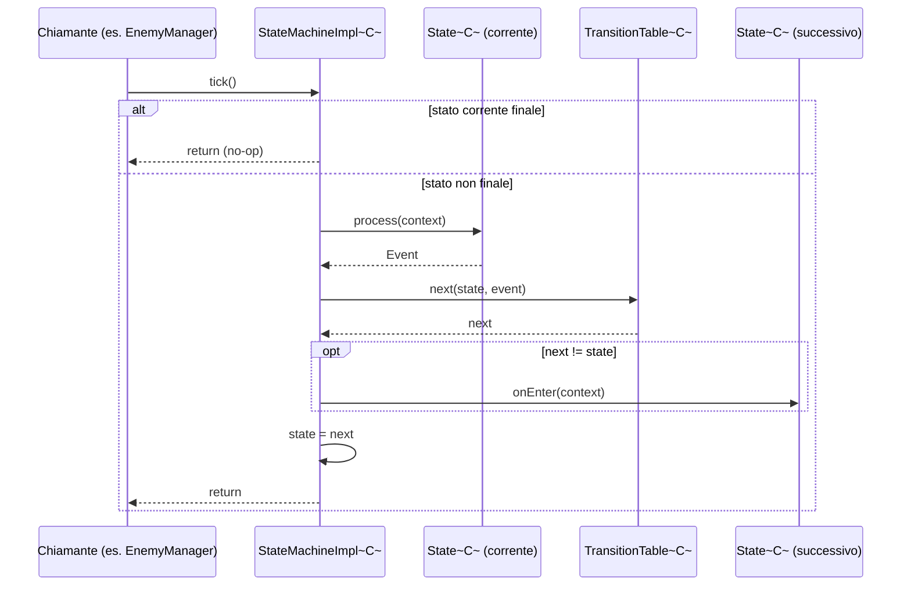

# Esecuzione della macchina a stati generica (modulo engine)

> **Indice correlato**: [Ciclo di vita dello spawn dei nemici](index.md)

> **Modulo:** `engine` — framework **riusabile e agnostico**. Questa pagina descrive *solo* il
> meccanismo generico `engine.statemachine.*`. Non contiene nulla di specifico dei nemici o delle
> ondate: quello è l'[esempio implementativo del gioco](sequenziamento-horde.md).

## Indice

1. [Contesto](#1-contesto)
2. [Descrizione dei componenti](#2-descrizione-dei-componenti)
3. [Flusso dati](#3-flusso-dati)
4. [Punti di integrazione](#4-punti-di-integrazione)
5. [Stato dell'engine toccato](#5-stato-dellengine-toccato)

---

## 1. Contesto

### Scopo
`engine.statemachine` è una **macchina a stati finiti generica**, parametrica sul tipo di contesto
condiviso `C`. È il motore che il gioco usa per sequenziare le ondate, ma non conosce nulla del
gioco: potrebbe pilotare qualsiasi flusso a stati di un altro titolo costruito sull'engine.

### Obiettivo
A ogni **tick** (`tick()`) la macchina, se non è in uno stato finale:

1. chiede allo stato corrente di calcolare un `Event` dal contesto (`state.process(context)`);
2. risolve lo stato successivo nella tabella (`table.next(state, event)`);
3. se lo stato cambia, notifica l'ingresso al nuovo stato (`next.onEnter(context)`);
4. adotta lo stato successivo.

Avviene **al massimo una transizione per tick**. Su uno stato finale il tick è un **no-op**.

### Trigger
La macchina è **passiva**: non ha un thread proprio. Avanza solo quando qualcuno chiama `tick()`.
Nel gioco quel chiamante è `EnemyManager.updateEntity(...)`, una volta per frame — ma dal punto di
vista dell'engine il chiamante è irrilevante.

### Concetti locali
- **Contesto `C`**: oggetto arbitrario condiviso, passato invariato a ogni stato. L'engine non lo
  interpreta: lo *inoltra* soltanto.
- **Stato finale**: uno `State` la cui `isFinal()` restituisce `true`. La macchina si ferma su di
  esso e i tick successivi non fanno nulla.
- **Self-loop**: una transizione che riporta allo stesso stato; usata per "restare in attesa".

---

## 2. Descrizione dei componenti

| Componente | Modulo | Classe/Interfaccia | Responsabilità |
|---|---|---|---|
| Macchina | `engine` | `StateMachine<C>` / `StateMachineImpl<C>` | Tiene stato corrente, tabella e contesto; esegue un tick. |
| Nodo | `engine` | `State<C>` | Calcola un `Event`; espone nome, finalità e hook `onEnter`. |
| Base stato | `engine` | `AbstractState<C>` | Avvolge `internalProcess(C)` in un try/catch uniforme. |
| Tabella | `engine` | `TransitionTable<C>` | Grafo dichiarativo `(nomeStato, nomeEvento) → stato`. |
| Evento | `engine` | `Event` | Contenitore immutabile del nome dell'evento. |
| Errori | `engine` | `StateMachineException`, `StateMachineUnsupportedState`, `StateMachineUnsupportedEvent` | Segnalano fallimenti di esecuzione o transizioni non dichiarate. |

### Contratti essenziali

**`StateMachineImpl.tick()`** — il cuore del motore
([StateMachineImpl.java](../../../engine/src/main/java/it/spaghettisource/tigersupply/engine/statemachine/StateMachineImpl.java)):

```java
public void tick() throws StateMachineException {
    if (state.isFinal()) {
        return; // stato finale: la macchina è ferma, niente da elaborare
    }
    Event event = state.process(context);   // 1. lo stato produce un evento
    State<C> next = table.next(state, event); // 2. risolvi il prossimo stato
    if (next != state) {
        next.onEnter(context);               // 3. notifica l'ingresso (salta i self-loop)
    }
    this.state = next;                       // 4. adotta il prossimo stato
}
```

**`AbstractState.process(...)`** — traduce ogni eccezione in `StateMachineException`
([AbstractState.java](../../../engine/src/main/java/it/spaghettisource/tigersupply/engine/statemachine/AbstractState.java)):

```java
public Event process(C context) throws StateMachineException {
    try {
        return internalProcess(context);
    } catch (Exception e) {
        e.printStackTrace();
        throw new StateMachineException("error in the execution of the state", e);
    }
}
```

**`TransitionTable`** — dichiarazione e risoluzione
([TransitionTable.java](../../../engine/src/main/java/it/spaghettisource/tigersupply/engine/statemachine/TransitionTable.java)):

- `add(from, "evento", to)` dichiara una transizione;
- `selfLoop(state, "evento")` è la scorciatoia per `add(state, "evento", state)`;
- `next(current, event)` cerca la chiave `(nomeStato, nomeEvento)`;
- la finalità **non** vive nella tabella: uno stato finale non ha transizioni uscenti, quindi non
  compare mai come sorgente.

---

## 3. Flusso dati



Narrazione passo-passo:

1. **Il chiamante invoca `tick()`.** L'engine non sa (né gli importa) chi sia.
2. **Controllo di finalità.** Se `state.isFinal()`, ritorna subito: la macchina è ferma.
3. **Calcolo dell'evento.** `state.process(context)` legge/aggiorna il contesto e restituisce un
   `Event`. Se lo stato concreto lancia, `AbstractState` lo riconfeziona in `StateMachineException`.
4. **Risoluzione della transizione.** `table.next(state, event)` restituisce lo stato successivo o
   solleva un'eccezione se la coppia non è dichiarata.
5. **Hook di ingresso.** Solo se lo stato cambia, `next.onEnter(context)` gira una volta (i
   self-loop non lo attivano).
6. **Adozione.** La macchina memorizza `next` come stato corrente. Fine del tick.

---

## 4. Punti di integrazione

Il framework è una **pura API in-process**: **non** legge file, **non** usa reflection, **non** ha
dipendenze oltre la JDK. Si integra esclusivamente per composizione programmatica:

| Punto di integrazione | Come |
|---|---|
| Fornire gli stati | Implementare `State<C>` (di norma estendendo `AbstractState<C>`). |
| Dichiarare il grafo | Popolare una `TransitionTable<C>` con `add` / `selfLoop`. |
| Fornire il contesto | `setContext(c)` con un oggetto qualsiasi di tipo `C`. |
| Impostare lo stato iniziale | `setState(iniziale)`. |
| Far avanzare | Chiamare `tick()` quando serve (per il gioco, ogni frame). |

Un esempio completo di cablaggio è in `EnemyManager.initComponents()` — vedi
[sequenziamento-horde.md §2](sequenziamento-horde.md#2-descrizione-dei-componenti).

---

## 5. Stato dell'engine toccato

La macchina mantiene **solo** tre riferimenti interni
([StateMachineImpl.java](../../../engine/src/main/java/it/spaghettisource/tigersupply/engine/statemachine/StateMachineImpl.java)):

| Campo | Tipo | Note |
|---|---|---|
| `state` | `State<C>` | Lo stato corrente; riscritto a ogni tick non finale. |
| `table` | `TransitionTable<C>` | Immutabile dopo il cablaggio. |
| `context` | `C` | Non interpretato dall'engine; passato invariato agli stati. |

### Casi limite e sicurezza

| Situazione | Comportamento |
|---|---|
| Stato non presente nella tabella | `TransitionTable.next` solleva `StateMachineUnsupportedState`. |
| Coppia `(stato,evento)` non dichiarata | Solleva `StateMachineUnsupportedEvent`. |
| Lo stato concreto lancia un'eccezione | `AbstractState.process` fa `printStackTrace()` e la riconfeziona in `StateMachineException`. |
| Stato finale raggiunto | `tick()` diventa un no-op; `isInFinalState()` restituisce `true`. |
| Self-transition (`next == state`) | `onEnter` **non** viene invocato. |

> **Nota.** `StateMachineException` è una `RuntimeException` (non checked), coerente con la
> convenzione dell'engine di propagare fallimenti tecnici senza costringere ogni chiamante a
> dichiararli.
