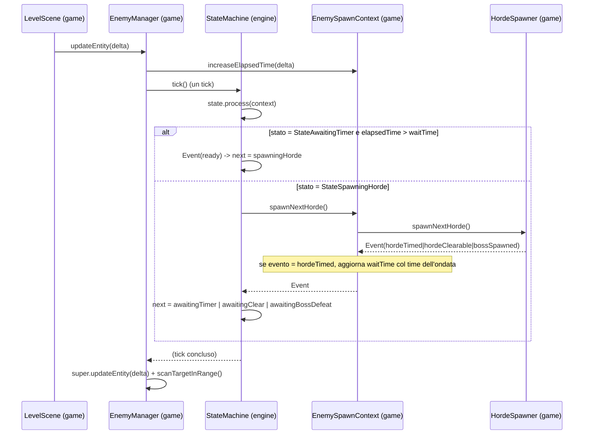

# Sequenziamento delle ondate (modulo game)

> **Indice correlato**: [Ciclo di vita dello spawn dei nemici](index.md)

> **Modulo:** `game` — **esempio implementativo** costruito sul framework
> [`engine.statemachine`](motore-macchina-a-stati.md). Questa pagina mostra come i cinque stati
> concreti di TigerSupply usano quella macchina a stati generica per sequenziare le ondate di un
> livello.

## Indice

1. [Contesto](#1-contesto)
2. [Descrizione dei componenti](#2-descrizione-dei-componenti)
3. [Flusso dati](#3-flusso-dati)
4. [Punti di integrazione](#4-punti-di-integrazione)
5. [Stato dell'engine toccato](#5-stato-dellengine-toccato)

---

## 1. Contesto

### Scopo
Sequenziare le ondate del livello: decidere **quando** generare l'ondata successiva (dopo un tempo
o dopo aver ripulito lo schermo), gestire il boss e riconoscere la **fine del livello**. Tutto
questo istanziando la macchina a stati generica dell'engine come
`StateMachine<EnemySpawnContext>`.

### Obiettivo
Portare la macchina da `awaitingTimer` (attesa iniziale) fino allo stato finale `levelCleared`,
attraversando le ondate dichiarate in [level-1.xml](../../../game/src/main/resources/level/level-1.xml).

### Trigger
Il **frame update** della scena di gioco. `LevelScene.update(...)` chiama
`enemyManager.updateEntity(deltaTimeSeconds)`, che a sua volta fa un tick della macchina a stati.

### Concetti locali
- **`elapsedTime`**: secondi accumulati nello stato di attesa corrente (`float`, stessa base
  temporale del frame update).
- **`waitTime`**: ritardo da rispettare in `StateAwaitingTimer`. Vale `1` prima della primissima ondata,
  poi è sovrascritto dal `time` dichiarato da ogni ondata `hordeTimed`.
- **Ondata "time-gated"**: un'ondata il cui `generateEvent` è `hordeTimed`; il suo `time` è
  obbligatorio e validato al caricamento (vedi [caricamento-dati-livello.md](caricamento-dati-livello.md)).

---

## 2. Descrizione dei componenti

### Il cablaggio (dove engine e game si incontrano)

`EnemyManager.initComponents()` è il **punto di composizione**: costruisce gli stati concreti,
dichiara la tabella delle transizioni e avvia la macchina generica dell'engine.

| Componente | Modulo | Classe | Responsabilità |
|---|---|---|---|
| Cablaggio | `game` | `EnemyManager` | Costruisce stati + `TransitionTable`, imposta contesto e stato iniziale, fa il tick. |
| Contesto | `game` | `EnemySpawnContext` | Il `C` della macchina: tempo, ritardo, delega a `HordeSpawner`. |
| Coordinatore | `game` | `HordeSpawner` | Genera l'ondata corrente e ne restituisce l'`Event`. |

Estratto da [EnemyManager.java](../../../game/src/main/java/it/spaghettisource/tigersupply/game/entity/EnemyManager.java):

```java
// costruisci gli stati una volta (senza stato interno, riusati come singleton)
StateAwaitingTimer      awaitingTimer      = new StateAwaitingTimer();
StateAwaitingClear      awaitingClear      = new StateAwaitingClear();
StateSpawningHorde      spawningHorde      = new StateSpawningHorde();
StateAwaitingBossDefeat awaitingBossDefeat = new StateAwaitingBossDefeat();
StateLevelCleared       levelCleared       = new StateLevelCleared();

TransitionTable<EnemySpawnContext> table = new TransitionTable<EnemySpawnContext>();
table.selfLoop(awaitingTimer, GameResources.EVENT_PENDING);
table.add(awaitingTimer, GameResources.EVENT_READY, spawningHorde);
table.selfLoop(awaitingClear, GameResources.EVENT_PENDING);
table.add(awaitingClear, GameResources.EVENT_READY, spawningHorde);
table.add(spawningHorde, GameResources.EVENT_HORDE_TIMED,     awaitingTimer);
table.add(spawningHorde, GameResources.EVENT_HORDE_CLEARABLE, awaitingClear);
table.add(spawningHorde, GameResources.EVENT_BOSS_SPAWNED,    awaitingBossDefeat);
table.selfLoop(awaitingBossDefeat, GameResources.EVENT_PENDING);
table.add(awaitingBossDefeat, GameResources.EVENT_BOSS_DEFEATED, levelCleared);

stateMachine = new StateMachineImpl<EnemySpawnContext>();
stateMachine.setTransitionTable(table);
stateMachine.setContext(spawnContext);   // spawnContext = EnemySpawnContext
stateMachine.setState(awaitingTimer);    // stato iniziale
```

### I cinque stati concreti

| Stato | Nome (`GameResources`) | Evento prodotto | Comportamento |
|---|---|---|---|
| [`StateAwaitingTimer`](../../../game/src/main/java/it/spaghettisource/tigersupply/game/scene/statemachine/StateAwaitingTimer.java) | `awaitingTimer` | `ready` se `elapsedTime > waitTime`, altrimenti `pending` | In `onEnter` azzera il timer; conta i secondi. |
| [`StateAwaitingClear`](../../../game/src/main/java/it/spaghettisource/tigersupply/game/scene/statemachine/StateAwaitingClear.java) | `awaitingClear` | `ready` se lo schermo è ripulito, altrimenti `pending` | Attende che tutti i nemici siano morti. |
| [`StateSpawningHorde`](../../../game/src/main/java/it/spaghettisource/tigersupply/game/scene/statemachine/StateSpawningHorde.java) | `spawningHorde` | l'evento dell'ondata: `hordeTimed` \| `hordeClearable` \| `bossSpawned` | Genera l'ondata e ne emette l'evento di completamento. |
| [`StateAwaitingBossDefeat`](../../../game/src/main/java/it/spaghettisource/tigersupply/game/scene/statemachine/StateAwaitingBossDefeat.java) | `awaitingBossDefeat` | `bossDefeated` se il boss è morto, altrimenti `pending` | Attende l'uccisione del boss. |
| [`StateLevelCleared`](../../../game/src/main/java/it/spaghettisource/tigersupply/game/scene/statemachine/StateLevelCleared.java) | `levelCleared` | *(nessuno: `isFinal()` → `true`)* | Terminale: livello vinto, la macchina si ferma. |

> **Perché due stati di attesa distinti?** `awaitingTimer` è temporizzato (ideale per ondate ravvicinate
> e coreografate), `awaitingClear` è a "schermo pulito" (obbligatorio per il boss e per i colli di
> bottiglia). Lo stato `spawningHorde` sceglie a quale tornare in base al `generateEvent` **della
> stessa ondata appena generata**.

---

## 3. Flusso dati



Narrazione dell'esempio di riferimento (Livello 1):

1. **Avvio.** La macchina parte in `StateAwaitingTimer` con `waitTime = 1`: attende ~1 secondo.
2. **Prima ondata.** Superato il secondo, `StateAwaitingTimer` emette `ready` → `spawningHorde`.
3. **Generazione.** `StateSpawningHorde` chiama `context.spawnNextHorde()`: `HordeSpawner` istanzia
   i nemici della prima ondata e restituisce l'`Event` `hordeTimed` (la prima ondata dichiara
   `<generateEvent name="hordeTimed" time="1" />`). Il contesto legge `getCurrentWaitTime()` e imposta
   `waitTime = 1`.
4. **Ritorno all'attesa.** `spawningHorde --hordeTimed--> awaitingTimer`; `onEnter` azzera `elapsedTime` e
   il ciclo ricomincia per l'ondata successiva.
5. **Ondate `hordeClearable`.** Quando un'ondata dichiara `hordeClearable`, si passa a `StateAwaitingClear`, che
   attende finché `areAllEnemiesKilled()` è `true`.
6. **Boss.** L'ultima ondata dichiara `bossSpawned` → `awaitingBossDefeat`. Quando il boss muore,
   `awaitingBossDefeat` emette `bossDefeated` → `levelCleared` (finale).
7. **Fine livello.** `EnemyManager.isBossDead()` diventa `true`; `LevelScene` avvia il livello
   successivo.

---

## 4. Punti di integrazione

| Punto | Formato / dettaglio |
|---|---|
| Nomi di stato ed evento | Costanti `STATE_*` / `EVENT_*` in [GameResources](../../../game/src/main/java/it/spaghettisource/tigersupply/game/utils/GameResources.java). I nomi degli **eventi** coincidono con i valori `name` del tag `<generateEvent>` dell'XML. |
| `<generateEvent name="…" time="…">` | L'XML pilota indirettamente le transizioni: l'evento restituito da `HordeSpawner.spawnNextHorde()` porta lo stesso nome del `generateEvent` dell'ondata. |
| Attesa iniziale | `EnemySpawnContext.waitTime` è inizializzato a `1` per introdurre una pausa prima della primissima ondata. |

> **Corrispondenza nome evento ↔ XML.** `EVENT_HORDE_TIMED = "hordeTimed"`,
> `EVENT_HORDE_CLEARABLE = "hordeClearable"`, `EVENT_BOSS_SPAWNED = "bossSpawned"`: sono esattamente i
> valori ammessi per `<generateEvent name="…">`. Aggiungere un nuovo tipo di completamento richiede
> quindi sia una nuova costante/transizione sia il valore corrispondente nell'XML.

---

## 5. Stato dell'engine toccato

| Elemento | Modulo | Letto / scritto | Note |
|---|---|---|---|
| `EnemySpawnContext.elapsedTime` | `game` | scritto ogni frame, azzerato in `onEnter` di `StateAwaitingTimer` | Base temporale del sequenziamento. |
| `EnemySpawnContext.waitTime` | `game` | scritto quando l'evento generato è `hordeTimed` | Sovrascrive il default `1`. |
| `EnemyManager` (entità) | `game` | scritto da `HordeSpawner.addRequest(...)` | I nemici generati entrano nel gruppo gestito. |
| `StateMachineImpl.state` | `engine` | scritto a ogni tick non finale | Lo stato corrente. |

### Casi limite e sicurezza

| Situazione | Comportamento |
|---|---|
| Un tick su `levelCleared` | No-op (stato finale); `internalProcess` non viene mai invocato. |
| Ondata `hordeTimed` con `time` mancante o non numerico | Rifiutata **al caricamento** da `HordeSpawner.validateWaitTimeHordes` (fail-fast) — vedi [caricamento-dati-livello.md](caricamento-dati-livello.md). |
| `generateEvent` con `name` non fra quelli dichiarati nella tabella | `TransitionTable.next` solleva `StateMachineUnsupportedEvent` al tick. |
| Nemici ancora vivi in `awaitingClear` / `awaitingBossDefeat` | Lo stato emette `pending` e resta su sé stesso (self-loop). |

> **Attenzione.** Gli stati concreti sono **senza stato interno** e riusati come singleton: tutta la
> memoria vive in `EnemySpawnContext`. Non aggiungere campi mutabili agli stati.
