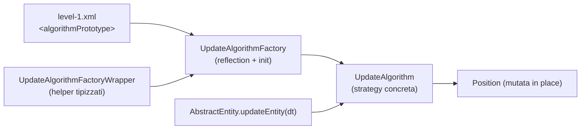
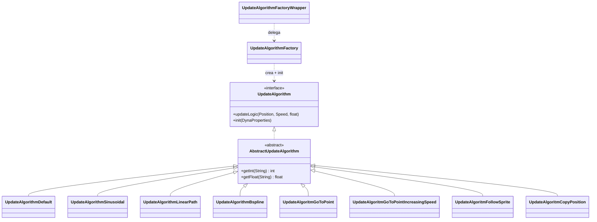
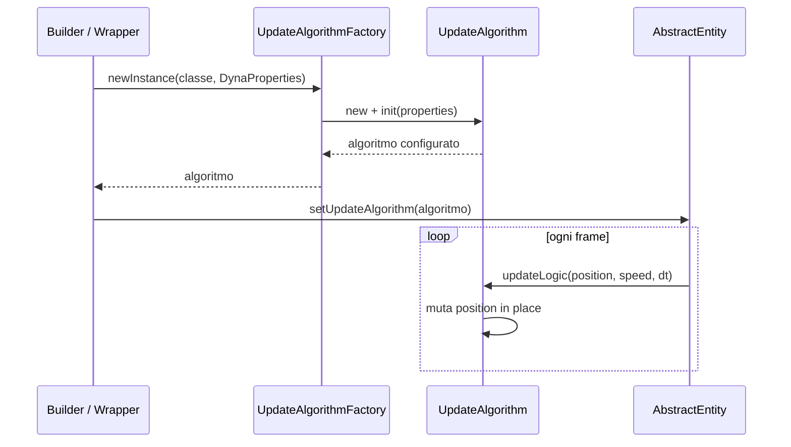

# Algoritmi di movimento delle entità (entity-movement-algorithms)

> **Nota sulla lingua.** Questo sottosistema è documentato in **italiano** su richiesta. La
> [guida alla documentazione dei sottosistemi](../subsystem-documentation-guide.md) è in inglese e
> definisce la struttura (spine, archetipi, diagrammi): qui se ne segue la forma, non la lingua.

> **Archetipo.** Questo è un sottosistema **catalogo** (vedi §4 della guida): una famiglia di
> implementazioni interscambiabili della **Strategy** [`UpdateAlgorithm`](../../../engine/src/main/java/it/spaghettisource/tigersupply/engine/entity/logic/UpdateAlgorithm.java).
> Il catalogo completo di ciò che **esiste oggi** è in
> [catalogo-algoritmi-attuali.md](catalogo-algoritmi-attuali.md); gli algoritmi **proposti** e l'idea
> di composizione sono in [algoritmi-proposti-e-composizione.md](algoritmi-proposti-e-composizione.md).

## Indice

1. [Panoramica](#1-panoramica)
2. [Contesto di sistema](#2-contesto-di-sistema)
3. [Concetti chiave](#3-concetti-chiave)
4. [Convenzioni: chiavi di configurazione](#4-convenzioni-chiavi-di-configurazione)
5. [Inventario dei componenti](#5-inventario-dei-componenti)
6. [Ciclo di vita: `init` una volta, `updateLogic` ogni frame](#6-ciclo-di-vita-init-una-volta-updatelogic-ogni-frame)
7. [Catalogo degli algoritmi attuali](#7-catalogo-degli-algoritmi-attuali)
8. [Ricette](#8-ricette)
9. [Scenari di riferimento](#9-scenari-di-riferimento)
10. [Possibili migliorie](#10-possibili-migliorie)

---

## 1. Panoramica

### Cos'è un algoritmo di movimento?

In termini di gioco, ogni entità (nemico, proiettile, oggetto) si muove sullo schermo in un **modo
riconoscibile**: va dritta, ondeggia, insegue il giocatore, segue un percorso disegnato a mano,
resta agganciata a un'altra entità. Ognuno di questi "modi" è un **algoritmo di movimento**: una
strategia che, frame dopo frame, decide come cambia la posizione dell'entità.

Tecnicamente il sottosistema è la **Strategy** [`UpdateAlgorithm`](../../../engine/src/main/java/it/spaghettisource/tigersupply/engine/entity/logic/UpdateAlgorithm.java)
nel modulo `engine` e le sue implementazioni concrete nel package
[engine.entity.logic](../../../engine/src/main/java/it/spaghettisource/tigersupply/engine/entity/logic).
Una `AbstractEntity` possiede **un** `UpdateAlgorithm` e gli delega la propria motricità a ogni
aggiornamento (vedi [`AbstractEntity.updateEntity`](../../../engine/src/main/java/it/spaghettisource/tigersupply/engine/entity/AbstractEntity.java)).
La separazione Entità (simulazione) / Sprite (presentazione) / Weapon (fuoco) è un obiettivo di
design del progetto: l'algoritmo di movimento tocca **solo** la `Position`.

> **Obiettivo di questa documentazione:** permettere a uno sviluppatore (o a un agente AI) di
> capire **quali algoritmi di movimento esistono oggi** e come sono fatti (catalogo), e di
> aggiungerne di nuovi seguendo la [ricetta esistente](../level-director-sequencing/aggiungere-nuovi-elementi.md).
> Le idee non ancora realizzate stanno separate in
> [algoritmi-proposti-e-composizione.md](algoritmi-proposti-e-composizione.md), così la
> documentazione dell'esistente resta distinta dalle proposte.

| Documento di riferimento | Ruolo |
|---|---|
| [catalogo-algoritmi-attuali.md](catalogo-algoritmi-attuali.md) | Documentazione completa dei **8 algoritmi esistenti** (comportamento, formula, chiavi, note frame-rate). |
| [algoritmi-proposti-e-composizione.md](algoritmi-proposti-e-composizione.md) | Algoritmi **mancanti** proposti per uno shmup anni '90 + idea di un algoritmo **composito**. |
| [level-director-sequencing](../level-director-sequencing/index.md) | Come l'XML del livello diventa prototipi di algoritmo istanziati e assegnati alle entità. |

---

## 2. Contesto di sistema

Il sottosistema è **offline** e ha **due stili di integrazione** complementari:

| Sorgente | Modulo | Ruolo | Autorevole? |
|---|---|---|---|
| [level/level-1.xml](../../../game/src/main/resources/level/level-1.xml) (`<algorithmsPrototype>`) | `game` (resources) | Dichiara i prototipi di algoritmo per **nome di classe** e le loro proprietà (`delta`, `listpoints`, …). | **Sì** — è la fonte di verità del movimento scriptato del livello. |
| [UpdateAlgorithmFactory](../../../engine/src/main/java/it/spaghettisource/tigersupply/engine/entity/logic/UpdateAlgorithmFactory.java) | `engine` | Istanzia un algoritmo dal nome di classe (reflection) o dalla `Class`, poi chiama `init(...)`. | Sì per la costruzione. |
| [UpdateAlgorithmFactoryWrapper](../../../engine/src/main/java/it/spaghettisource/tigersupply/engine/entity/logic/UpdateAlgorithmFactoryWrapper.java) | `engine` | Helper **tipizzati** (`newDefault`, `newSinusoidal`, …) che nascondono le chiavi `DynaProperties`. | Sì per l'uso programmatico. |
| [StaticResources](../../../engine/src/main/java/it/spaghettisource/tigersupply/engine/utils/StaticResources.java) | `engine` | Costanti `ALGPRO_*`: i nomi delle chiavi di configurazione. | Sì per i nomi delle chiavi. |

**Stile di integrazione.** L'uso da XML è **guidato dai dati** (SAX + reflection): il nome di classe
nel tag `<algorithmPrototype class="…">` viene istanziato da `UpdateAlgorithmFactory`. L'uso da
codice è invece una **API in-process** tipizzata via `UpdateAlgorithmFactoryWrapper`. In entrambi i
casi il punto d'ingresso è la factory: gli algoritmi **non** vanno costruiti con `new` diretto.

---

## 3. Concetti chiave

### 3.1 `UpdateAlgorithm` (la strategy)

Interfaccia con due soli metodi:
[`init(DynaProperties)`](../../../engine/src/main/java/it/spaghettisource/tigersupply/engine/entity/logic/UpdateAlgorithm.java)
(configurazione, una sola volta) e
`updateLogic(Position, Speed, float deltaSeconds)` (un frame, muta la `Position` in place, può
leggere la `Speed`).

### 3.2 `AbstractUpdateAlgorithm` (base)

[Base class](../../../engine/src/main/java/it/spaghettisource/tigersupply/engine/entity/logic/AbstractUpdateAlgorithm.java)
con solo tre helper di parsing (`getInt`, `getDouble`, `getFloat`) per leggere i valori testuali di
`DynaProperties`. Tutti gli algoritmi concreti la estendono.

### 3.3 `Speed` come riferimento, non come stato

La `Speed` passata a `updateLogic` è la **velocità di riferimento** dell'entità (dal prototipo
nemico nell'XML). Alcuni algoritmi la integrano direttamente (`Default`, `Sinusoidal`), altri ne
usano solo il **modulo** come "passo" (`LinearPath`), altri ancora la **ignorano** perché la
traiettoria è già interamente determinata (`Bspline`, `CopyPosition`).

### 3.4 Dipendenza dal frame-rate (`deltaSeconds`)

Un algoritmo "corretto" moltiplica ogni spostamento per `deltaSeconds`, così a 30 o 60 FPS l'entità
percorre la stessa distanza al secondo. Due algoritmi attuali **non** lo fanno e avanzano *di un
passo per frame* (vedi il catalogo): a FPS diversi cambiano velocità. È una caratteristica da tenere
presente quando si scelgono o si aggiungono algoritmi.

### 3.5 Configurazione via `DynaProperties`

`init(...)` riceve una borsa di proprietà eterogenea
([`DynaProperties`](../../../engine/src/main/java/it/spaghettisource/tigersupply/engine/utils/DynaProperties.java)):
stringhe (`getString`), liste (`getList`, es. i `Point` di un percorso) e oggetti
(`getObject`, es. una `Position` o una `Entity` bersaglio). Le chiavi sono le costanti `ALGPRO_*`.

---

## 4. Convenzioni: chiavi di configurazione

Ogni algoritmo legge le sue proprietà da chiavi note, definite in
[StaticResources](../../../engine/src/main/java/it/spaghettisource/tigersupply/engine/utils/StaticResources.java)
e usate come attributo `name` nei tag `<property>` / `<listPoints>` dell'XML.

| Costante | Valore chiave | Tipo | Usata da |
|---|---|---|---|
| `ALGPRO_DELTA` | `delta` | float | Sinusoidal (ampiezza) |
| `ALGPRO_INCREMENT` | `increment` | float | Sinusoidal (velocità angolare, °/s) |
| `ALGPRO_START` | `start` | float (opz.) | Sinusoidal (angolo iniziale) |
| `ALGPRO_LIST_POINTS` | `listpoints` | List&lt;Point&gt; | Bspline, LinearPath |
| `ALGPRO_SPEEDX` | `speedx` | int | GoToPoint, GoToPointIncreasingSpeed |
| `ALGPRO_SPEEDY` | `speedy` | int | GoToPoint, GoToPointIncreasingSpeed |
| `ALGPRO_POINT` | `point` | Position/Object | GoToPoint(+Incr), CopyPosition |
| `ALGPRO_SPRITE` | `sprite` | Entity/Object | FollowSprite |
| `ALGPRO_DELTAX` | `deltax` | int | CopyPosition (offset X) |
| `ALGPRO_DELTAY` | `deltay` | int | CopyPosition (offset Y) |

---

## 5. Inventario dei componenti

| Livello | Elemento | Path | Ruolo |
|---|---|---|---|
| Strategy | `UpdateAlgorithm` | [logic/UpdateAlgorithm.java](../../../engine/src/main/java/it/spaghettisource/tigersupply/engine/entity/logic/UpdateAlgorithm.java) | L'interfaccia (`init` + `updateLogic`). |
| Base | `AbstractUpdateAlgorithm` | [logic/AbstractUpdateAlgorithm.java](../../../engine/src/main/java/it/spaghettisource/tigersupply/engine/entity/logic/AbstractUpdateAlgorithm.java) | Helper di parsing condivisi. |
| Concreto | `UpdateAlgorithmDefault` | [logic/UpdateAlgorithmDefault.java](../../../engine/src/main/java/it/spaghettisource/tigersupply/engine/entity/logic/UpdateAlgorithmDefault.java) | Retta a velocità costante. |
| Concreto | `UpdateAlgorithmSinusoidal` | [logic/UpdateAlgorithmSinusoidal.java](../../../engine/src/main/java/it/spaghettisource/tigersupply/engine/entity/logic/UpdateAlgorithmSinusoidal.java) | Avanza in X, oscilla in Y (seno). |
| Concreto | `UpdateAlgorithmLinearPath` | [logic/UpdateAlgorithmLinearPath.java](../../../engine/src/main/java/it/spaghettisource/tigersupply/engine/entity/logic/UpdateAlgorithmLinearPath.java) | Waypoint spezzati a velocità costante. |
| Concreto | `UpdateAlgorithmBspline` | [logic/UpdateAlgorithmBspline.java](../../../engine/src/main/java/it/spaghettisource/tigersupply/engine/entity/logic/UpdateAlgorithmBspline.java) | Spline cubica liscia, snap su punti precalcolati. |
| Concreto | `UpdateAlgoritmGoToPoint` | [logic/UpdateAlgoritmGoToPoint.java](../../../engine/src/main/java/it/spaghettisource/tigersupply/engine/entity/logic/UpdateAlgoritmGoToPoint.java) | Va verso un punto fisso a velocità costante. |
| Concreto | `UpdateAlgoritmGoToPointIncreasingSpeed` | [logic/UpdateAlgoritmGoToPointIncreasingSpeed.java](../../../engine/src/main/java/it/spaghettisource/tigersupply/engine/entity/logic/UpdateAlgoritmGoToPointIncreasingSpeed.java) | Come sopra ma accelerando. |
| Concreto | `UpdateAlgoritmFollowSprite` | [logic/UpdateAlgoritmFollowSprite.java](../../../engine/src/main/java/it/spaghettisource/tigersupply/engine/entity/logic/UpdateAlgoritmFollowSprite.java) | Insegue un'entità bersaglio. |
| Concreto | `UpdateAlgoritmCopyPosition` | [logic/UpdateAlgoritmCopyPosition.java](../../../engine/src/main/java/it/spaghettisource/tigersupply/engine/entity/logic/UpdateAlgoritmCopyPosition.java) | Si aggancia a un punto + offset fisso. |
| Factory | `UpdateAlgorithmFactory` | [logic/UpdateAlgorithmFactory.java](../../../engine/src/main/java/it/spaghettisource/tigersupply/engine/entity/logic/UpdateAlgorithmFactory.java) | Istanzia + `init` (reflection o `Class`). |
| Helper | `UpdateAlgorithmFactoryWrapper` | [logic/UpdateAlgorithmFactoryWrapper.java](../../../engine/src/main/java/it/spaghettisource/tigersupply/engine/entity/logic/UpdateAlgorithmFactoryWrapper.java) | Metodi tipizzati per l'uso da codice. |

> **Attenzione al refuso storico.** Quattro classi concrete hanno il nome scritto `UpdateAlgoritm…`
> (senza la `h`): `GoToPoint`, `GoToPointIncreasingSpeed`, `FollowSprite`, `CopyPosition`. È un refuso
> di lunga data nei nomi pubblici: **non** va corretto come modifica opportunistica, perché il nome è
> referenziato per stringa nell'XML del livello. Qui i nomi sono riportati esattamente come nel codice.

---

## 6. Ciclo di vita: `init` una volta, `updateLogic` ogni frame

| Passo | Fornito da | Comportamento |
|---|---|---|
| Costruzione | `UpdateAlgorithmFactory.newInstance` | Istanzia la classe (reflection o `Class`) e chiama `init`. |
| Configurazione | `UpdateAlgorithm.init(DynaProperties)` | Legge le chiavi `ALGPRO_*`; eseguito **una** volta. |
| Assegnazione | `AbstractEntity.setUpdateAlgorithm` | L'entità memorizza la strategy. |
| Aggiornamento | `AbstractEntity.updateEntity(dt)` → `updateLogic` | Muta la `Position` a ogni frame. |

---

## 7. Catalogo degli algoritmi attuali

La tabella riassume gli **8 algoritmi esistenti**; ognuno è documentato in dettaglio in
[catalogo-algoritmi-attuali.md](catalogo-algoritmi-attuali.md).

| # | Algoritmo | Forma del moto | Usa `dt`? | Chiavi | Dettaglio |
|---|---|---|---|---|---|
| 1 | `UpdateAlgorithmDefault` | retta a velocità costante | Sì | — | [§1](catalogo-algoritmi-attuali.md#1-updatealgorithmdefault) |
| 2 | `UpdateAlgorithmSinusoidal` | X costante + Y a onda sinusoidale | Sì | `delta`, `increment`, `start`(opz.) | [§2](catalogo-algoritmi-attuali.md#2-updatealgorithmsinusoidal) |
| 3 | `UpdateAlgorithmLinearPath` | waypoint spezzati a velocità costante | Sì | `listpoints` | [§3](catalogo-algoritmi-attuali.md#3-updatealgorithmlinearpath) |
| 4 | `UpdateAlgorithmBspline` | spline liscia, snap punti | **No** | `listpoints` | [§4](catalogo-algoritmi-attuali.md#4-updatealgorithmbspline) |
| 5 | `UpdateAlgoritmGoToPoint` | verso un punto fisso | Sì | `speedx`, `speedy`, `point` | [§5](catalogo-algoritmi-attuali.md#5-updatealgoritmgotopoint) |
| 6 | `UpdateAlgoritmGoToPointIncreasingSpeed` | verso un punto, accelerando | Sì | `speedx`, `speedy`, `point` | [§6](catalogo-algoritmi-attuali.md#6-updatealgoritmgotopointincreasingspeed) |
| 7 | `UpdateAlgoritmFollowSprite` | insegue un'entità | Sì | `sprite` | [§7](catalogo-algoritmi-attuali.md#7-updatealgoritmfollowsprite) |
| 8 | `UpdateAlgoritmCopyPosition` | agganciato a un punto + offset | Ignora | `deltax`, `deltay`, `point` | [§8](catalogo-algoritmi-attuali.md#8-updatealgoritmcopyposition) |

---

## 8. Ricette

| Ricetta | Quando usarla | Dettaglio |
|---|---|---|
| Aggiungere un nuovo algoritmo di movimento | Serve una nuova traiettoria non esprimibile con quelle esistenti | [Ricetta del Level Director — sezione algoritmi](../level-director-sequencing/aggiungere-nuovi-elementi.md) |

> Non esiste una ricetta dedicata a questo sottosistema: la procedura per creare una nuova
> sottoclasse di `UpdateAlgorithm`, registrarne l'eventuale wrapper e referenziarla dall'XML è già
> descritta nella ricetta del sottosistema [level-director-sequencing](../level-director-sequencing/aggiungere-nuovi-elementi.md),
> che è il punto di estensione aperto per nemici, azioni e algoritmi.

---

## 9. Scenari di riferimento

Gli algoritmi sono indipendenti da una singola Scene: sono usati dai prototipi nemico e proiettile
del livello. Gli usi concreti nel **worked example** di riferimento (il livello 1) sono nei tag
`<algorithmsPrototype>` di [level-1.xml](../../../game/src/main/resources/level/level-1.xml):
`default`, `sinusoidal`, `pathAlfa` (Bspline), `pathUp`/`pathDown`/`backToFrontUp`/`backToFrontDown`/
`straightBackToFrontDown` (LinearPath).

---

## 10. Possibili migliorie

Gli **algoritmi mancanti** proposti per uno shoot 'em up anni '90 (zig-zag, enter-hold-exit,
homing con turn-rate, orbita, figure-8/Lissajous, arco balistico, spirale) e l'idea di un
**algoritmo composito** che concatena strategie esistenti sono documentati, separatamente
dall'esistente, in [algoritmi-proposti-e-composizione.md](algoritmi-proposti-e-composizione.md).
