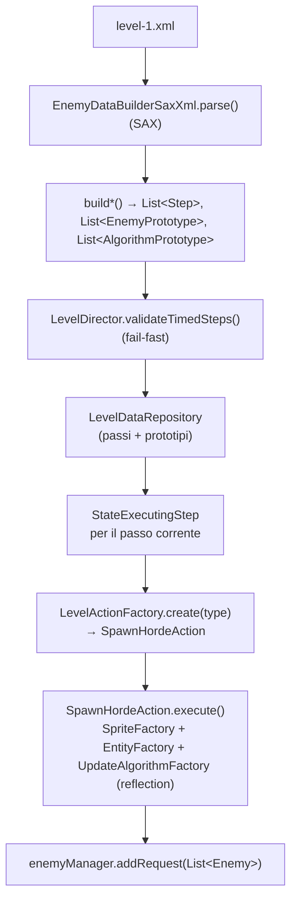

# Caricamento dei dati del livello (modulo game)

> **Indice correlato**: [Sequenziamento del livello tramite il Level Director](index.md)

> **Modulo:** `game` — **esempio implementativo** guidato dai dati. Questa pagina descrive come
> l'XML del livello diventa passi, azioni e nemici concreti in scena. È la controparte "dati" del
> [sequenziamento a stati](sequenziamento-step.md); il framework a stati generico è invece nel
> [modulo engine](motore-macchina-a-stati.md).

## Indice

1. [Contesto](#1-contesto)
2. [Descrizione dei componenti](#2-descrizione-dei-componenti)
3. [Flusso dati](#3-flusso-dati)
4. [Punti di integrazione](#4-punti-di-integrazione)
5. [Stato dell'engine toccato](#5-stato-dellengine-toccato)

---

## 1. Contesto

### Scopo
Trasformare la definizione dichiarativa del livello
([level-1.xml](../../../game/src/main/resources/level/level-1.xml)) in strutture in memoria (passi,
azioni e prototipi) e, passo dopo passo, in istanze di `Enemy` pronte per la scena.

### Obiettivo
Due fasi distinte:

1. **Caricamento (una tantum):** `LevelDirector.init()` fa il parse SAX dell'XML tramite
   `EnemyDataBuilderSaxXml`, **valida** i passi temporizzati e popola `LevelDataRepository`.
2. **Generazione (su richiesta):** durante `StateExecutingStep`, l'azione `SpawnHordeAction` istanzia
   — per **reflection** — sprite, nemici e algoritmi di movimento dichiarati, e li consegna
   all'`EnemyGroup`.

### Trigger
- **Caricamento:** `LevelDirector.init()` durante l'avvio della `LevelScene` (una volta).
- **Generazione:** l'azione `spawnHorde` di un passo, eseguita da `StateExecutingStep` (vedi
  [sequenziamento-step.md](sequenziamento-step.md)).

### Concetti locali
- **Prototipo**: modello riusabile (nemico o algoritmo) referenziato per nome dalle azioni di spawn.
- **Reflection**: tipi di azione e nomi di classe pienamente qualificati istanziati a runtime
  tramite `LevelActionFactory`, `EntityFactory` e `UpdateAlgorithmFactory`.

---

## 2. Descrizione dei componenti

| Componente | Modulo | Classe/Interfaccia | Responsabilità |
|---|---|---|---|
| Interfaccia builder | `game` | `EnemyDataBuilder` | Contratto: `parse()`, `buildSteps()`, `buildEnemyPrototypes()`, `buildAlgorithmPrototypes()`. |
| Parser | `game` | `EnemyDataBuilderSaxXml` | Handler SAX che riempie passi, azioni, eventi di completamento e prototipi dai tag XML. |
| Coordinatore | `game` | `LevelDirector` | Orchestratore del caricamento: fa il parse, **valida** i passi `timed`, popola il repository. |
| Repository | `game` | `LevelDataRepository` | Custodisce passi + prototipi; lookup per indice (passi) e per nome (prototipi). |
| Factory azioni | `game` | `LevelActionFactory` | Risolve `<action type>` nella classe `LevelAction` e la configura via `init(...)`. |
| Azione di spawn | `game` | `SpawnHordeAction` | Istanzia i nemici dell'azione e li consegna all'`EnemyGroup`. |
| Modello dati | `game` | `Step`, `ActionDefinition`, `CompletionEvent`, `EnemyDefinition`, `EnemyPrototype`, `AlgorithmPrototype`, … | POJO che rispecchiano i tag XML. |
| Fabbriche (engine) | `engine` | `SpriteFactory`, `EntityFactory`, `UpdateAlgorithmFactory`, `ClassFactory` | Creano sprite, entità, algoritmi e istanze di azione (le ultime per reflection). |

> **Il seam di reflection è nell'engine.** I nomi di classe dell'XML sono istanziati da
> `EntityFactory`, `UpdateAlgorithmFactory` e `ClassFactory`, che stanno nel modulo `engine`. Il
> gioco fornisce i **nomi** (nell'XML e nel registro `LevelActionFactory`) e i **tipi concreti**
> (`game.entity.*`, `game.scene.action.*`, `engine.entity.logic.*`); l'engine fornisce il meccanismo
> di creazione.

---

## 3. Flusso dati

### Fase 1 — caricamento (`LevelDirector.init()`)

1. `builder.parse()` legge l'XML con SAX; ogni `startElement` costruisce il POJO corrispondente
   (`<step>` → `Step`, `<action>` → `ActionDefinition`, `<completionEvent>` → `CompletionEvent`,
   `<enemy>` → `EnemyDefinition`, `<enemyPrototype>` → `EnemyPrototype`, …).
2. `buildSteps()` / `buildEnemyPrototypes()` / `buildAlgorithmPrototypes()` restituiscono le liste.
3. `validateTimedSteps(steps)` scorre i passi e **fallisce subito** se un passo `timed` ha `time`
   assente, vuoto o non numerico, **nominando l'indice** del passo.
4. Le tre liste vengono riposte in `LevelDataRepository`, che viene messo nel `DirectorContext`.

### Fase 2 — generazione (`StateExecutingStep` → `SpawnHordeAction`)

1. Per ogni `ActionDefinition` del passo, `LevelActionFactory.create(definition)` risolve il `type`
   nella classe (`spawnHorde` → `SpawnHordeAction`), la istanzia via `ClassFactory.newIstance` e la
   configura con `init(definition)` (che copia la lista di `EnemyDefinition`).
2. `SpawnHordeAction.execute(context)` chiama `createEnemies(...)` e, per ogni `EnemyDefinition`:
   - risolve `EnemyPrototype` e `AlgorithmPrototype` per **nome** dal repository;
   - crea lo `Sprite` via `SpriteFactory.createImageSingleSprite(alias)`;
   - crea l'algoritmo via `UpdateAlgorithmFactory.newInstance(classe, proprietà)` (**reflection**);
   - crea l'`Enemy` via `EntityFactory.createEntity(x, y, z, vx, vy, scala, algoritmo, sprite, classe)` (**reflection**);
   - inietta effect/shot/enemy manager, target (il player) e contesto.
3. `context.getEnemyManager().addRequest(created)` accoda i nemici sull'`EnemyGroup`.

---

## 4. Punti di integrazione

### Elementi e attributi XML

| Tag | Attributi | POJO | Note |
|---|---|---|---|
| `<step>` | — | `Step` | Passo; ordine di dichiarazione = ordine di esecuzione. |
| `<actions>` | — | *(contenitore)* | Racchiude le `<action>` del passo, in ordine. |
| `<action>` | `type` (+ attributi liberi) | `ActionDefinition` | `type` sceglie la `LevelAction`; gli attributi diversi da `type` finiscono nel sacchetto `properties`. |
| `<completionEvent>` | `name`, `time` | `CompletionEvent` | `name` ∈ {`timed`, `cleared`, `bossSpawned`}; `time` in secondi (solo `timed`). Posto **dopo** le azioni. |
| `<enemy>` | `enemyPrototype`, `algorithmPrototype`, `posX`, `posY`, `posZ` | `EnemyDefinition` | Dentro un'`<action type="spawnHorde">`. Riferimenti per nome + posizione (la risoluzione assume 1360×660). |
| `<enemyPrototype>` | `name`, `type`, `class` | `EnemyPrototype` | `type` oggi è sempre `imageSingleSprite`; `class` è l'FQN del nemico. |
| `<speed>` / `<image>` / `<scale>` | vari | `Speed` / `Image` / `Scale` | Attributi del prototipo nemico. `image alias` risolto dal catalogo immagini. |
| `<algorithmPrototype>` | `name`, `class` | `AlgorithmPrototype` | `class` è l'FQN dell'algoritmo (`engine.entity.logic.*`). |
| `<algorithmProperties>` | — | `AlgorithmProperties` | Contenitore di parametri semplici e liste di punti. |
| `<property>` | `name`, `value` | proprietà semplice | Es. `delta`, `increment`. |
| `<listPoints>` / `<point>` | `name` / `posX`, `posY` | `List<PointDefinition>` | Waypoint per gli algoritmi a spline (B-spline). |

### File esterni

| File | Ruolo |
|---|---|
| [level/level-1.xml](../../../game/src/main/resources/level/level-1.xml) | Definizione autorevole del livello (caricata dal classpath). |
| `image-catalog.txt` | Risolve gli alias `<image alias="…">` in immagini reali. |

---

## 5. Stato dell'engine toccato

| Elemento | Modulo | Letto / scritto | Note |
|---|---|---|---|
| `LevelDataRepository` | `game` | scritto in caricamento, letto in generazione | Fonte in memoria di passi e prototipi. |
| `EnemyGroup` (gruppo entità) | `game` | scritto via `addRequest(...)` | I nemici generati entrano in scena. |
| `ClassFactory` (engine) | `engine` | letto | Istanzia le `LevelAction` per reflection dall'FQN registrato. |
| `SpriteFactory` (singleton) | `engine` | letto | Crea gli sprite dagli alias immagine. |
| `EntityFactory` (singleton) | `engine` | letto | Istanzia i nemici per reflection dall'FQN. |
| `UpdateAlgorithmFactory` | `engine` | letto | Istanzia gli algoritmi di movimento per reflection. |

### Casi limite e sicurezza

| Situazione | Comportamento |
|---|---|
| Passo `timed` senza `time` valido | `LevelDirector.validateTimedSteps` lancia un'eccezione che **nomina l'indice** del passo; il livello non parte. |
| `time` dichiarato su un passo **non** `timed` | Ignorato: la validazione passa e il valore non ha effetto sul sequenziamento. |
| `action type` non registrato in `LevelActionFactory` | `LevelActionFactory.create` lancia "unknown level action type '…'". |
| `enemyPrototype` / `algorithmPrototype` con nome inesistente | Il lookup nel repository restituisce `null` → `NullPointerException` alla generazione. |
| FQN di classe nemico/algoritmo errato | La factory di reflection fallisce; l'eccezione viene ripropagata da `createEnemies`. |
| `type` del prototipo diverso da `imageSingleSprite` | Nessun ramo lo gestisce: l'entità resta `null` (oggi tutti i prototipi usano `imageSingleSprite`). |

> **Nota.** La validazione fail-fast riguarda **solo** il `time` dei passi `timed`: rende ogni attesa
> temporizzata esplicita e leggibile, senza fallback a un valore di default.
