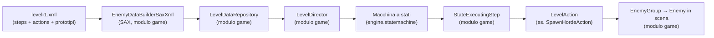
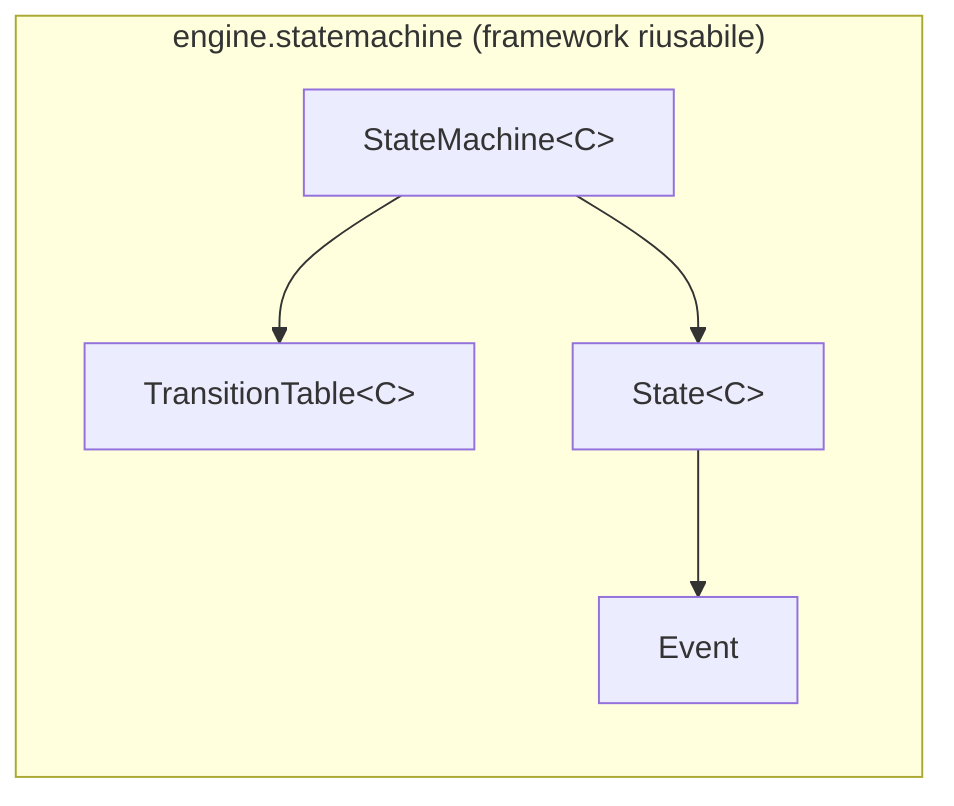
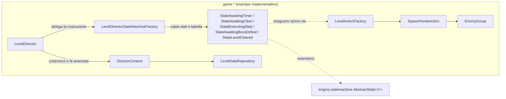
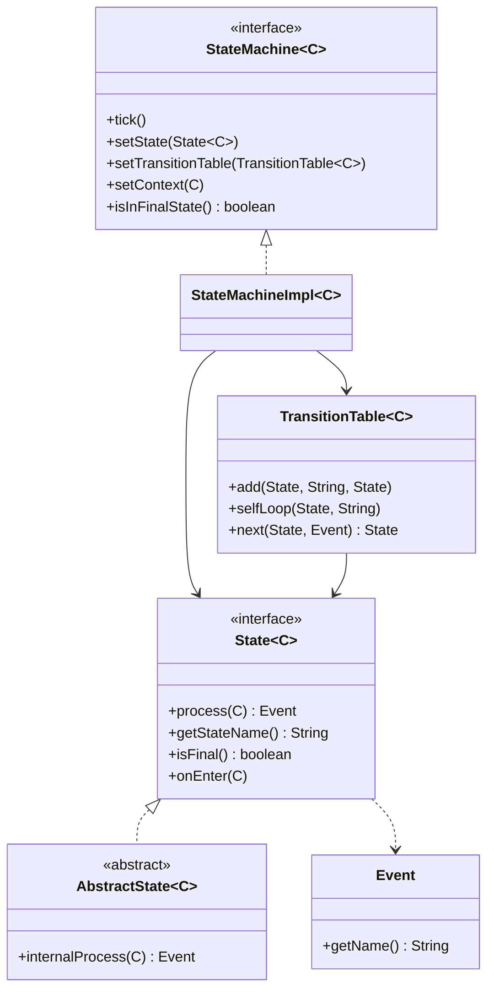
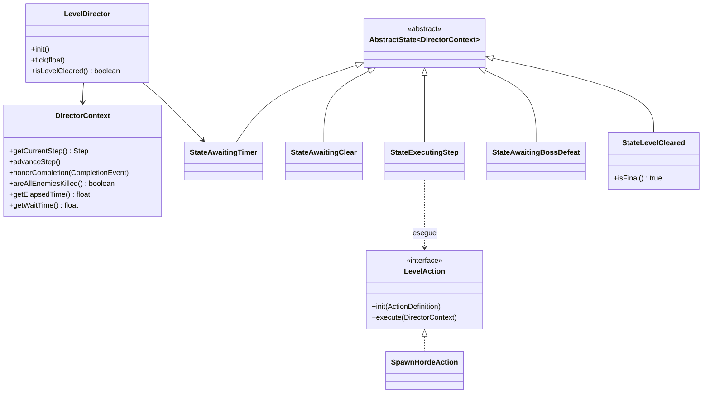
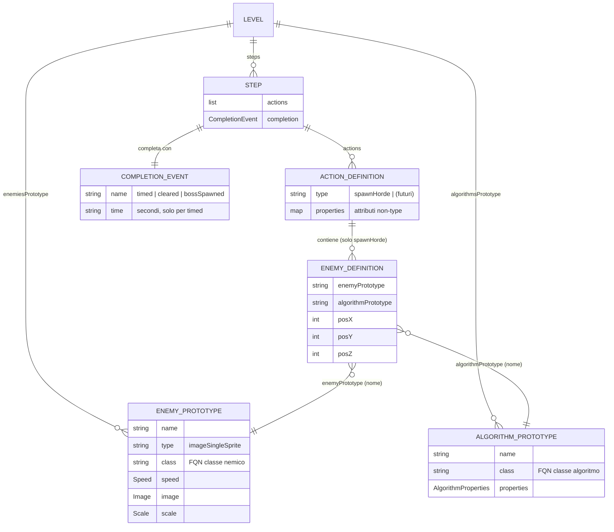
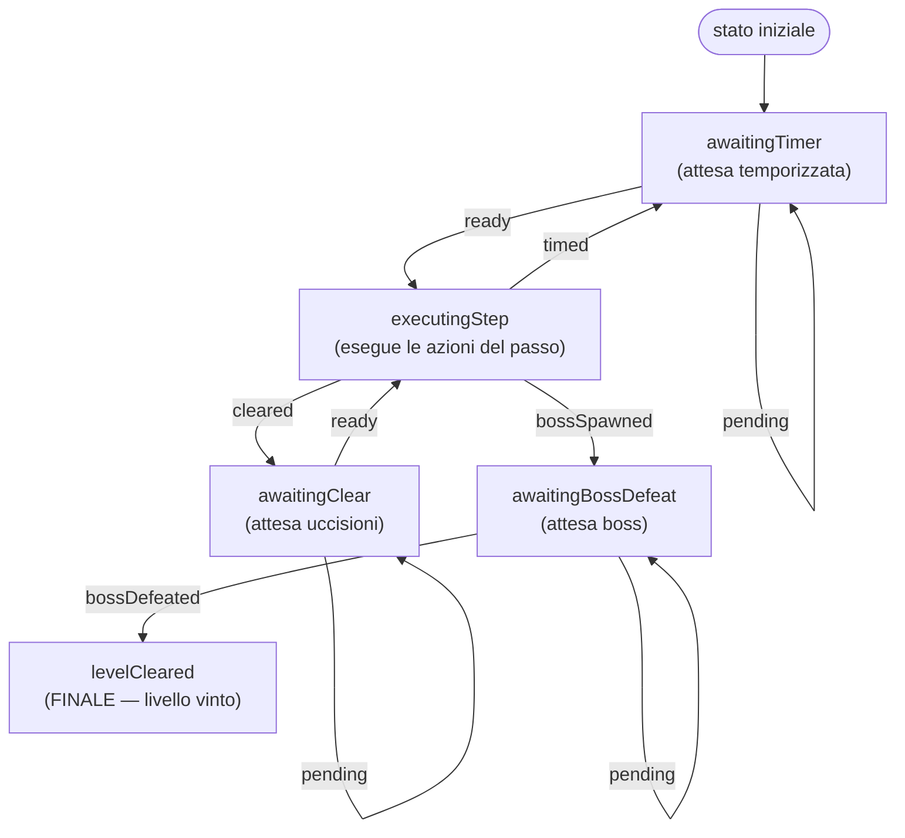

# Sequenziamento del livello tramite il Level Director (level-director-sequencing)

> **Nota sulla lingua.** Questo sottosistema è documentato in **italiano** su richiesta. La
> [guida alla documentazione dei sottosistemi](../subsystem-documentation-guide.md) è in inglese e
> definisce la struttura (spine, archetipi, diagrammi): qui se ne segue la forma, non la lingua.

> **Nota sul nome.** Questo sottosistema si chiamava in precedenza `enemy-spawn-lifecycle` perché la
> macchina a stati sapeva fare una cosa sola: generare ondate di nemici. Ora la generazione delle
> ondate è **solo una delle azioni** che un passo del livello può eseguire, e la macchina è pilotata
> da un **Level Director** capace di comandare più sottosistemi. Il vecchio nome non è più corretto:
> il sottosistema è il **sequenziamento del livello**. La capability OpenSpec conserva invece il nome
> storico `enemy-spawn-lifecycle`.

## Indice

1. [Panoramica](#1-panoramica)
2. [Contesto di sistema](#2-contesto-di-sistema)
3. [Concetti chiave](#3-concetti-chiave)
4. [La netta separazione Engine / Game](#4-la-netta-separazione-engine--game)
5. [Inventario dei componenti](#5-inventario-dei-componenti)
6. [Modello dati / configurazione (XML del livello)](#6-modello-dati--configurazione-xml-del-livello)
7. [Ciclo di vita / pipeline](#7-ciclo-di-vita--pipeline)
8. [Flussi documentati](#8-flussi-documentati)
9. [Ricette](#9-ricette)
10. [Scenari di riferimento](#10-scenari-di-riferimento)
11. [Possibili migliorie](#11-possibili-migliorie)

---

## 1. Panoramica

### Cos'è il sequenziamento del livello?

In termini di gioco, un livello di TigerSupply è una **sequenza di passi** (gli *step*). Ogni passo
**fa qualcosa** — genera un'ondata di nemici, in futuro potrà far muovere la base o lo sfondo,
lanciare una traccia audio — e poi dichiara **come il gioco riconosce che quel passo è finito**
prima di procedere al successivo: aspettando un tempo, aspettando che lo schermo sia ripulito, o
aspettando l'abbattimento del **boss** (che conclude il livello). Il "sequenziamento del livello" è
il meccanismo che decide **quando** eseguire il passo successivo e **quando** il livello è finito.

Tecnicamente il sottosistema è composto da **due parti nettamente distinte** (vedi
[§4](#4-la-netta-separazione-engine--game)):

- una **macchina a stati generica e riusabile** nel modulo `engine` (`engine.statemachine.*`), che
  non conosce nulla dei passi, delle azioni né delle ondate;
- un **esempio implementativo concreto** nel modulo `game` (il **Level Director** e il suo contesto
  in `game.scene.director.*`, gli stati in `game.scene.statemachine.*`, le azioni in
  `game.scene.action.*`, il caricamento XML in `game.scene.builder.*`), che *usa* quella macchina a
  stati per sequenziare i passi letti dall'XML del livello.



> **Obiettivo di questa documentazione:** permettere a uno sviluppatore (o a un agente AI) di
> capire **dove finisce il framework `engine` e dove inizia il gioco `game`**, e di aggiungere un
> nuovo passo, un nuovo tipo di azione, un nuovo tipo di nemico, un nuovo algoritmo di movimento o
> un nuovo stato seguendo la [ricetta](aggiungere-nuovi-elementi.md).

| Documento di riferimento | Ruolo |
|---|---|
| [motore-macchina-a-stati.md](motore-macchina-a-stati.md) | Il framework `engine` riusabile: come gira la macchina a stati generica. |
| [sequenziamento-step.md](sequenziamento-step.md) | L'esempio `game`: come il Level Director sequenzia i passi a ogni frame. |
| [caricamento-dati-livello.md](caricamento-dati-livello.md) | L'esempio `game`: come l'XML diventa passi, azioni e nemici in scena. |
| [aggiungere-nuovi-elementi.md](aggiungere-nuovi-elementi.md) | Ricetta: aggiungere passi, azioni, nemici, algoritmi, stati. |
| [migliorie-payload-eventi.md](migliorie-payload-eventi.md) | Nota di design (proposta, non pianificata): payload sugli eventi. |

---

## 2. Contesto di sistema

Il sottosistema è **offline** e **guidato da file**: non c'è rete, database o servizio esterno. Le
uniche risorse esterne che tocca sono file sul classpath e costanti di gioco.

| Risorsa | Modulo | Ruolo | Autorevole? |
|---|---|---|---|
| [level/level-1.xml](../../../game/src/main/resources/level/level-1.xml) | `game` (resources) | Definisce l'ordine dei passi, le azioni di ciascun passo con il relativo evento di completamento, i prototipi dei nemici e gli algoritmi di movimento. | **Sì** — è la fonte di verità del contenuto del livello. |
| [LevelDirectorStateMachineFactory](../../../game/src/main/java/it/spaghettisource/tigersupply/game/scene/statemachine/LevelDirectorStateMachineFactory.java) | `game` | Costanti `STATE_*` / `EVENT_*` e `Event` condivisi che nominano stati ed eventi della macchina; ne costruisce anche il grafo delle transizioni. I nomi degli **eventi** sono il vocabolario di `<completionEvent name="…">`. | Sì per i nomi di stato/evento e per il grafo. |
| [LevelActionFactory](../../../game/src/main/java/it/spaghettisource/tigersupply/game/scene/action/LevelActionFactory.java) | `game` | Registro `tipo azione → classe`; risolve il valore di `<action type="…">` in una classe `LevelAction` concreta. | Sì per i tipi di azione disponibili. |
| Cataloghi immagini/audio/font (`*-catalog.txt`) | `game` (resources) | Risolvono gli alias (`enemy1`, `boss`, …) usati dai prototipi nemico in immagini reali. | Sì per gli asset. |

**Stile di integrazione.** La parte `game` è **guidata dai dati**: l'XML è letto con SAX; i tipi di
azione, i nomi di classe (nemici e algoritmi) sono istanziati per **reflection**. La parte `engine`,
al contrario, è una **API in-process** puramente programmatica: la macchina a stati non legge alcun
file e non usa reflection — riceve stati, tabella e contesto via setter e viene fatta avanzare a
ogni frame.

---

## 3. Concetti chiave

### 3.1 Step (passo)

Un **passo** è un singolo battito della timeline del livello: una **lista ordinata di azioni** da
eseguire più **un** evento di completamento che decide come il gioco aspetta prima del passo
successivo. Nel codice è
[`Step`](../../../game/src/main/java/it/spaghettisource/tigersupply/game/scene/builder/definition/Step.java):
una `List<ActionDefinition>` + un `CompletionEvent`. Sostituisce la vecchia `Horde` (che fondeva
"genera questi nemici" con "come si completa l'ondata").

### 3.2 LevelAction e SpawnHordeAction (azione)

Un'**azione** è un comando *fire-and-forget* eseguito dentro un passo: prende effetto una volta,
subito, e ogni comportamento durativo che avvia è di competenza del sottosistema che comanda, non
dell'azione stessa. Nel codice è l'interfaccia
[`LevelAction`](../../../game/src/main/java/it/spaghettisource/tigersupply/game/scene/action/LevelAction.java)
(`init(ActionDefinition)` + `execute(DirectorContext)`), istanziata per nome di classe via
[`LevelActionFactory`](../../../game/src/main/java/it/spaghettisource/tigersupply/game/scene/action/LevelActionFactory.java).
L'unica azione concreta esistente oggi è
[`SpawnHordeAction`](../../../game/src/main/java/it/spaghettisource/tigersupply/game/scene/action/SpawnHordeAction.java)
(la vecchia logica di spawn dei nemici). Le **azioni sono il punto di estensione aperto**: base,
sfondo, audio saranno nuove `LevelAction`.

### 3.3 CompletionEvent (evento di completamento)

Ogni passo dichiara **come** si completa tramite il tag `<completionEvent>`. Il valore diventa il
nome dell'`Event` engine che instrada la macchina a stati; il vocabolario è **chiuso** (costanti
`EVENT_*` in `LevelDirectorStateMachineFactory`):

| `name` | Significato | Attributo `time` |
|---|---|---|
| `timed` | Attendi *N* secondi, poi esegui il passo successivo. | **obbligatorio** (secondi, anche frazionari) |
| `cleared` | Attendi finché tutti i nemici in scena sono morti, poi esegui il successivo. | ignorato |
| `bossSpawned` | Questo passo ha introdotto il boss: passa allo stato di attesa uccisione boss. | ignorato |

> **Azioni aperte, completamento chiuso.** Le azioni sono estensibili all'infinito (qualsiasi FQN);
> il vocabolario di completamento è un piccolo insieme chiuso perché ogni valore mappa su uno stato
> di attesa dedicato. Rendere aperto anche il completamento moltiplicherebbe gli stati della
> macchina.

### 3.4 Prototipo nemico / prototipo algoritmo

Un **prototipo** è un modello riusabile referenziato per nome dalle azioni di spawn. Un
[`EnemyPrototype`](../../../game/src/main/java/it/spaghettisource/tigersupply/game/scene/builder/definition/EnemyPrototype.java)
definisce sprite, velocità, scala e classe Java del nemico; un
[`AlgorithmPrototype`](../../../game/src/main/java/it/spaghettisource/tigersupply/game/scene/builder/definition/AlgorithmPrototype.java)
definisce la classe dell'algoritmo di movimento e i suoi parametri. Le azioni contengono solo
**riferimenti per nome** (`enemyPrototype="standard-1"`, `algorithmPrototype="default"`).

### 3.5 LevelDirector e DirectorContext (il coordinatore condiviso)

Il [`LevelDirector`](../../../game/src/main/java/it/spaghettisource/tigersupply/game/scene/director/LevelDirector.java)
è l'unico coordinatore che **possiede la macchina a stati** e il contesto, la costruisce e la fa
avanzare a ogni frame. Il
[`DirectorContext`](../../../game/src/main/java/it/spaghettisource/tigersupply/game/scene/director/DirectorContext.java)
è il **contesto `C`** passato a ogni stato: tiene il tempo trascorso (`elapsedTime`), il ritardo da
rispettare (`waitTime`), il cursore sul passo corrente (`stepIndex`) ed **espone i sottosistemi che
le azioni comandano** (oggi l'enemy manager; domani base, sfondo, audio). È il successore allargato
del vecchio `EnemySpawnContext`.

### 3.6 State, Event, TransitionTable (vocabolario dell'engine)

- Uno **State** (`State<C>`) calcola un **Event** dal contesto e può essere *finale*.
- Un **Event** è un semplice contenitore di un nome (`engine.statemachine.Event`).
- Una **TransitionTable** mappa la coppia `(nomeStato, nomeEvento)` sullo stato successivo.
- La **StateMachine** avanza di **al massimo una transizione per tick** e si **ferma** su uno stato
  finale.

### 3.7 Tick

Un **tick** è una chiamata a `StateMachine.tick()`, invocata una volta per frame da
`LevelDirector.tick(deltaSeconds)`. Non più di una transizione avviene per tick.

### 3.8 Stato finale (fine livello)

Lo stato `levelCleared` è **finale** (`State.isFinal()` → `true`). Quando la macchina lo raggiunge
si ferma; `LevelDirector.isLevelCleared()` diventa `true` e la scena passa al livello successivo. È
l'**unica fonte di verità** per "boss morto / livello vinto".

> **Attenzione — nome vs evento.** La costante di **stato** `STATE_LEVEL_CLEARED` vale
> `"levelCleared"`, mentre la costante di **evento** `EVENT_BOSS_DEFEATED` vale `"bossDefeated"`.
> Sono deliberatamente distinti: lo stato finale e l'evento che vi conduce non collidono.

---

## 4. La netta separazione Engine / Game

Questa è la distinzione centrale del sottosistema: **il modulo `engine` fornisce il meccanismo
riusabile, il modulo `game` ne è un esempio implementativo concreto.**

| Aspetto | Modulo **engine** (framework) | Modulo **game** (esempio implementativo) |
|---|---|---|
| Package | `it.spaghettisource.tigersupply.engine.statemachine` | `...game.scene.director`, `...game.scene.statemachine`, `...game.scene.action`, `...game.scene.builder`, `...game.entity` |
| Cosa fornisce | Una macchina a stati **generica** `StateMachine<C>` parametrica sul contesto `C`. | Il `LevelDirector`, il `DirectorContext`, gli stati concreti, le azioni, il caricatore XML, il cablaggio. |
| Conosce passi/azioni/nemici? | **No.** Nessun riferimento a `Step`, `LevelAction`, `Enemy` o all'XML. Compila da solo. | **Sì.** È interamente specifico di TigerSupply. |
| Come si estende | Aggiungendo un nuovo `State<C>` / una nuova transizione. | Aggiungendo un passo/un'azione/un prototipo nell'XML o un nuovo stato/azione di gioco. |
| Reflection / file | Nessuno: pura API in-process. | SAX sull'XML + reflection su tipi di azione, classi nemico/algoritmo. |
| Diagramma di firma | `classDiagram` del framework | `erDiagram` del modello XML + `classDiagram` degli stati/azioni |

**La parte engine — riusabile, agnostica:**



**La parte game — usa il framework per sequenziare i passi:**



> **Regola pratica.** Se stai scrivendo codice che potrebbe servire a un *altro* gioco basato su
> questo engine, va in `engine.statemachine`. Se nomina `Step`, `LevelAction`, `Enemy`, `timed` o
> l'XML, va in `game.*`. L'unico punto in cui i due mondi si toccano è il **parametro di tipo `C`**:
> `game` istanzia `StateMachine<DirectorContext>`.

---

## 5. Inventario dei componenti

### 5.1 Modulo engine — la macchina a stati generica

| Livello | Elemento | Path | Ruolo |
|---|---|---|---|
| Interfaccia | `StateMachine<C>` | [StateMachine.java](../../../engine/src/main/java/it/spaghettisource/tigersupply/engine/statemachine/StateMachine.java) | Contratto: `tick()`, `setState`, `setTransitionTable`, `setContext`, `isInFinalState`. |
| Impl. | `StateMachineImpl<C>` | [StateMachineImpl.java](../../../engine/src/main/java/it/spaghettisource/tigersupply/engine/statemachine/StateMachineImpl.java) | Esegue un tick: `process` → `next` → `onEnter`; no-op se lo stato è finale. |
| Interfaccia | `State<C>` | [State.java](../../../engine/src/main/java/it/spaghettisource/tigersupply/engine/statemachine/State.java) | Nodo: `process(C)`, `getStateName()`, `isFinal()`, `onEnter(C)`. |
| Astratta | `AbstractState<C>` | [AbstractState.java](../../../engine/src/main/java/it/spaghettisource/tigersupply/engine/statemachine/AbstractState.java) | Wrapper try/catch attorno a `internalProcess(C)`. |
| Classe | `TransitionTable<C>` | [TransitionTable.java](../../../engine/src/main/java/it/spaghettisource/tigersupply/engine/statemachine/TransitionTable.java) | Grafo dichiarativo `(stato,evento) → stato`. |
| Classe | `Event` | [Event.java](../../../engine/src/main/java/it/spaghettisource/tigersupply/engine/statemachine/Event.java) | Contenitore del nome dell'evento. |
| Eccezione | `StateMachineException` | [StateMachineException.java](../../../engine/src/main/java/it/spaghettisource/tigersupply/engine/statemachine/StateMachineException.java) | Errore di esecuzione della macchina. |
| Eccezione | `StateMachineUnsupportedState` | [StateMachineUnsupportedState.java](../../../engine/src/main/java/it/spaghettisource/tigersupply/engine/statemachine/StateMachineUnsupportedState.java) | Stato sconosciuto alla tabella. |
| Eccezione | `StateMachineUnsupportedEvent` | [StateMachineUnsupportedEvent.java](../../../engine/src/main/java/it/spaghettisource/tigersupply/engine/statemachine/StateMachineUnsupportedEvent.java) | Coppia (stato,evento) non dichiarata. |



### 5.2 Modulo game — il Level Director e le sue azioni

| Livello | Elemento | Path | Ruolo |
|---|---|---|---|
| Coordinatore | `LevelDirector` | [LevelDirector.java](../../../game/src/main/java/it/spaghettisource/tigersupply/game/scene/director/LevelDirector.java) | Carica e valida il livello, cabla il contesto, costruisce la macchina e la fa avanzare a ogni frame; espone `tick()` e `isLevelCleared()`. |
| Contesto | `DirectorContext` | [DirectorContext.java](../../../game/src/main/java/it/spaghettisource/tigersupply/game/scene/director/DirectorContext.java) | Il `C` della macchina: tempo, ritardo, cursore sul passo, riferimenti ai sottosistemi comandabili. |
| Definizione FSM | `LevelDirectorStateMachineFactory` | [LevelDirectorStateMachineFactory.java](../../../game/src/main/java/it/spaghettisource/tigersupply/game/scene/statemachine/LevelDirectorStateMachineFactory.java) | Costanti di stato/evento, `Event` condivisi, `TransitionTable`, stato iniziale; costruisce la `StateMachine`. |
| Stato | `StateAwaitingTimer` | [StateAwaitingTimer.java](../../../game/src/main/java/it/spaghettisource/tigersupply/game/scene/statemachine/StateAwaitingTimer.java) | Attesa temporizzata fra i passi. |
| Stato | `StateAwaitingClear` | [StateAwaitingClear.java](../../../game/src/main/java/it/spaghettisource/tigersupply/game/scene/statemachine/StateAwaitingClear.java) | Attesa finché lo schermo è ripulito. |
| Stato | `StateExecutingStep` | [StateExecutingStep.java](../../../game/src/main/java/it/spaghettisource/tigersupply/game/scene/statemachine/StateExecutingStep.java) | Esegue in ordine le azioni del passo corrente e ne emette l'evento di completamento. |
| Stato | `StateAwaitingBossDefeat` | [StateAwaitingBossDefeat.java](../../../game/src/main/java/it/spaghettisource/tigersupply/game/scene/statemachine/StateAwaitingBossDefeat.java) | Attende l'uccisione del boss. |
| Stato (finale) | `StateLevelCleared` | [StateLevelCleared.java](../../../game/src/main/java/it/spaghettisource/tigersupply/game/scene/statemachine/StateLevelCleared.java) | Terminale: boss morto, livello vinto. |
| Azione (interfaccia) | `LevelAction` | [LevelAction.java](../../../game/src/main/java/it/spaghettisource/tigersupply/game/scene/action/LevelAction.java) | Comando fire-and-forget: `init(ActionDefinition)` + `execute(DirectorContext)`. |
| Factory azioni | `LevelActionFactory` | [LevelActionFactory.java](../../../game/src/main/java/it/spaghettisource/tigersupply/game/scene/action/LevelActionFactory.java) | Registro `tipo → classe`; istanzia e configura una `LevelAction` per reflection. |
| Azione concreta | `SpawnHordeAction` | [SpawnHordeAction.java](../../../game/src/main/java/it/spaghettisource/tigersupply/game/scene/action/SpawnHordeAction.java) | Istanzia i nemici dichiarati e li registra sull'`EnemyGroup`. |
| Gruppo nemici | `EnemyGroup` | [EnemyGroup.java](../../../game/src/main/java/it/spaghettisource/tigersupply/game/entity/EnemyGroup.java) | Gestisce **solo** le entità nemico vive (nessun sequenziamento). |
| Builder | `EnemyDataBuilderSaxXml` | [EnemyDataBuilderSaxXml.java](../../../game/src/main/java/it/spaghettisource/tigersupply/game/scene/builder/EnemyDataBuilderSaxXml.java) | Parser SAX dell'XML del livello (passi, azioni, completamento, prototipi). |
| Repository | `LevelDataRepository` | [LevelDataRepository.java](../../../game/src/main/java/it/spaghettisource/tigersupply/game/scene/builder/LevelDataRepository.java) | Custodisce passi + prototipi, lookup per indice/nome. |
| Scena | `LevelScene` | [LevelScene.java](../../../game/src/main/java/it/spaghettisource/tigersupply/game/scene/LevelScene.java) | Crea e fa il tick del `LevelDirector`; rileva la fine livello. |



---

## 6. Modello dati / configurazione (XML del livello)

La parte `game` è guidata dall'XML. La struttura di
[level-1.xml](../../../game/src/main/resources/level/level-1.xml) è:



Un passo si legge **in ordine di esecuzione**: prima le `<actions>`, poi il `<completionEvent>`.

```xml
<step>
    <actions>
        <action type="spawnHorde">
            <enemy enemyPrototype="standard-1" posX="1350" posY="500" posZ="20" algorithmPrototype="straightBackToFrontDown" />
        </action>
    </actions>
    <completionEvent name="timed" time="0.5" />
</step>
```

- **`<step>`** → [`Step`](../../../game/src/main/java/it/spaghettisource/tigersupply/game/scene/builder/definition/Step.java): il passo scriptato, in ordine di dichiarazione.
- **`<action type="…">`** → [`ActionDefinition`](../../../game/src/main/java/it/spaghettisource/tigersupply/game/scene/builder/definition/ActionDefinition.java): il `type` sceglie la `LevelAction`; per `spawnHorde` contiene i `<enemy>`, per gli altri tipi un sacchetto di proprietà (gli attributi diversi da `type`).
- **`<completionEvent>`** → [`CompletionEvent`](../../../game/src/main/java/it/spaghettisource/tigersupply/game/scene/builder/definition/CompletionEvent.java): come si completa il passo (vedi [§3.3](#33-completionevent-evento-di-completamento)).
- **`<enemy>`** → [`EnemyDefinition`](../../../game/src/main/java/it/spaghettisource/tigersupply/game/scene/builder/definition/EnemyDefinition.java): un'istanza di nemico con posizione e i nomi dei due prototipi.
- **`<enemyPrototype>`** / **`<algorithmPrototype>`**: i modelli riusabili risolti per nome a runtime tramite `LevelDataRepository`.

Il dettaglio del parsing è in [caricamento-dati-livello.md](caricamento-dati-livello.md).

---

## 7. Ciclo di vita / pipeline

La macchina a stati parte da `awaitingTimer` e termina su `levelCleared`. Ogni freccia è una
transizione dichiarata in `LevelDirectorStateMachineFactory.build()`.



| Passo | Fornito da | Comportamento |
|---|---|---|
| Tick | `LevelDirector.tick` (game) | Incrementa il tempo e chiama `stateMachine.tick()` una volta per frame. |
| Calcolo evento | `State.process` (engine → stato game) | Lo stato legge il contesto e restituisce un `Event`. |
| Esecuzione azioni | `StateExecutingStep.internalProcess` (game) | Esegue in ordine le azioni del passo via `LevelActionFactory`, poi emette il `CompletionEvent`. |
| Risoluzione transizione | `TransitionTable.next` (engine) | Dalla coppia `(stato,evento)` ricava lo stato successivo. |
| Ingresso stato | `State.onEnter` (engine → `StateAwaitingTimer`) | Solo al cambio di stato; `StateAwaitingTimer` azzera il timer. |
| Arresto | `StateMachineImpl.tick` (engine) | No-op quando lo stato corrente è finale. |

Il dettaglio frame-by-frame è in [sequenziamento-step.md](sequenziamento-step.md); il funzionamento
generico della macchina in [motore-macchina-a-stati.md](motore-macchina-a-stati.md).

---

## 8. Flussi documentati

| # | Flusso | Modulo | Trigger | Descrizione | Dettaglio |
|---|---|---|---|---|---|
| 1 | Esecuzione della macchina a stati generica | **engine** | `tick()` per tick | Come un tick sceglie l'evento, risolve la transizione e si ferma sul finale. | [motore-macchina-a-stati.md](motore-macchina-a-stati.md) |
| 2 | Sequenziamento dei passi | **game** | frame update | Come i 5 stati concreti sequenziano i passi, eseguono le azioni e rispettano `timed`/`cleared`. | [sequenziamento-step.md](sequenziamento-step.md) |
| 3 | Caricamento dati livello (XML → passi/azioni/nemici) | **game** | avvio livello | Come il SAX builder e la reflection trasformano l'XML in `Step`/azioni e `Enemy` in scena. | [caricamento-dati-livello.md](caricamento-dati-livello.md) |

---

## 9. Ricette

| Ricetta | Quando usarla | Dettaglio |
|---|---|---|
| Aggiungere passi, azioni, nemici, algoritmi o un nuovo stato | Estendere il contenuto o la logica di sequenziamento del livello. | [aggiungere-nuovi-elementi.md](aggiungere-nuovi-elementi.md) |

---

## 10. Scenari di riferimento

| Scenario | Stato |
|---|---|
| Pipeline dei passi del Livello 1 | Esempio verticale di riferimento usato in tutte le pagine: `level-1.xml` → `EnemyDataBuilderSaxXml` → `LevelDataRepository` → `LevelDirector` → macchina a stati → `StateExecutingStep` → `SpawnHordeAction` → `EnemyGroup` → `Enemy`. |

---

## 11. Possibili migliorie

| Nota | Stato |
|---|---|
| [Payload sugli eventi consegnato agli stati](migliorie-payload-eventi.md) | Proposta di design, **non pianificata**: far portare all'`Event` il proprio payload (es. il `time` di `timed`) invece di farlo viaggiare nel contesto come canale laterale. |
