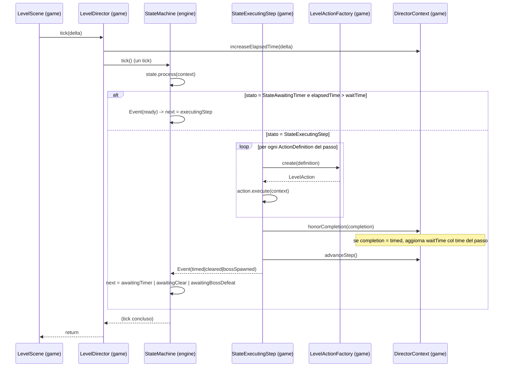

# Sequenziamento dei passi (modulo game)

> **Indice correlato**: [Sequenziamento del livello tramite il Level Director](index.md)

> **Modulo:** `game` — **esempio implementativo** costruito sul framework
> [`engine.statemachine`](motore-macchina-a-stati.md). Questa pagina mostra come il **Level Director**
> e i cinque stati concreti di TigerSupply usano quella macchina a stati generica per sequenziare i
> passi di un livello: eseguire le azioni di ogni passo e aspettare il tempo giusto prima del
> successivo.

## Indice

1. [Contesto](#1-contesto)
2. [Descrizione dei componenti](#2-descrizione-dei-componenti)
3. [Flusso dati](#3-flusso-dati)
4. [Punti di integrazione](#4-punti-di-integrazione)
5. [Stato dell'engine toccato](#5-stato-dellengine-toccato)

---

## 1. Contesto

### Scopo
Sequenziare i passi del livello: eseguire le **azioni** di ogni passo e decidere **quando** eseguire
il passo successivo (dopo un tempo o dopo aver ripulito lo schermo), gestire il boss e riconoscere la
**fine del livello**. Tutto questo istanziando la macchina a stati generica dell'engine come
`StateMachine<DirectorContext>` dentro un `LevelDirector`.

### Obiettivo
Portare la macchina da `awaitingTimer` (attesa iniziale) fino allo stato finale `levelCleared`,
attraversando i passi dichiarati in [level-1.xml](../../../game/src/main/resources/level/level-1.xml).

### Trigger
Il **frame update** della scena di gioco. `LevelScene.update(...)` chiama
`levelDirector.tick(deltaTimeSeconds)`, che accumula il tempo e fa **un tick** della macchina a
stati, **prima** di aggiornare i manager delle entità (ordine preservato dalla versione precedente).

### Concetti locali
- **`elapsedTime`**: secondi accumulati nello stato di attesa corrente (`float`, stessa base
  temporale del frame update).
- **`waitTime`**: ritardo da rispettare in `StateAwaitingTimer`. Vale `1` prima del primissimo
  passo, poi è sovrascritto dal `time` dichiarato da ogni passo `timed`.
- **Passo "time-gated"**: un passo il cui `completionEvent` è `timed`; il suo `time` è obbligatorio e
  validato al caricamento (vedi [caricamento-dati-livello.md](caricamento-dati-livello.md)).

---

## 2. Descrizione dei componenti

### Il cablaggio (dove engine e game si incontrano)

Tutta la definizione della macchina a stati — stati, nomi, eventi, grafo delle transizioni e stato
iniziale — vive in un unico punto: `LevelDirectorStateMachineFactory.build(...)`. Il `LevelDirector`
prepara il contesto e delega alla factory la costruzione della macchina; poi la fa avanzare a ogni
frame.

| Componente | Modulo | Classe | Responsabilità |
|---|---|---|---|
| Coordinatore | `game` | `LevelDirector` | Carica il livello, cabla il `DirectorContext`, ottiene la macchina dalla factory; fa il tick e rileva la fine livello. |
| Definizione FSM | `game` | `LevelDirectorStateMachineFactory` | Costanti di stato/evento, `Event` condivisi, `TransitionTable`, stato iniziale; costruisce la `StateMachine`. |
| Contesto | `game` | `DirectorContext` | Il `C` della macchina: tempo, ritardo, cursore sul passo, riferimenti ai sottosistemi comandabili. |
| Stato azione | `game` | `StateExecutingStep` | Esegue in ordine le azioni del passo corrente e ne emette l'evento di completamento. |

Estratto da [LevelDirectorStateMachineFactory.java](../../../game/src/main/java/it/spaghettisource/tigersupply/game/scene/statemachine/LevelDirectorStateMachineFactory.java):

```java
// i nomi degli stati sono iniettati dalla factory (unico punto in cui compaiono)
State<DirectorContext> awaitingTimer      = new StateAwaitingTimer(STATE_AWAITING_TIMER);
State<DirectorContext> awaitingClear      = new StateAwaitingClear(STATE_AWAITING_CLEAR);
State<DirectorContext> executingStep      = new StateExecutingStep(STATE_EXECUTING_STEP);
State<DirectorContext> awaitingBossDefeat = new StateAwaitingBossDefeat(STATE_AWAITING_BOSS_DEFEAT);
State<DirectorContext> levelCleared       = new StateLevelCleared(STATE_LEVEL_CLEARED);

TransitionTable<DirectorContext> table = new TransitionTable<DirectorContext>();
table.selfLoop(awaitingTimer, EVENT_PENDING);
table.add(awaitingTimer, EVENT_READY, executingStep);
table.selfLoop(awaitingClear, EVENT_PENDING);
table.add(awaitingClear, EVENT_READY, executingStep);
table.add(executingStep, EVENT_TIMED,        awaitingTimer);
table.add(executingStep, EVENT_CLEARED,      awaitingClear);
table.add(executingStep, EVENT_BOSS_SPAWNED, awaitingBossDefeat);
table.selfLoop(awaitingBossDefeat, EVENT_PENDING);
table.add(awaitingBossDefeat, EVENT_BOSS_DEFEATED, levelCleared);

StateMachine<DirectorContext> stateMachine = new StateMachineImpl<DirectorContext>();
stateMachine.setTransitionTable(table);
stateMachine.setContext(context);       // context = DirectorContext
stateMachine.setState(awaitingTimer);   // stato iniziale
return stateMachine;
```

### I cinque stati concreti

| Stato | Nome (`LevelDirectorStateMachineFactory`) | Evento prodotto | Comportamento |
|---|---|---|---|
| [`StateAwaitingTimer`](../../../game/src/main/java/it/spaghettisource/tigersupply/game/scene/statemachine/StateAwaitingTimer.java) | `awaitingTimer` | `ready` se `elapsedTime > waitTime`, altrimenti `pending` | In `onEnter` azzera il timer; conta i secondi. |
| [`StateAwaitingClear`](../../../game/src/main/java/it/spaghettisource/tigersupply/game/scene/statemachine/StateAwaitingClear.java) | `awaitingClear` | `ready` se lo schermo è ripulito, altrimenti `pending` | Attende che tutti i nemici siano morti. |
| [`StateExecutingStep`](../../../game/src/main/java/it/spaghettisource/tigersupply/game/scene/statemachine/StateExecutingStep.java) | `executingStep` | l'evento di completamento del passo: `timed` \| `cleared` \| `bossSpawned` | Esegue in ordine le azioni del passo, ne emette l'evento di completamento e avanza il cursore. |
| [`StateAwaitingBossDefeat`](../../../game/src/main/java/it/spaghettisource/tigersupply/game/scene/statemachine/StateAwaitingBossDefeat.java) | `awaitingBossDefeat` | `bossDefeated` se il boss è morto, altrimenti `pending` | Attende l'uccisione del boss. |
| [`StateLevelCleared`](../../../game/src/main/java/it/spaghettisource/tigersupply/game/scene/statemachine/StateLevelCleared.java) | `levelCleared` | *(nessuno: `isFinal()` → `true`)* | Terminale: livello vinto, la macchina si ferma. |

Il cuore dello stato azione, da [StateExecutingStep.java](../../../game/src/main/java/it/spaghettisource/tigersupply/game/scene/statemachine/StateExecutingStep.java):

```java
public Event internalProcess(DirectorContext context) throws Exception {
    Step step = context.getCurrentStep();

    for (ActionDefinition definition : step.getActions()) {   // esegue OGNI azione, in ordine
        LevelAction action = LevelActionFactory.create(definition);
        action.execute(context);
    }

    CompletionEvent completion = step.getCompletion();
    context.honorCompletion(completion);   // se 'timed', copia il time in waitTime
    context.advanceStep();                 // sposta il cursore sul passo successivo

    return new Event(completion.getName()); // 'timed' | 'cleared' | 'bossSpawned'
}
```

> **Perché due stati di attesa distinti?** `awaitingTimer` è temporizzato (ideale per passi
> ravvicinati e coreografati), `awaitingClear` è a "schermo pulito" (obbligatorio per il boss e per i
> colli di bottiglia). Lo stato `executingStep` sceglie a quale tornare in base al `completionEvent`
> **dello stesso passo appena eseguito**, in modo del tutto **indipendente da quali azioni** il passo
> abbia eseguito.

---

## 3. Flusso dati



Narrazione dell'esempio di riferimento (Livello 1):

1. **Avvio.** La macchina parte in `StateAwaitingTimer` con `waitTime = 1`: attende ~1 secondo.
2. **Primo passo.** Superato il secondo, `StateAwaitingTimer` emette `ready` → `executingStep`.
3. **Esecuzione delle azioni.** `StateExecutingStep` legge il passo corrente e, per **ogni**
   `ActionDefinition`, chiede a `LevelActionFactory` la `LevelAction` concreta e la esegue. Nel
   Livello 1 ogni passo ha una sola azione `spawnHorde` → `SpawnHordeAction` istanzia i nemici e li
   registra sull'`EnemyGroup`.
4. **Completamento.** Il primo passo dichiara `<completionEvent name="timed" time="1" />`:
   `honorCompletion` imposta `waitTime = 1`, `advanceStep()` sposta il cursore e lo stato emette
   l'`Event` `timed`.
5. **Ritorno all'attesa.** `executingStep --timed--> awaitingTimer`; `onEnter` azzera `elapsedTime` e
   il ciclo ricomincia per il passo successivo.
6. **Passi `cleared`.** Quando un passo dichiara `cleared`, si passa a `StateAwaitingClear`, che
   attende finché `areAllEnemiesKilled()` è `true`.
7. **Boss.** Il passo che introduce il boss dichiara `bossSpawned` (lo spawn del boss è un'ordinaria
   azione `spawnHorde`) → `awaitingBossDefeat`. Quando il boss muore, `awaitingBossDefeat` emette
   `bossDefeated` → `levelCleared` (finale).
8. **Fine livello.** `LevelDirector.isLevelCleared()` diventa `true`; `LevelScene` avvia il livello
   successivo.

---

## 4. Punti di integrazione

| Punto | Formato / dettaglio |
|---|---|
| Nomi di stato ed evento | Costanti `STATE_*` / `EVENT_*` in [LevelDirectorStateMachineFactory](../../../game/src/main/java/it/spaghettisource/tigersupply/game/scene/statemachine/LevelDirectorStateMachineFactory.java). I nomi degli **eventi** coincidono con i valori `name` del tag `<completionEvent>` dell'XML. |
| `<completionEvent name="…" time="…">` | L'XML pilota le transizioni: l'evento emesso da `StateExecutingStep` porta lo stesso nome del `completionEvent` del passo. |
| `<action type="…">` | Il `type` è risolto dinamicamente da `LevelActionFactory` nella `LevelAction` concreta (vedi [caricamento-dati-livello.md](caricamento-dati-livello.md)). |
| Attesa iniziale | `DirectorContext.waitTime` è inizializzato a `1` per introdurre una pausa prima del primissimo passo. |

> **Corrispondenza nome evento ↔ XML.** `EVENT_TIMED = "timed"`, `EVENT_CLEARED = "cleared"`,
> `EVENT_BOSS_SPAWNED = "bossSpawned"`: sono esattamente i valori ammessi per
> `<completionEvent name="…">`. Aggiungere un nuovo tipo di completamento richiede quindi sia una
> nuova costante/transizione sia il valore corrispondente nell'XML. Al contrario, gli eventi
> `pending`/`ready`/`bossDefeated` sono **interni** alla macchina e non compaiono nell'XML.

---

## 5. Stato dell'engine toccato

| Elemento | Modulo | Letto / scritto | Note |
|---|---|---|---|
| `DirectorContext.elapsedTime` | `game` | scritto ogni frame, azzerato in `onEnter` di `StateAwaitingTimer` | Base temporale del sequenziamento. |
| `DirectorContext.waitTime` | `game` | scritto in `honorCompletion` quando l'evento è `timed` | Sovrascrive il default `1`. |
| `DirectorContext.stepIndex` | `game` | avanzato da `advanceStep()` a ogni passo eseguito | Cursore sul passo corrente. |
| `EnemyGroup` (entità) | `game` | scritto da `SpawnHordeAction.execute` via `addRequest(...)` | I nemici generati entrano nel gruppo gestito. |
| `StateMachineImpl.state` | `engine` | scritto a ogni tick non finale | Lo stato corrente. |

### Casi limite e sicurezza

| Situazione | Comportamento |
|---|---|
| Un tick su `levelCleared` | No-op (stato finale); `internalProcess` non viene mai invocato. |
| Passo `timed` con `time` mancante o non numerico | Rifiutato **al caricamento** da `LevelDirector.validateTimedSteps` (fail-fast) — vedi [caricamento-dati-livello.md](caricamento-dati-livello.md). |
| `completionEvent` con `name` non fra quelli dichiarati nella tabella | `TransitionTable.next` solleva `StateMachineUnsupportedEvent` al tick. |
| `action type` non registrato in `LevelActionFactory` | `LevelActionFactory.create` lancia un'eccezione ("unknown level action type"), riconfezionata in `StateMachineException` dallo stato. |
| Nemici ancora vivi in `awaitingClear` / `awaitingBossDefeat` | Lo stato emette `pending` e resta su sé stesso (self-loop). |

> **Attenzione.** Gli stati concreti sono **senza stato interno**: tutta la memoria vive in
> `DirectorContext`. Non aggiungere campi mutabili agli stati. Analogamente, una `LevelAction` è
> creata *ad ogni esecuzione del passo* dalla factory: è usa-e-getta, la sua sola configurazione
> arriva da `init(ActionDefinition)`.
