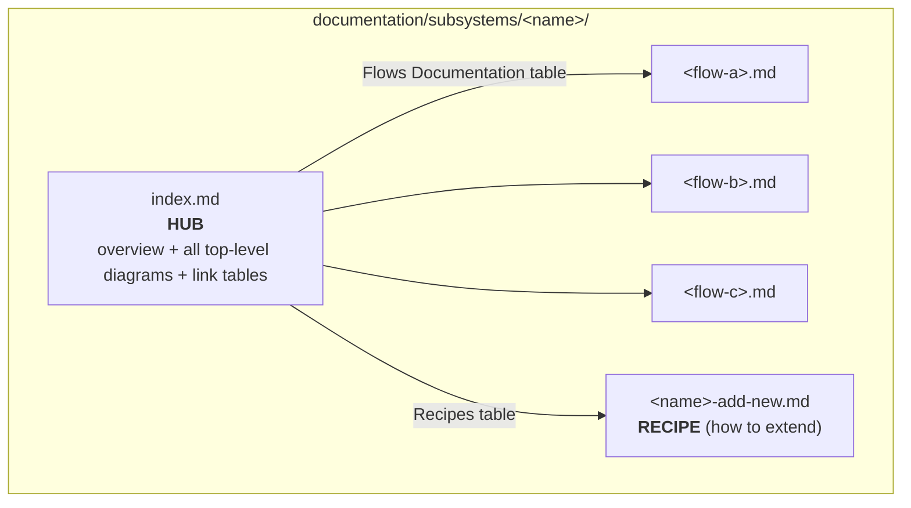
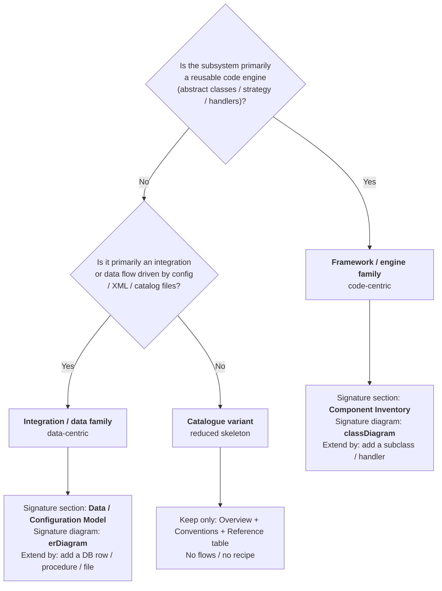
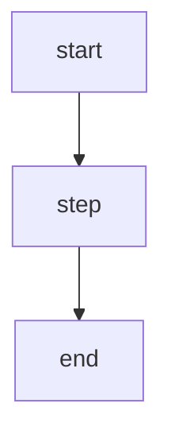
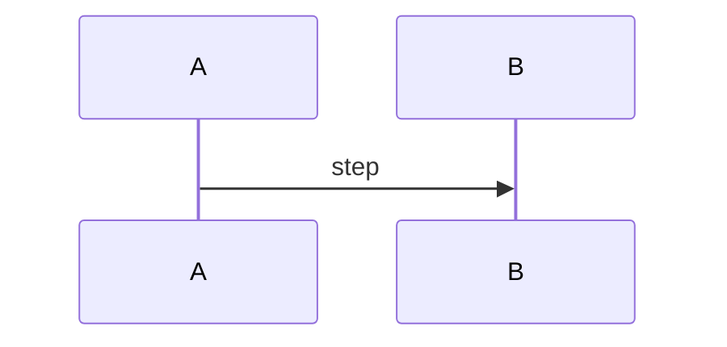

# Subsystem Documentation Guide

> **Purpose:** this guide defines **how to document a subsystem** in TigerSupply so that every
> subsystem folder looks and reads the same way. It is written both for **human developers**
> and for **AI agents** that generate or extend documentation. Follow it whenever you create
> a new subsystem folder or add pages to an existing one.

## Table of Contents

1. [What is a "subsystem"?](#1-what-is-a-subsystem)
2. [Folder Anatomy](#2-folder-anatomy)
3. [Naming Conventions](#3-naming-conventions)
4. [Choose the Archetype](#4-choose-the-archetype)
5. [The `index.md` Section Skeleton](#5-the-indexmd-section-skeleton)
6. [Section-by-Section Guidance](#6-section-by-section-guidance)
7. [Detail Pages](#7-detail-pages)
8. [Recipe Pages](#8-recipe-pages)
9. [Documentation Devices & Conventions](#9-documentation-devices--conventions)
10. [Mermaid Diagram Reference](#10-mermaid-diagram-reference)
11. [Writing Style Rules](#11-writing-style-rules)
12. [Cross-Linking Rules](#12-cross-linking-rules)
13. [Register the Subsystem](#13-register-the-subsystem)
14. [Authoring Checklist](#14-authoring-checklist)
15. [Templates](#15-templates)
16. [Review Gate (Quality Checklist)](#16-review-gate-quality-checklist)

---

## 1. What is a "subsystem"?

A **subsystem** is a **cross-cutting, reusable capability** of the TigerSupply engine that is
bigger than a single class and is used by (or shared across) several Scenes or game features —
for example the sprite/animation pipeline, the horde/level-script loader, the weapon
fire-control model, or a per-Scene UI composition.

### Subsystem vs Change documentation

| Question | If **yes** → document as a… |
|----------|-----------------------------|
| Is it a reusable engine / framework / mechanism used by many Scenes or features? | **Subsystem** (`documentation/subsystems/<name>/`) |
| Is it the delivery of a specific, scoped change with a start/end (a new feature, fix, or enemy/level content)? | **OpenSpec change** (`openspec/changes/<change-id>/`) |
| Is it a shared vocabulary of resources/aliases/constants? | **Data dictionary** (`documentation/data-dictionary/`) |

> **Rule of thumb:** a subsystem answers *"how does this mechanism work and how do I extend it?"*;
> an OpenSpec change answers *"what did we build in this change and why?"*.

---

## 2. Folder Anatomy

Every subsystem is a **self-contained folder** under
[documentation/subsystems/](../subsystems) built from **three roles**:



| Role | File(s) | Responsibility |
|------|---------|----------------|
| **Hub** | `index.md` | The single entry point. Defines the concept, holds every top-level diagram, and links out to all other pages. A reader must be able to understand the subsystem from the hub alone. |
| **Flow detail pages** | one file per flow (e.g. `outbound-export.md`) | The step-by-step behaviour of **one** flow: triggers, sequence, data touched, edge cases. |
| **Recipe page** | one `*-add-new.md` (or similar) | The **how-to-extend** procedure: the exact, ordered steps to add a new case/UC/column/type. |

> A subsystem **must** have a hub. Flow pages and a recipe page are **strongly recommended**;
> a pure "catalogue" subsystem (see [§4](#4-choose-the-archetype)) omits the flow pages and the
> recipe, and instead documents each catalogued item on a **module/utility detail page**
> (see [§7](#7-detail-pages)).

---

## 3. Naming Conventions

| Item | Convention | Examples |
|------|-----------|----------|
| Subsystem folder | lowercase kebab-case, describes the capability | `horde-level-pipeline`, `weapon-loadout`, `entity-movement-framework` |
| Hub file | always `index.md` | `index.md` |
| Flow page | descriptive kebab-case | `horde-spawn-lifecycle.md`, `level-script-loading.md`, `weapon-fire-cycle.md`, `hangar-loadout-selection.md` |
| Recipe page | `implement-new-*` / `*-add-new` / `*-add-uc` / `add-new-*` | `implement-new-scene.md`, `weapon-loadout-add-new.md`, `entity-movement-framework-add-new.md` |

- Use **kebab-case** for every file name.
- Keep names **specific** (`level-script-loading.md`, not `loading.md`).
- One flow = one file. Do not merge two flows into a single page.

---

## 4. Choose the Archetype

Subsystems fall into **two families** that share one common spine but differ in the *middle*
sections. Pick the archetype **before** you start writing — it decides your signature diagram
and your "how to extend" model.



| | **Framework / engine** | **Integration / data** | **Catalogue variant** |
|---|---|---|---|
| Examples | `entity-movement-framework`, `weapon-loadout` | `horde-level-pipeline`, `asset-catalog-loading` | `image-effect-filters`, `update-algorithms` |
| Distinctive section | Component Inventory | Data / Configuration Model | Utilities Reference |
| Signature diagram | `classDiagram` | `erDiagram` | *(none required)* |
| Integration style | usually an in-process API shared by several Scenes | file/XML/catalog-driven, resolved via reflection | self-contained engine utility (filter, algorithm, effect) |
| Extension model | subclass / strategy handler | new XML entry (prototype/algorithm) or catalog line | add a module + reference row |

> A subsystem can lean on both families (e.g. a level-loading *framework* has a `classDiagram`
> **and** file conventions). Choose the **dominant** trait and add the other section when it
> adds value.

---

## 5. The `index.md` Section Skeleton

The hub always opens with a **numbered Table of Contents**, then follows this canonical order.
The **spine** (bold) is mandatory for every non-catalogue subsystem; the **middle** flexes by
archetype.

| # | Section | Required? | Diagram / device |
|---|---------|-----------|------------------|
| — | **Table of Contents** | **Required** | numbered anchor links |
| 1 | **Overview** | **Required** | high-level `flowchart LR` + "goal of this doc" callout |
| 2 | **System Context** | **Required** | external-systems table |
| 3 | **Key Concepts** | **Required** | numbered `3.x` glossary |
| 4 | Conventions *(Folder / File / Output / Module)* | Recommended | config/key table |
| 5 | Component Inventory *(framework family)* | Family-specific | class→path table + `classDiagram` |
| 6 | Data / Configuration Model *(integration family)* | Family-specific | `erDiagram` |
| 7 | Lifecycle / Pipeline / Process Overview | **Required** | `flowchart TD` or `sequenceDiagram` |
| 8 | **Flows Documentation** | **Required** | link table → flow pages |
| 9 | **Recipes** | Recommended | link table → recipe page |
| 10 | Reference Scenarios / Reference Implementation | Recommended | table anchoring the worked example |

> **Invariant spine:** `Overview → System Context → Key Concepts → … → Flows Documentation →
> (Recipes / Reference Scenarios)`. Keep this order even if you rename a middle section to fit
> your domain (e.g. "Generation Pipeline" instead of "Lifecycle"). The **middle** sections
> (Conventions / Component Inventory / Data Model / Lifecycle) may be reordered to suit the
> archetype, and the closing **Recipes** and **Reference Scenarios** sections may appear in
> **either order** (e.g. a catalogue subsystem lists Scenarios before Recipes).

---

## 6. Section-by-Section Guidance

### §1 — Overview (Required)

- Open with a **"What is X?"** subsection that defines the domain concept in **business terms**
  first, then technically.
- Include **exactly one** high-level `flowchart LR` that shows the subsystem's boxes and the
  main data/flow direction end to end.
- State the **goal of the documentation** in a `>` callout — typically *"enable an AI agent or a
  human developer to understand the pattern and to add a new … by following the recipe."*
- Optionally list reference documents / source entry points in a small table.

### §2 — System Context (Required)

- Describe the **external resources** the subsystem talks to (classpath resource files, XML
  level scripts, catalog files — name, role, which one is authoritative).
- State the **integration style** explicitly and contrast it with the other archetype
  (e.g. *"unlike the XML-driven horde loader, this is a direct in-process API"*).
- Use a table for channels/protocols/direction when more than one exists.

### §3 — Key Concepts (Required)

- A **numbered glossary** (`3.1`, `3.2`, …). One concept per sub-heading.
- Define every term that the flow pages will later assume the reader knows (identifiers,
  triggers, granularity levels, correlation keys, de-duplication, safety rules…).
- Prefer short definitions + a tiny table or example over long prose.

### §4 — Conventions (Recommended)

- Document the **naming / folder / file / column** conventions the subsystem relies on:
  configuration property keys, file-name tokens, output formats, sheet/file naming, etc.
- Use a **key → meaning** table.

### §5 — Component Inventory (Framework family)

- A table with columns **Layer | Element | Path | Role** listing every class/bean, each linked
  to its source file.
- Follow it with a `classDiagram` showing the interface → abstract → concrete hierarchy and the
  key collaborators (composition/association).

### §6 — Data / Configuration Model (Integration family)

- An `erDiagram` (or a simple relationship table) of the XML/catalog entities involved
  (e.g. `Horde` → `EnemyDefinition` → `EnemyPrototype`/`AlgorithmPrototype`), with their key
  attributes and cardinality.
- One short subsection per entity explaining its role (e.g. "the scripted wave" vs "the
  reusable template it references"), how it is parsed/loaded, and the key used to look it up
  at runtime (usually a `name` attribute resolved through `LevelDataRepository` or a catalog
  alias).

### §7 — Lifecycle / Pipeline (Required)

- Show **how it runs** with a `flowchart TD` (loading/spawn pipeline) or a `sequenceDiagram`
  (frame-by-frame or input-driven flow).
- Follow the diagram with a **hook/step table** (`Step | Provided by | Behaviour`) and link to
  the flow page that details it.

### §8 — Flows Documentation (Required)

- A link table: `# | Flow | Trigger | Description | Detail page`.
- Every flow listed here **must** have a corresponding detail page in the folder.

### §9 — Recipes (Recommended)

- A link table: `Recipe | When to use it | Detail`.
- Points to the `*-add-new.md` page(s). Keep the *how* in the recipe page, not here.

### §10 — Reference Scenarios / Reference Implementation (Recommended)

- List the Scenes/features the subsystem supports (or the catalogue of codes/types).
- Name the **single worked example** used throughout the pages (see [§11](#11-writing-style-rules)).

---

## 7. Detail Pages

Beyond the hub, a subsystem has **detail pages**. **Every** detail page opens with a title, the
`> **Related index**` back-link (**directly under the H1**, never above it) and its own Table of
Contents. The body template depends on the archetype:

- **Integration / data family** → *flow pages* (§7.1): one page per flow, 5-section template.
- **Framework / web-flow family** → a *Request Lifecycle* page + a *Vertical Slice / anatomy* page (§7.2).
- **Catalogue variant** → *module / utility pages* (§7.3).

### 7.1 Flow detail pages (integration / data family)

An integration/data subsystem (level-script parsing / catalog loading / file-based config)
documents **one** flow per page, end to end, with the **same 5-section template** so every
flow page reads alike:

| # | Section | Content |
|---|---------|---------|
| — | `> Related index` back-link | Placed directly under the `# <Flow Name>` title: `> **Related index**: [<Hub Title>](index.md)`. |
| — | **Table of Contents** | Numbered and anchor-linked; every flow page carries its own ToC. |
| 1 | **Business Context** | *Purpose*, *Business Goal*, the **trigger** (frame tick / player input / horde timer / scene transition) and any flow-local *Key Concepts*. |
| 2 | **Component Descriptions** | Layered tables (columns: Component, Module, Class/Interface, Responsibility) for the entity / manager / factory / builder classes involved. |
| 3 | **Data Flow** | The concrete runtime steps as a `sequenceDiagram` (or `flowchart TD`) plus a step-by-step narrative that matches the diagram. |
| 4 | **Integration Points** | External touch points (classpath resource files, level-XML elements/attributes, catalog-file lines) with their exact format documented. |
| 5 | **Engine State Touched** | Every repository/manager/entity collection read and written (e.g. `ImageRepositoryManager`, `EnemyManager`, `GameContext`), plus edge cases & safety checks (missing catalog alias, unknown prototype name, reflection failure). |

Keep the **same worked example** as the hub so a reader can follow one case across pages.

> **Scope note:** a very simple flow may fold *Component Descriptions* and *Integration Points*
> into *Data Flow*, but any flow that reads external resource files or mutates shared engine
> state should keep **Integration Points** and **Engine State Touched** explicit — those are the
> sections readers rely on most.

### 7.2 Detail pages for the framework / web-flow family

A framework or in-process-API subsystem (e.g. `weapon-loadout`) usually splits its
detail into **two complementary pages** instead of the 5-section flow template:

| Page | Purpose | Signature device |
|------|---------|------------------|
| **Request Lifecycle** | The end-to-end runtime path: entry points, dispatch / validation, the core call chain, return value, error handling. | `sequenceDiagram` + numbered narrative |
| **Vertical Slice / anatomy** | The per-case slice layer by layer (data/XML model → factory → entity/algorithm → render/behaviour) plus a *shared vs. per-case* table. | `flowchart TD` slice map + per-layer sections |

A framework subsystem may instead use a *lifecycle* + *library* + *configuration* split. The
principle is the same: **one page per concern**, not one page per flow.

### 7.3 Module / utility detail pages (catalogue variant)

A catalogue subsystem (e.g. `image-effect-filters`, `update-algorithms`) documents each
catalogued item — an image filter, a movement algorithm, a UI widget — on its own detail page,
using this template:

| # | Section | Content |
|---|---------|---------|
| — | back-link + ToC | As for every detail page. |
| 1 | **Overview** | What the module is, the pattern it uses, and a **Source file** link. |
| 2 | **Dependencies** | Table of required libraries / versions and their role. |
| 3 | **How to Import** | The exact Java package/class to import (and any catalog/XML registration needed) to use it. |
| 4 | **Public API** | One sub-section per public method: signature, params table, return value. |
| 5 | **Internal Design** | Private state and internal structure (a `text` tree or a `classDiagram`). |
| 6 | **Usage Examples** | Copy-pasteable snippets for the common scenarios. |

> The single-worked-example rule does **not** apply here: catalogue items are usually independent
> of any single Scene or feature, so each detail page stands alone.

---

## 8. Recipe Pages

The recipe page is the **"add a new X" procedure**. It must be **ordered, exhaustive, and
copy-pasteable**. Recommended structure:

1. **Goal** — "Add a new `<UC / PW type / column / flow>` end to end."
2. **Prerequisites** — what must already exist.
3. **Numbered steps**, one per artefact to create/modify, each with:
   - the **module** and **path**,
   - what to write (a minimal code/XML/SQL skeleton),
   - why it is needed.
4. **Wiring** — engine registration (add to `StaticResources` constants, an asset catalog
   file, or a Manager's registration map/constructor).
5. **Verification** — how to confirm it works (run the game and trigger the Scene/action,
   inspect console output, etc.).
6. **Checklist** — a final tick-list mirroring the steps.

> Design the subsystem so that **adding a case is additive and isolated** — the recipe should
> read as "create these N new files + one registration", not "edit these shared files".

---

## 9. Documentation Devices & Conventions

Every hub is built from the same toolkit — use them consistently:

| Device | Rule |
|--------|------|
| **Table of Contents** | Numbered, anchor-linked; first element after the title on the hub. **Every flow page also carries its own ToC.** |
| **Related-index back-link** | Every **detail page** (flow, recipe, or module/utility) opens with `> **Related index**: [<Hub Title>](index.md)` directly under the title. |
| **Mermaid diagrams** | ≥ 1 high-level `flowchart LR` in *Overview*; plus the signature diagram for your family; add a `sequenceDiagram` for request/response flows. See [§10](#10-mermaid-diagram-reference). |
| **Tables** | Prefer tables over prose for config keys, columns, components, Scenes/features, external systems. |
| **Callout blockquotes** | Use `>` for **Goal / Important / Rationale / Legacy behaviour / Note / Asymmetry**. |
| **Worked example** | Thread **one** concrete case through every page. The Level 1 horde pipeline (level XML → `EnemyDataBuilderSaxXml` → `EnemyDataManager` → `EnemyManager` → `Enemy`) is the house standard; reuse it unless your subsystem is unrelated. |
| **Cross-links** | Link every referenced page and source file (see [§12](#12-cross-linking-rules)). |
| **"What is X?" opener** | Always define the domain concept in business terms before going technical. |

---

## 10. Mermaid Diagram Reference

Pick the diagram type by **intent**:

| Intent | Diagram type | Where |
|--------|--------------|-------|
| End-to-end boxes & data direction | `flowchart LR` | Overview |
| Class hierarchy / strategy / collaborators | `classDiagram` | Component Inventory (framework) |
| Tables, keys, cardinality | `erDiagram` | Data / Configuration Model (integration) |
| Ordered runtime steps (loading/spawn pipeline) | `flowchart TD` | Lifecycle / Pipeline |
| Request → handler → factory → entity/algorithm | `sequenceDiagram` | Request Lifecycle / flow pages |
| State transitions of an entity | `flowchart TD` (state-style) | Lifecycle (e.g. Work Order lifecycle) |

### Rendering rules

- Quote any node label containing special characters: `A["text (with parens)"]`.
- Use `<br/>` for line breaks inside a node.
- Keep one diagram to one idea; split large diagrams into several.
- Validate the diagram renders before committing.

---

## 11. Writing Style Rules

- **English only.** Use clear, neutral technical English.
- **Business first, then technical.** Define *what* and *why* before *how*.
- **Present tense, active voice.** "The horde spawns the enemy", not "the enemy will be spawned".
- **One worked example.** Choose a single concrete case (the Level 1 horde pipeline by default)
  and reuse it everywhere.
- **Respect the actual stack.** This is Java 17 with Swing/AWT and a hand-rolled game engine —
  no Spring, Hibernate, JSP, servlet container, or ORM. Do not describe frameworks or patterns
  that are not actually present in the codebase unless the doc is explicitly proposing a
  migration.
- **Terminology consistency.** Reuse the exact class/package names from the codebase (see
  [code-structure.md](../architecture/system-overview/code-structure.md)) and the data
  dictionary.
- **Callouts for the non-obvious.** Engine quirks, asymmetries, and safety rules go in `>` blocks.
- **No change-logs in the docs.** Describe the *current* behaviour; release history belongs to
  OpenSpec change history (`openspec/changes/`).

---

## 12. Cross-Linking Rules

From a hub or flow page located at `documentation/subsystems/<name>/`:

| Target | Relative path from `<name>/` |
|--------|------------------------------|
| A sibling flow/recipe page | `./<page>.md` (or just `<page>.md`) |
| This authoring guide | `../subsystem-documentation-guide.md` |
| Another subsystem hub | `../<other>/index.md` |
| The data dictionary | `../../data-dictionary/<file>.md` |
| A source file (module) | `../../../<module>/src/main/java/...` |

Rules:

- **Every detail page (flow, recipe, or module/utility) opens with a back-link** to its hub,
  directly under the title: `> **Related index**: [<Hub Title>](index.md)`.
- **Always link source files** referenced in Component Inventory / code snippets.
- Use **relative** links only; never absolute file-system paths or `file://` URIs.
- Verify every link resolves (no dangling pages).

> This guide lives one level **above** the subsystem folders, so from **inside** a subsystem
> folder you reach it with `../subsystem-documentation-guide.md`.

---

## 13. Register the Subsystem

After creating the folder and `index.md`, register the subsystem so it is discoverable:

1. Open [.github/copilot-instructions.md](../../.github/copilot-instructions.md).
2. Under the **Subsystems** heading, add a bullet linking to the new hub:

   ```markdown
   - **[<name>](../documentation/subsystems/<name>/index.md)**
   ```

3. Keep the list alphabetically ordered.

---

## 14. Authoring Checklist

Follow this order when creating a **new** subsystem:

1. [ ] Create `documentation/subsystems/<name>/`.
2. [ ] Decide the **archetype** ([§4](#4-choose-the-archetype)).
3. [ ] Write `index.md`:
   - [ ] Table of Contents.
   - [ ] **Overview** (define the concept + one `flowchart LR` + a "goal" callout).
   - [ ] **System Context** (external systems + integration style).
   - [ ] **Key Concepts** (`3.x`).
   - [ ] Family-specific middle: **Component Inventory + classDiagram** *or*
         **Data Model + erDiagram**.
   - [ ] **Lifecycle / Pipeline** diagram + step table.
   - [ ] **Flows Documentation** link table.
   - [ ] **Recipes** link table.
   - [ ] **Reference Scenarios / Reference Implementation**.
4. [ ] Create one **flow page** per flow listed in §8.
5. [ ] Create one **recipe page** (`*-add-new.md`).
6. [ ] Pick **one worked example** and thread it through every page.
7. [ ] Add all **cross-links** (pages + source files).
8. [ ] **Register** the subsystem in `.github/copilot-instructions.md`.
9. [ ] Run the [Review Gate](#16-review-gate-quality-checklist).

---

## 15. Templates

### 15.1 `index.md` skeleton (copy & fill)

````markdown
# <Subsystem Title>

## Table of Contents

1. [Overview](#1-overview)
2. [System Context](#2-system-context)
3. [Key Concepts](#3-key-concepts)
4. [<Conventions | Configuration Model>](#4-...)
5. [<Component Inventory | Data Model>](#5-...)
6. [<Lifecycle | Pipeline | Process Overview>](#6-...)
7. [Flows Documentation](#7-flows-documentation)
8. [Recipes](#8-recipes)
9. [Reference Scenarios](#9-reference-scenarios)

---

## 1. Overview

### What is <X>?

<Business definition first, then technical.>


> **Goal of this documentation:** enable an AI agent or a human developer to understand the
> pattern and to add a new <case> by following the [recipe](<name>-add-new.md).

---

## 2. System Context

<External systems, who is authoritative, integration style (sync vs async).>

---

## 3. Key Concepts

### 3.1 <Concept>
### 3.2 <Concept>

---

## 4. <Conventions | Configuration Model>

<Key → meaning table, or erDiagram for data-centric subsystems.>

---

## 5. <Component Inventory | Data Model>

<classDiagram (framework) or table of tables (integration).>

---

## 6. <Lifecycle | Pipeline>



---

## 7. Flows Documentation

| # | Flow | Trigger | Description | Detail |
|---|------|---------|-------------|--------|
| 1 | <Flow> | <trigger> | <what it does> | [<page>.md](<page>.md) |

---

## 8. Recipes

| Recipe | When to use it | Detail |
|--------|----------------|--------|
| Add a new <case> | <when> | [<name>-add-new.md](<name>-add-new.md) |

---

## 9. Reference Scenarios

| Scenario | Status |
|----------|--------|
| Level 1 horde pipeline | Reference vertical slice used throughout this documentation. |
````

### 15.2 Flow page skeleton

````markdown
# <Flow Name>

> **Related index**: [<Hub Title>](index.md)

## Table of Contents

1. [Business Context](#1-business-context)
2. [Component Descriptions](#2-component-descriptions)
3. [Data Flow](#3-data-flow)
4. [Integration Points](#4-integration-points)
5. [Database](#5-database)

---

## 1. Business Context

### Purpose
<What this flow does + its trigger: frame tick / player input / horde timer / scene transition.>

### Business Goal
<The outcome, step by step.>

## 2. Component Descriptions
<Layered tables: Component / Module / Class / Responsibility.>

## 3. Data Flow


## 4. Integration Points
<External touch points: classpath resource files, level-XML elements, catalog-file lines; the exact format read.>

## 5. Engine State Touched
<Repositories/managers/entity collections read/written; edge cases & safety checks.>
````

### 15.3 Recipe page skeleton

````markdown
# Add a new <case>

**Goal:** add a new <case> end to end.

## Prerequisites
- ...

## Steps
1. **<Artefact>** — `<module>/<path>`: <what to write and why>.
2. ...

## Wiring
- Engine registration (`StaticResources` constants, an asset catalog file, or a Manager's
  registration map/constructor).

## Verification
- <how to confirm it works>.

## Checklist
- [ ] ...
````

### 15.4 Module / utility detail page skeleton (catalogue variant)

````markdown
# <ModuleName>

> **Related index**: [<Hub Title>](index.md)

## Table of Contents

1. [Overview](#1-overview)
2. [Dependencies](#2-dependencies)
3. [How to Import](#3-how-to-import)
4. [Public API](#4-public-api)
5. [Internal Design](#5-internal-design)
6. [Usage Examples](#6-usage-examples)

---

## 1. Overview
<What the module is + the pattern it uses.>
**Source file**: [<path>](../../../engine/src/main/java/it/spaghettisource/tigersupply/engine/<package>/<ModuleName>.java)

## 2. Dependencies
<Table: Library / Version / Role.>

## 3. How to Import
<The include order: `<script>` / `<link>`.>

## 4. Public API
### 4.1 `functionName(args)`
<Description + params table + return value.>

## 5. Internal Design
<Private state + structure (a text tree or a classDiagram).>

## 6. Usage Examples
<Copy-pasteable snippets.>
````

---

## 16. Review Gate (Quality Checklist)

Before considering the subsystem documented, confirm:

- [ ] The **hub alone** lets a new reader understand what the subsystem is and how it runs.
- [ ] The **spine** is present and in order (Overview → System Context → Key Concepts → … →
      Flows → Recipes → Reference Scenarios).
- [ ] Overview has a **"What is X?"** opener and **one** high-level `flowchart`.
- [ ] The **archetype-specific** section exists (Component Inventory **or** Data Model) with its
      signature diagram.
- [ ] There is a **Lifecycle/Pipeline** diagram plus a step/hook table.
- [ ] Every flow in the **Flows Documentation** table has a real detail page.
- [ ] A **recipe** page exists and reads as an additive, isolated procedure.
- [ ] **Every detail page** (flow or module/utility) opens with the `> Related index` back-link and its own ToC.
- [ ] **One worked example** runs through all pages.
- [ ] All **cross-links** (pages + source files) resolve.
- [ ] Every **Mermaid diagram renders**.
- [ ] The subsystem is **registered** in `.github/copilot-instructions.md`.
- [ ] The document is written in **English**, present tense, active voice.
